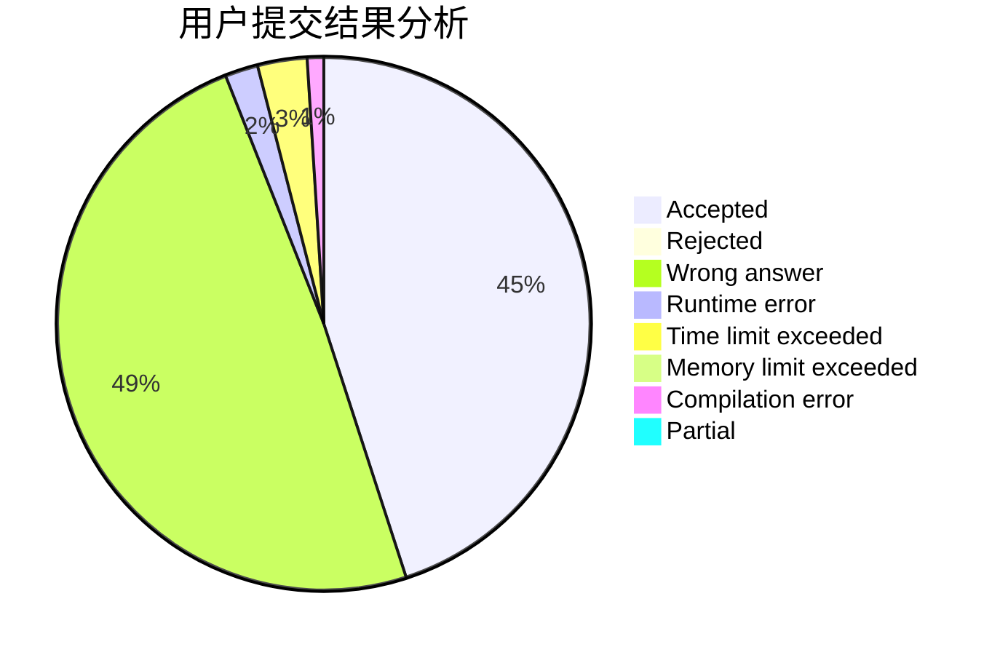
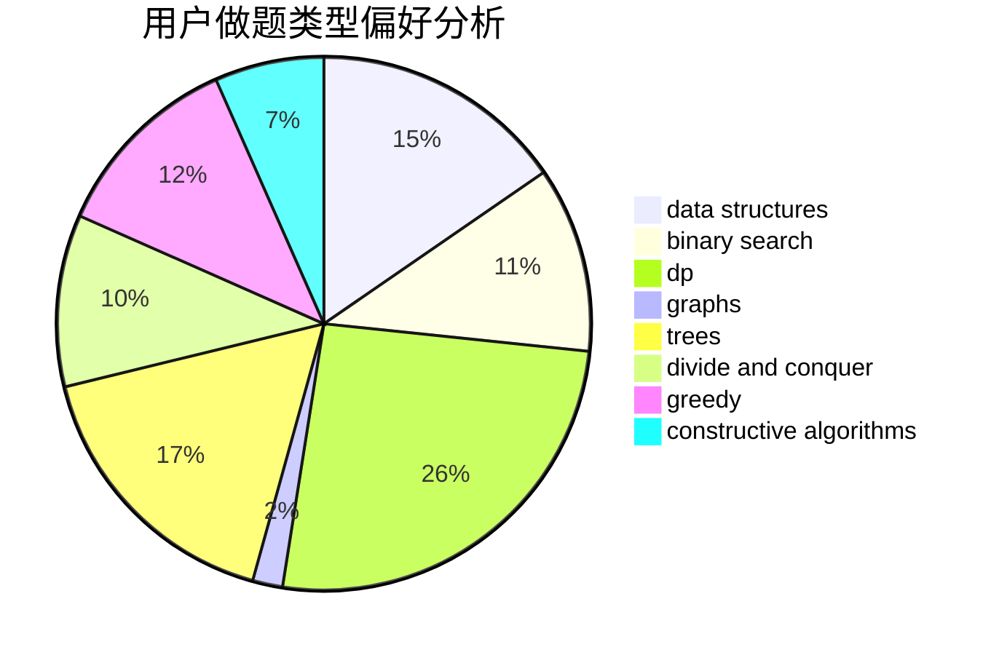
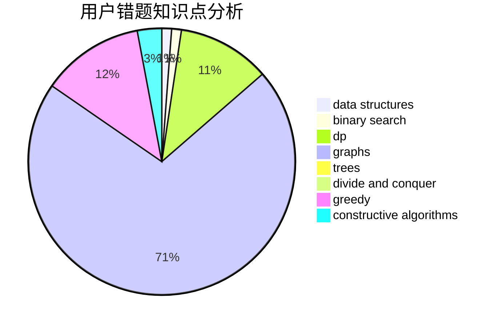

# HighLights

<!-- tabs:start -->

#### **用户提交结果分析**

#### **用户做题类型偏好分析**

#### **用户错题知识点分析**

<!-- tabs:end -->
# 推荐题目
[414E](https://codeforces.com/contest/414/problem/E)		data structures		  
[862D](https://codeforces.com/contest/862/problem/D)		binary search,
                        divide and conquer,
                        interactive		  
[448D](https://codeforces.com/contest/448/problem/D)		binary search,
                        brute force		  
[1411G](https://codeforces.com/contest/1411/problem/G)		bitmasks,
                        games,
                        math,
                        matrices		  
[755G](https://codeforces.com/contest/755/problem/G)		combinatorics,
                        divide and conquer,
                        dp,
                        fft,
                        math,
                        number theory		  
[843B](https://codeforces.com/contest/843/problem/B)		brute force,
                        interactive,
                        probabilities		  
[917E](https://codeforces.com/contest/917/problem/E)		data structures,
                        string suffix structures,
                        strings,
                        trees		  
[33D](https://codeforces.com/contest/33/problem/D)		geometry,
                        graphs,
                        shortest paths,
                        sortings		  
[703A](https://codeforces.com/contest/703/problem/A)		implementation		  
[477A](https://codeforces.com/contest/477/problem/A)		dsu,graphs,sortings,trees		  
