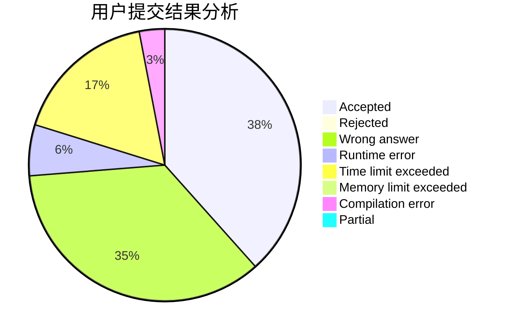
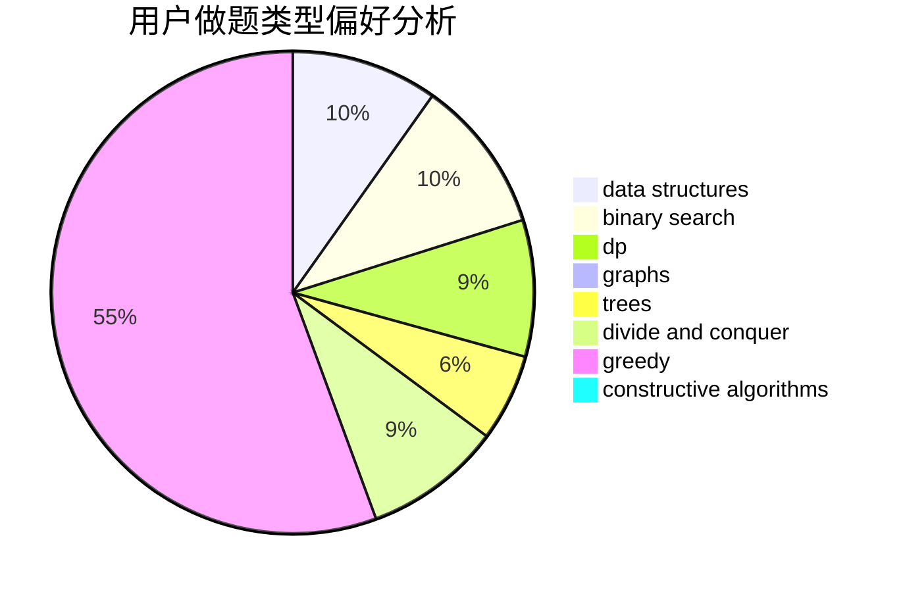
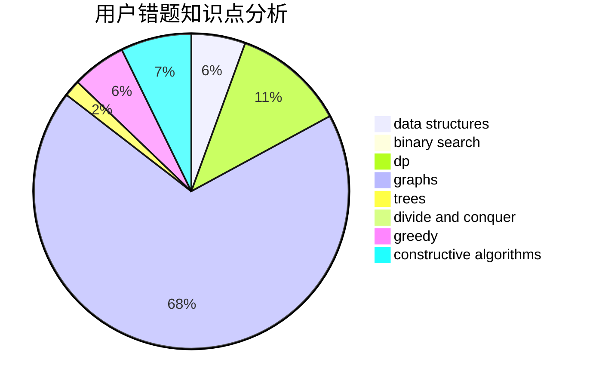

# Hile_Meow
<!-- tabs:start -->
#### **用户提交结果分析**

#### **用户做题类型偏好分析**

#### **用户错题知识点分析**

<!-- tabs:end -->
# 推荐题目
[Chips on a Board](http://codeforces.com/problemset/problem/1511/G)		bitmasks,
                        brute force,
                        data structures,
                        games,
                        two pointers		  
[Blood Cousins Return](http://codeforces.com/problemset/problem/246/E)		binary search,
                        data structures,
                        dfs and similar,
                        dp,
                        sortings		  
[The Way to Home](http://codeforces.com/problemset/problem/910/A)		dfs and similar,
                        dp,
                        greedy,
                        implementation		  
[Minimum spanning tree for each edge](http://codeforces.com/problemset/problem/609/E)		data structures,
                        dfs and similar,
                        dsu,
                        graphs,
                        trees		  
[AND-permutations](http://codeforces.com/problemset/problem/909/F)		constructive algorithms		  
[Sum Over Subsets](http://codeforces.com/problemset/problem/1436/F)		combinatorics,
                        math,
                        number theory		  
[Soap Time! - 2](http://codeforces.com/problemset/problem/185/E)		binary search,
                        data structures		  
[Roads](http://codeforces.com/problemset/problem/1402/B)		*special problem,
                        geometry,
                        sortings		  
[I.O.U.](http://codeforces.com/problemset/problem/376/B)		implementation		  
[The Fair Nut and the Best Path](http://codeforces.com/problemset/problem/1083/A)		data structures,
                        dp,
                        trees		  
<!-- tabs:start -->
#### **data structures**
[Chips on a Board](http://codeforces.com/problemset/problem/1511/G)		bitmasks,
                        brute force,
                        data structures,
                        games,
                        two pointers		  
[Blood Cousins Return](http://codeforces.com/problemset/problem/246/E)		binary search,
                        data structures,
                        dfs and similar,
                        dp,
                        sortings		  
[Minimum spanning tree for each edge](http://codeforces.com/problemset/problem/609/E)		data structures,
                        dfs and similar,
                        dsu,
                        graphs,
                        trees		  
[Soap Time! - 2](http://codeforces.com/problemset/problem/185/E)		binary search,
                        data structures		  
[The Fair Nut and the Best Path](http://codeforces.com/problemset/problem/1083/A)		data structures,
                        dp,
                        trees		  
[Chip Play](https://codeforces.com/contest/90/problem/E)		brute force,
                        data structures,
                        implementation		  
[Matches Are Not a Child's Play](http://codeforces.com/problemset/problem/1137/F)		data structures,
                        trees		  
[80-th Level Archeology](http://codeforces.com/problemset/problem/731/D)		brute force,
                        data structures,
                        greedy,
                        sortings		  
[Iahub and Xors](http://codeforces.com/problemset/problem/341/D)		data structures		  
[Phoenix and Memory](http://codeforces.com/problemset/problem/1348/F)		data structures,
                        dfs and similar,
                        graphs,
                        greedy		  
#### **binary search**
[Blood Cousins Return](http://codeforces.com/problemset/problem/246/E)		binary search,
                        data structures,
                        dfs and similar,
                        dp,
                        sortings		  
[Soap Time! - 2](http://codeforces.com/problemset/problem/185/E)		binary search,
                        data structures		  
[Accidental Victory](http://codeforces.com/problemset/problem/1490/E)		binary search,
                        data structures,
                        greedy		  
[Binary Search](http://codeforces.com/problemset/problem/1436/C)		binary search,
                        combinatorics		  
[Maximum width](http://codeforces.com/problemset/problem/1492/C)		binary search,
                        data structures,
                        dp,
                        greedy,
                        two pointers		  
[Pairs](http://codeforces.com/problemset/problem/1463/D)		binary search,
                        constructive algorithms,
                        greedy,
                        two pointers		  
[Old Floppy Drive](http://codeforces.com/problemset/problem/1490/G)		binary search,
                        data structures,
                        math		  
[Odd Mineral Resource](http://codeforces.com/problemset/problem/1479/D)		binary search,
                        bitmasks,
                        brute force,
                        data structures,
                        probabilities,
                        trees		  
[Complicated Computations](http://codeforces.com/problemset/problem/1436/E)		binary search,
                        data structures,
                        two pointers		  
[Divide and Summarize](http://codeforces.com/problemset/problem/1461/D)		binary search,
                        brute force,
                        data structures,
                        divide and conquer,
                        implementation,
                        sortings		  
#### **dp**
[Blood Cousins Return](http://codeforces.com/problemset/problem/246/E)		binary search,
                        data structures,
                        dfs and similar,
                        dp,
                        sortings		  
[The Way to Home](http://codeforces.com/problemset/problem/910/A)		dfs and similar,
                        dp,
                        greedy,
                        implementation		  
[The Fair Nut and the Best Path](http://codeforces.com/problemset/problem/1083/A)		data structures,
                        dp,
                        trees		  
[Good Sequences](http://codeforces.com/problemset/problem/264/B)		dp,
                        number theory		  
[A Lot of Games](http://codeforces.com/problemset/problem/455/B)		dfs and similar,
                        dp,
                        games,
                        implementation,
                        strings,
                        trees		  
[Subsequences (hard version)](http://codeforces.com/problemset/problem/1183/H)		dp,
                        strings		  
[Mahmoud and a xor trip](http://codeforces.com/problemset/problem/766/E)		bitmasks,
                        constructive algorithms,
                        data structures,
                        dfs and similar,
                        dp,
                        math,
                        trees		  
[Cupboards Jumps](http://codeforces.com/problemset/problem/1500/F)		dp		  
[Sum Balance](http://codeforces.com/problemset/problem/1242/C)		bitmasks,
                        dfs and similar,
                        dp,
                        graphs		  
[Maximum width](http://codeforces.com/problemset/problem/1492/C)		binary search,
                        data structures,
                        dp,
                        greedy,
                        two pointers		  
#### **graph**
[Minimum spanning tree for each edge](http://codeforces.com/problemset/problem/609/E)		data structures,
                        dfs and similar,
                        dsu,
                        graphs,
                        trees		  
[Challenges in school №41](http://codeforces.com/problemset/problem/1333/D)		brute force,
                        constructive algorithms,
                        games,
                        graphs,
                        greedy,
                        implementation,
                        sortings		  
[Foolprüf Security](http://codeforces.com/problemset/problem/1267/F)		graphs		  
[Phoenix and Memory](http://codeforces.com/problemset/problem/1348/F)		data structures,
                        dfs and similar,
                        graphs,
                        greedy		  
[Avoid Rainbow Cycles](http://codeforces.com/problemset/problem/1408/E)		data structures,
                        dsu,
                        graphs,
                        greedy,
                        sortings,
                        trees		  
[Kilani and the Game](http://codeforces.com/problemset/problem/1105/D)		dfs and similar,
                        graphs,
                        implementation,
                        shortest paths		  
[Sum Balance](http://codeforces.com/problemset/problem/1242/C)		bitmasks,
                        dfs and similar,
                        dp,
                        graphs		  
[Minimum Ties](http://codeforces.com/problemset/problem/1487/C)		brute force,
                        constructive algorithms,
                        dfs and similar,
                        graphs,
                        greedy,
                        implementation,
                        math		  
[Chef Monocarp](http://codeforces.com/problemset/problem/1437/C)		dp,
                        flows,
                        graph matchings,
                        greedy,
                        math,
                        sortings		  
[Strange Housing](http://codeforces.com/problemset/problem/1470/D)		constructive algorithms,
                        dfs and similar,
                        graph matchings,
                        graphs,
                        greedy		  
#### **trees**
[Minimum spanning tree for each edge](http://codeforces.com/problemset/problem/609/E)		data structures,
                        dfs and similar,
                        dsu,
                        graphs,
                        trees		  
[The Fair Nut and the Best Path](http://codeforces.com/problemset/problem/1083/A)		data structures,
                        dp,
                        trees		  
[Matches Are Not a Child's Play](http://codeforces.com/problemset/problem/1137/F)		data structures,
                        trees		  
[A Lot of Games](http://codeforces.com/problemset/problem/455/B)		dfs and similar,
                        dp,
                        games,
                        implementation,
                        strings,
                        trees		  
[Avoid Rainbow Cycles](http://codeforces.com/problemset/problem/1408/E)		data structures,
                        dsu,
                        graphs,
                        greedy,
                        sortings,
                        trees		  
[Mahmoud and a xor trip](http://codeforces.com/problemset/problem/766/E)		bitmasks,
                        constructive algorithms,
                        data structures,
                        dfs and similar,
                        dp,
                        math,
                        trees		  
[Odd Mineral Resource](http://codeforces.com/problemset/problem/1479/D)		binary search,
                        bitmasks,
                        brute force,
                        data structures,
                        probabilities,
                        trees		  
[Yet Another Card Deck](http://codeforces.com/problemset/problem/1511/C)		brute force,
                        data structures,
                        implementation,
                        trees		  
[Diameter Cuts](http://codeforces.com/problemset/problem/1499/F)		combinatorics,
                        dfs and similar,
                        dp,
                        trees		  
[Fib-tree](http://codeforces.com/problemset/problem/1491/E)		brute force,
                        dfs and similar,
                        divide and conquer,
                        number theory,
                        trees		  
#### **divide and conquer**
[Divide and Summarize](http://codeforces.com/problemset/problem/1461/D)		binary search,
                        brute force,
                        data structures,
                        divide and conquer,
                        implementation,
                        sortings		  
[Song of the Sirens](http://codeforces.com/problemset/problem/1466/G)		combinatorics,
                        divide and conquer,
                        hashing,
                        math,
                        string suffix structures,
                        strings		  
[Permutation Transformation](http://codeforces.com/problemset/problem/1490/D)		dfs and similar,
                        divide and conquer,
                        implementation		  
[Skyline Photo](https://codeforces.com/contest/1483/problem/C)		data structures,
                        divide and conquer,
                        dp		  
[Fib-tree](http://codeforces.com/problemset/problem/1491/E)		brute force,
                        dfs and similar,
                        divide and conquer,
                        number theory,
                        trees		  
[Sum of Prefix Sums](http://codeforces.com/problemset/problem/1303/G)		data structures,
                        divide and conquer,
                        geometry,
                        trees		  
[Dogeforces](http://codeforces.com/problemset/problem/1494/D)		constructive algorithms,
                        data structures,
                        dfs and similar,
                        divide and conquer,
                        dsu,
                        greedy,
                        sortings,
                        trees		  
[Logistical Questions](http://codeforces.com/problemset/problem/566/C)		dfs and similar,
                        divide and conquer,
                        trees		  
[Fruit Sequences](http://codeforces.com/problemset/problem/1428/F)		binary search,
                        data structures,
                        divide and conquer,
                        dp,
                        two pointers		  
[Dr. Evil Underscores](http://codeforces.com/problemset/problem/1285/D)		bitmasks,
                        brute force,
                        dfs and similar,
                        divide and conquer,
                        dp,
                        greedy,
                        strings,
                        trees		  
#### **greedy**
[The Way to Home](http://codeforces.com/problemset/problem/910/A)		dfs and similar,
                        dp,
                        greedy,
                        implementation		  
[Challenges in school №41](http://codeforces.com/problemset/problem/1333/D)		brute force,
                        constructive algorithms,
                        games,
                        graphs,
                        greedy,
                        implementation,
                        sortings		  
[80-th Level Archeology](http://codeforces.com/problemset/problem/731/D)		brute force,
                        data structures,
                        greedy,
                        sortings		  
[Kirk and a Binary String (easy version)](http://codeforces.com/problemset/problem/1204/D1)		brute force,
                        greedy,
                        strings		  
[RBS Deletion](http://codeforces.com/problemset/problem/1488/B)		*special problem,
                        greedy		  
[Phoenix and Memory](http://codeforces.com/problemset/problem/1348/F)		data structures,
                        dfs and similar,
                        graphs,
                        greedy		  
[Accidental Victory](http://codeforces.com/problemset/problem/1490/E)		binary search,
                        data structures,
                        greedy		  
[Avoid Rainbow Cycles](http://codeforces.com/problemset/problem/1408/E)		data structures,
                        dsu,
                        graphs,
                        greedy,
                        sortings,
                        trees		  
[Domino piling](http://codeforces.com/problemset/problem/50/A)		greedy,
                        math		  
[Maximum width](http://codeforces.com/problemset/problem/1492/C)		binary search,
                        data structures,
                        dp,
                        greedy,
                        two pointers		  
#### **constructive algorithms**
[AND-permutations](http://codeforces.com/problemset/problem/909/F)		constructive algorithms		  
[Rat Kwesh and Cheese](http://codeforces.com/problemset/problem/621/D)		brute force,
                        constructive algorithms,
                        math		  
[Challenges in school №41](http://codeforces.com/problemset/problem/1333/D)		brute force,
                        constructive algorithms,
                        games,
                        graphs,
                        greedy,
                        implementation,
                        sortings		  
[Книга - лучший подарок](http://codeforces.com/problemset/problem/609/B)		constructive algorithms,
                        implementation		  
[Mahmoud and a xor trip](http://codeforces.com/problemset/problem/766/E)		bitmasks,
                        constructive algorithms,
                        data structures,
                        dfs and similar,
                        dp,
                        math,
                        trees		  
[Anti-knapsack](http://codeforces.com/problemset/problem/1493/A)		constructive algorithms,
                        greedy		  
[Pairs](http://codeforces.com/problemset/problem/1463/D)		binary search,
                        constructive algorithms,
                        greedy,
                        two pointers		  
[XOR-gun](https://codeforces.com/contest/1456/problem/B)		bitmasks,
                        brute force,
                        constructive algorithms		  
[Genius's Gambit](http://codeforces.com/problemset/problem/1492/D)		bitmasks,
                        constructive algorithms,
                        greedy,
                        math		  
[3-Coloring](https://codeforces.com/contest/1504/problem/D)		constructive algorithms,
                        games,
                        interactive		  
#### **sortings**
[Blood Cousins Return](http://codeforces.com/problemset/problem/246/E)		binary search,
                        data structures,
                        dfs and similar,
                        dp,
                        sortings		  
[Roads](http://codeforces.com/problemset/problem/1402/B)		*special problem,
                        geometry,
                        sortings		  
[Challenges in school №41](http://codeforces.com/problemset/problem/1333/D)		brute force,
                        constructive algorithms,
                        games,
                        graphs,
                        greedy,
                        implementation,
                        sortings		  
[80-th Level Archeology](http://codeforces.com/problemset/problem/731/D)		brute force,
                        data structures,
                        greedy,
                        sortings		  
[Avoid Rainbow Cycles](http://codeforces.com/problemset/problem/1408/E)		data structures,
                        dsu,
                        graphs,
                        greedy,
                        sortings,
                        trees		  
[Diamond Miner](https://codeforces.com/contest/1496/problem/C)		geometry,
                        greedy,
                        math,
                        sortings		  
[Meximization](http://codeforces.com/problemset/problem/1497/A)		brute force,
                        data structures,
                        greedy,
                        sortings		  
[Avoiding Zero](http://codeforces.com/problemset/problem/1427/A)		math,
                        sortings		  
[Divide and Summarize](http://codeforces.com/problemset/problem/1461/D)		binary search,
                        brute force,
                        data structures,
                        divide and conquer,
                        implementation,
                        sortings		  
[Chef Monocarp](http://codeforces.com/problemset/problem/1437/C)		dp,
                        flows,
                        graph matchings,
                        greedy,
                        math,
                        sortings		  
<!-- tabs:end -->
