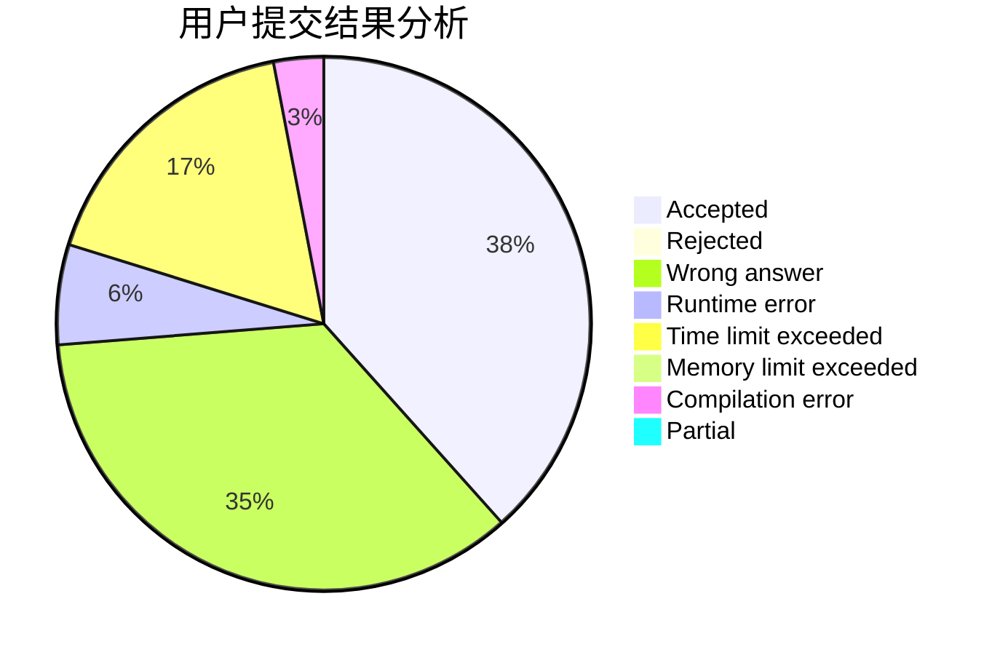
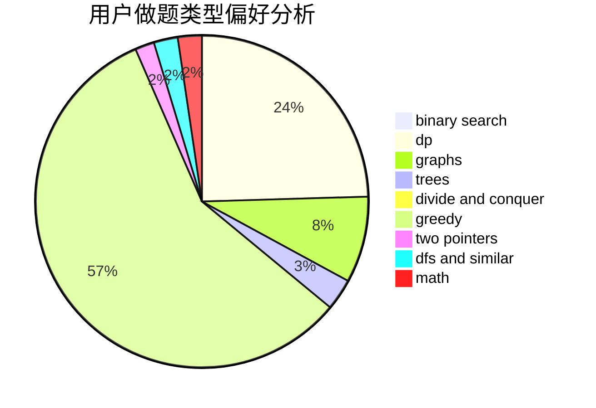

# Hile_Meow

<!-- tabs:start -->

#### **用户提交结果分析**

#### **用户做题类型偏好分析**

<!-- tabs:end -->
# 推荐题目
[1413D](https://codeforces.com/contest/1413/problem/D)
[1446E](https://codeforces.com/contest/1446/problem/E)
[12092](https://codeforces.com/contest/1209/problem/2)
[268A](https://codeforces.com/contest/268/problem/A)
[16E](https://codeforces.com/contest/16/problem/E)
[1083D](https://codeforces.com/contest/1083/problem/D)
[405A](https://codeforces.com/contest/405/problem/A)
[924D](https://codeforces.com/contest/924/problem/D)
[369A](https://codeforces.com/contest/369/problem/A)
[476C](https://codeforces.com/contest/476/problem/C)
