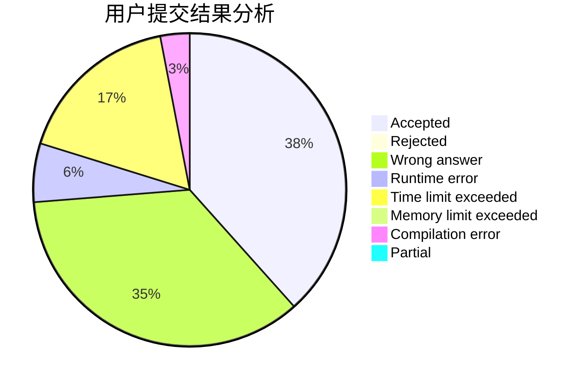
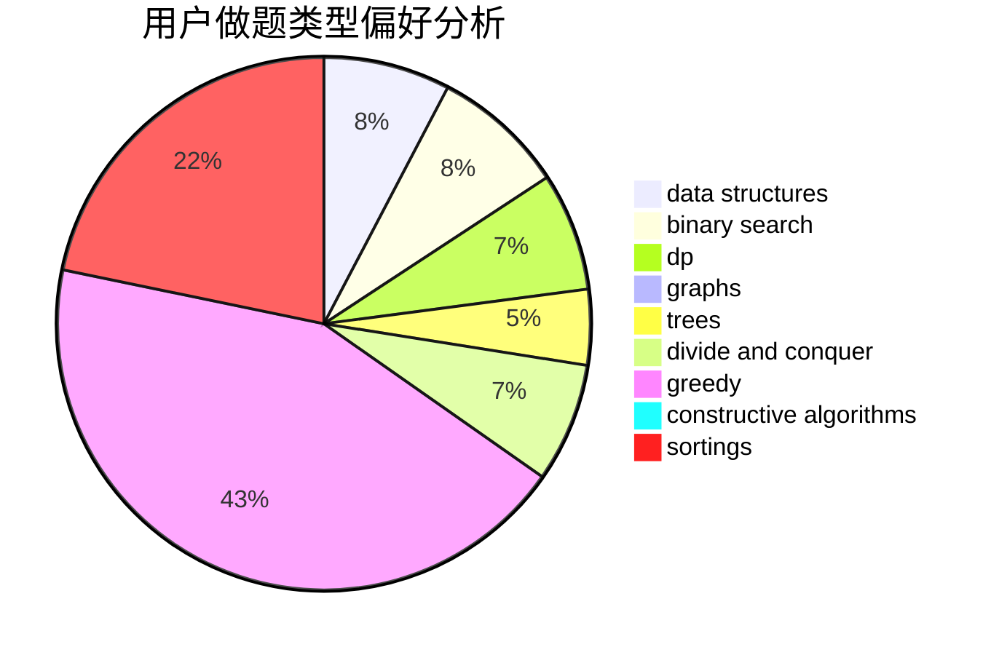
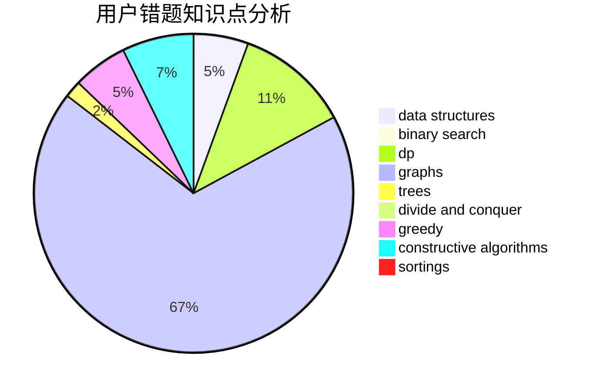

# Hile_Meow
<!-- tabs:start -->
#### **用户提交结果分析**

#### **用户做题类型偏好分析**

#### **用户错题知识点分析**

<!-- tabs:end -->
# 推荐题目
[1511G](http://codeforces.com/problemset/problem/1511/G)		bitmasks,
                        brute force,
                        data structures,
                        games,
                        two pointers		  
[246E](http://codeforces.com/problemset/problem/246/E)		binary search,
                        data structures,
                        dfs and similar,
                        dp,
                        sortings		  
[910A](http://codeforces.com/problemset/problem/910/A)		dfs and similar,
                        dp,
                        greedy,
                        implementation		  
[609E](http://codeforces.com/problemset/problem/609/E)		data structures,
                        dfs and similar,
                        dsu,
                        graphs,
                        trees		  
[909F](http://codeforces.com/problemset/problem/909/F)		constructive algorithms		  
[1436F](http://codeforces.com/problemset/problem/1436/F)		combinatorics,
                        math,
                        number theory		  
[185E](http://codeforces.com/problemset/problem/185/E)		binary search,
                        data structures		  
[1402B](http://codeforces.com/problemset/problem/1402/B)		*special problem,
                        geometry,
                        sortings		  
[376B](http://codeforces.com/problemset/problem/376/B)		implementation		  
[1083A](http://codeforces.com/problemset/problem/1083/A)		data structures,
                        dp,
                        trees		  
<!-- tabs:start -->
#### **data structures**
[1511G](http://codeforces.com/problemset/problem/1511/G)		bitmasks,
                        brute force,
                        data structures,
                        games,
                        two pointers		  
[246E](http://codeforces.com/problemset/problem/246/E)		binary search,
                        data structures,
                        dfs and similar,
                        dp,
                        sortings		  
[609E](http://codeforces.com/problemset/problem/609/E)		data structures,
                        dfs and similar,
                        dsu,
                        graphs,
                        trees		  
[185E](http://codeforces.com/problemset/problem/185/E)		binary search,
                        data structures		  
[1083A](http://codeforces.com/problemset/problem/1083/A)		data structures,
                        dp,
                        trees		  
[90E](https://codeforces.com/contest/90/problem/E)		brute force,
                        data structures,
                        implementation		  
[1137F](http://codeforces.com/problemset/problem/1137/F)		data structures,
                        trees		  
[731D](http://codeforces.com/problemset/problem/731/D)		brute force,
                        data structures,
                        greedy,
                        sortings		  
[341D](http://codeforces.com/problemset/problem/341/D)		data structures		  
[1348F](http://codeforces.com/problemset/problem/1348/F)		data structures,
                        dfs and similar,
                        graphs,
                        greedy		  
#### **binary search**
[246E](http://codeforces.com/problemset/problem/246/E)		binary search,
                        data structures,
                        dfs and similar,
                        dp,
                        sortings		  
[185E](http://codeforces.com/problemset/problem/185/E)		binary search,
                        data structures		  
[1490E](http://codeforces.com/problemset/problem/1490/E)		binary search,
                        data structures,
                        greedy		  
[1436C](http://codeforces.com/problemset/problem/1436/C)		binary search,
                        combinatorics		  
[1492C](http://codeforces.com/problemset/problem/1492/C)		binary search,
                        data structures,
                        dp,
                        greedy,
                        two pointers		  
[1463D](http://codeforces.com/problemset/problem/1463/D)		binary search,
                        constructive algorithms,
                        greedy,
                        two pointers		  
[1490G](http://codeforces.com/problemset/problem/1490/G)		binary search,
                        data structures,
                        math		  
[1479D](http://codeforces.com/problemset/problem/1479/D)		binary search,
                        bitmasks,
                        brute force,
                        data structures,
                        probabilities,
                        trees		  
[1436E](http://codeforces.com/problemset/problem/1436/E)		binary search,
                        data structures,
                        two pointers		  
[1461D](http://codeforces.com/problemset/problem/1461/D)		binary search,
                        brute force,
                        data structures,
                        divide and conquer,
                        implementation,
                        sortings		  
#### **dp**
[246E](http://codeforces.com/problemset/problem/246/E)		binary search,
                        data structures,
                        dfs and similar,
                        dp,
                        sortings		  
[910A](http://codeforces.com/problemset/problem/910/A)		dfs and similar,
                        dp,
                        greedy,
                        implementation		  
[1083A](http://codeforces.com/problemset/problem/1083/A)		data structures,
                        dp,
                        trees		  
[264B](http://codeforces.com/problemset/problem/264/B)		dp,
                        number theory		  
[455B](http://codeforces.com/problemset/problem/455/B)		dfs and similar,
                        dp,
                        games,
                        implementation,
                        strings,
                        trees		  
[1183H](http://codeforces.com/problemset/problem/1183/H)		dp,
                        strings		  
[766E](http://codeforces.com/problemset/problem/766/E)		bitmasks,
                        constructive algorithms,
                        data structures,
                        dfs and similar,
                        dp,
                        math,
                        trees		  
[1500F](http://codeforces.com/problemset/problem/1500/F)		dp		  
[1242C](http://codeforces.com/problemset/problem/1242/C)		bitmasks,
                        dfs and similar,
                        dp,
                        graphs		  
[1492C](http://codeforces.com/problemset/problem/1492/C)		binary search,
                        data structures,
                        dp,
                        greedy,
                        two pointers		  
#### **graph**
[609E](http://codeforces.com/problemset/problem/609/E)		data structures,
                        dfs and similar,
                        dsu,
                        graphs,
                        trees		  
[1333D](http://codeforces.com/problemset/problem/1333/D)		brute force,
                        constructive algorithms,
                        games,
                        graphs,
                        greedy,
                        implementation,
                        sortings		  
[1267F](http://codeforces.com/problemset/problem/1267/F)		graphs		  
[1348F](http://codeforces.com/problemset/problem/1348/F)		data structures,
                        dfs and similar,
                        graphs,
                        greedy		  
[1408E](http://codeforces.com/problemset/problem/1408/E)		data structures,
                        dsu,
                        graphs,
                        greedy,
                        sortings,
                        trees		  
[1105D](http://codeforces.com/problemset/problem/1105/D)		dfs and similar,
                        graphs,
                        implementation,
                        shortest paths		  
[1242C](http://codeforces.com/problemset/problem/1242/C)		bitmasks,
                        dfs and similar,
                        dp,
                        graphs		  
[1487C](http://codeforces.com/problemset/problem/1487/C)		brute force,
                        constructive algorithms,
                        dfs and similar,
                        graphs,
                        greedy,
                        implementation,
                        math		  
[1437C](http://codeforces.com/problemset/problem/1437/C)		dp,
                        flows,
                        graph matchings,
                        greedy,
                        math,
                        sortings		  
[1470D](http://codeforces.com/problemset/problem/1470/D)		constructive algorithms,
                        dfs and similar,
                        graph matchings,
                        graphs,
                        greedy		  
#### **trees**
[609E](http://codeforces.com/problemset/problem/609/E)		data structures,
                        dfs and similar,
                        dsu,
                        graphs,
                        trees		  
[1083A](http://codeforces.com/problemset/problem/1083/A)		data structures,
                        dp,
                        trees		  
[1137F](http://codeforces.com/problemset/problem/1137/F)		data structures,
                        trees		  
[455B](http://codeforces.com/problemset/problem/455/B)		dfs and similar,
                        dp,
                        games,
                        implementation,
                        strings,
                        trees		  
[1408E](http://codeforces.com/problemset/problem/1408/E)		data structures,
                        dsu,
                        graphs,
                        greedy,
                        sortings,
                        trees		  
[766E](http://codeforces.com/problemset/problem/766/E)		bitmasks,
                        constructive algorithms,
                        data structures,
                        dfs and similar,
                        dp,
                        math,
                        trees		  
[1479D](http://codeforces.com/problemset/problem/1479/D)		binary search,
                        bitmasks,
                        brute force,
                        data structures,
                        probabilities,
                        trees		  
[1511C](http://codeforces.com/problemset/problem/1511/C)		brute force,
                        data structures,
                        implementation,
                        trees		  
[1499F](http://codeforces.com/problemset/problem/1499/F)		combinatorics,
                        dfs and similar,
                        dp,
                        trees		  
[1491E](http://codeforces.com/problemset/problem/1491/E)		brute force,
                        dfs and similar,
                        divide and conquer,
                        number theory,
                        trees		  
#### **divide and conquer**
[1461D](http://codeforces.com/problemset/problem/1461/D)		binary search,
                        brute force,
                        data structures,
                        divide and conquer,
                        implementation,
                        sortings		  
[1466G](http://codeforces.com/problemset/problem/1466/G)		combinatorics,
                        divide and conquer,
                        hashing,
                        math,
                        string suffix structures,
                        strings		  
[1490D](http://codeforces.com/problemset/problem/1490/D)		dfs and similar,
                        divide and conquer,
                        implementation		  
[1483C](https://codeforces.com/contest/1483/problem/C)		data structures,
                        divide and conquer,
                        dp		  
[1491E](http://codeforces.com/problemset/problem/1491/E)		brute force,
                        dfs and similar,
                        divide and conquer,
                        number theory,
                        trees		  
[1303G](http://codeforces.com/problemset/problem/1303/G)		data structures,
                        divide and conquer,
                        geometry,
                        trees		  
[1494D](http://codeforces.com/problemset/problem/1494/D)		constructive algorithms,
                        data structures,
                        dfs and similar,
                        divide and conquer,
                        dsu,
                        greedy,
                        sortings,
                        trees		  
[1482E](http://codeforces.com/problemset/problem/1482/E)		data structures,
                        divide and conquer,
                        dp		  
[566C](http://codeforces.com/problemset/problem/566/C)		dfs and similar,
                        divide and conquer,
                        trees		  
[1428F](http://codeforces.com/problemset/problem/1428/F)		binary search,
                        data structures,
                        divide and conquer,
                        dp,
                        two pointers		  
#### **greedy**
[910A](http://codeforces.com/problemset/problem/910/A)		dfs and similar,
                        dp,
                        greedy,
                        implementation		  
[1333D](http://codeforces.com/problemset/problem/1333/D)		brute force,
                        constructive algorithms,
                        games,
                        graphs,
                        greedy,
                        implementation,
                        sortings		  
[731D](http://codeforces.com/problemset/problem/731/D)		brute force,
                        data structures,
                        greedy,
                        sortings		  
[1204D1](http://codeforces.com/problemset/problem/1204/D1)		brute force,
                        greedy,
                        strings		  
[1488B](http://codeforces.com/problemset/problem/1488/B)		*special problem,
                        greedy		  
[1348F](http://codeforces.com/problemset/problem/1348/F)		data structures,
                        dfs and similar,
                        graphs,
                        greedy		  
[1490E](http://codeforces.com/problemset/problem/1490/E)		binary search,
                        data structures,
                        greedy		  
[1408E](http://codeforces.com/problemset/problem/1408/E)		data structures,
                        dsu,
                        graphs,
                        greedy,
                        sortings,
                        trees		  
[50A](http://codeforces.com/problemset/problem/50/A)		greedy,
                        math		  
[1492C](http://codeforces.com/problemset/problem/1492/C)		binary search,
                        data structures,
                        dp,
                        greedy,
                        two pointers		  
#### **constructive algorithms**
[909F](http://codeforces.com/problemset/problem/909/F)		constructive algorithms		  
[621D](http://codeforces.com/problemset/problem/621/D)		brute force,
                        constructive algorithms,
                        math		  
[1333D](http://codeforces.com/problemset/problem/1333/D)		brute force,
                        constructive algorithms,
                        games,
                        graphs,
                        greedy,
                        implementation,
                        sortings		  
[609B](http://codeforces.com/problemset/problem/609/B)		constructive algorithms,
                        implementation		  
[766E](http://codeforces.com/problemset/problem/766/E)		bitmasks,
                        constructive algorithms,
                        data structures,
                        dfs and similar,
                        dp,
                        math,
                        trees		  
[1493A](http://codeforces.com/problemset/problem/1493/A)		constructive algorithms,
                        greedy		  
[1463D](http://codeforces.com/problemset/problem/1463/D)		binary search,
                        constructive algorithms,
                        greedy,
                        two pointers		  
[1456B](https://codeforces.com/contest/1456/problem/B)		bitmasks,
                        brute force,
                        constructive algorithms		  
[1492D](http://codeforces.com/problemset/problem/1492/D)		bitmasks,
                        constructive algorithms,
                        greedy,
                        math		  
[1504D](https://codeforces.com/contest/1504/problem/D)		constructive algorithms,
                        games,
                        interactive		  
#### **sortings**
[246E](http://codeforces.com/problemset/problem/246/E)		binary search,
                        data structures,
                        dfs and similar,
                        dp,
                        sortings		  
[1402B](http://codeforces.com/problemset/problem/1402/B)		*special problem,
                        geometry,
                        sortings		  
[1333D](http://codeforces.com/problemset/problem/1333/D)		brute force,
                        constructive algorithms,
                        games,
                        graphs,
                        greedy,
                        implementation,
                        sortings		  
[731D](http://codeforces.com/problemset/problem/731/D)		brute force,
                        data structures,
                        greedy,
                        sortings		  
[1408E](http://codeforces.com/problemset/problem/1408/E)		data structures,
                        dsu,
                        graphs,
                        greedy,
                        sortings,
                        trees		  
[1496C](https://codeforces.com/contest/1496/problem/C)		geometry,
                        greedy,
                        math,
                        sortings		  
[1495A](http://codeforces.com/problemset/problem/1495/A)		geometry,
                        greedy,
                        math,
                        sortings		  
[1497A](http://codeforces.com/problemset/problem/1497/A)		brute force,
                        data structures,
                        greedy,
                        sortings		  
[1427A](http://codeforces.com/problemset/problem/1427/A)		math,
                        sortings		  
[1461D](http://codeforces.com/problemset/problem/1461/D)		binary search,
                        brute force,
                        data structures,
                        divide and conquer,
                        implementation,
                        sortings		  
<!-- tabs:end -->
