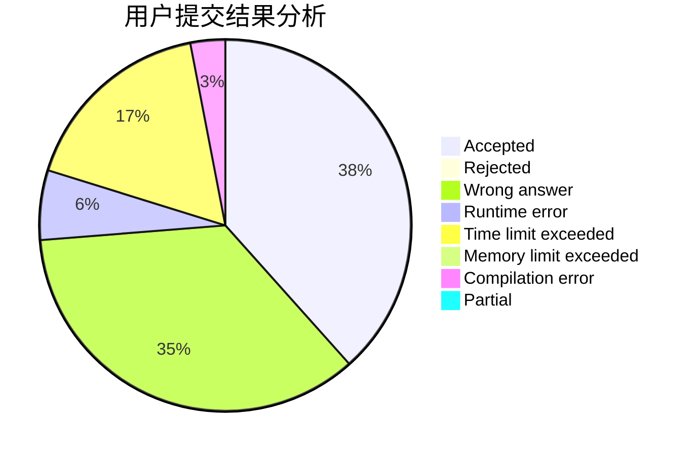
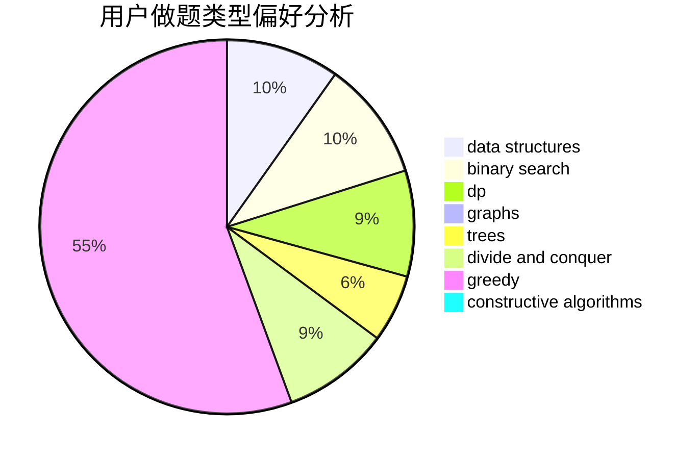
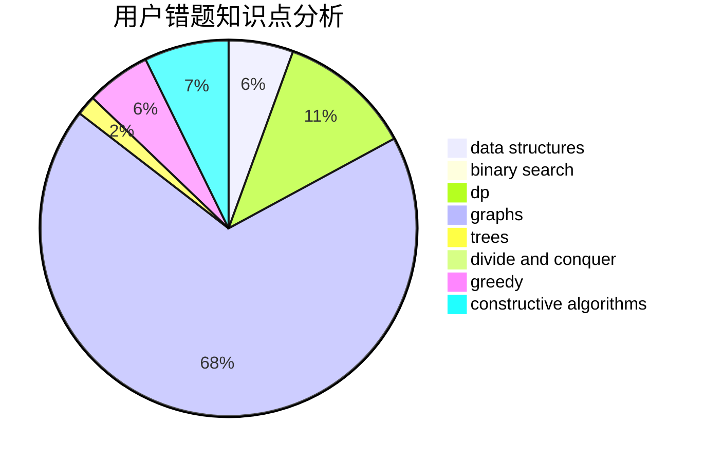

# Hile_Meow

<!-- tabs:start -->

#### **用户提交结果分析**

#### **用户做题类型偏好分析**

#### **用户错题知识点分析**

<!-- tabs:end -->
# 推荐题目
[1402B](https://codeforces.com/contest/1402/problem/B)		*special problem,
                        geometry,
                        sortings		  
[1436F](https://codeforces.com/contest/1436/problem/F)		combinatorics,
                        math,
                        number theory		  
[1204D1](https://codeforces.com/contest/1204D/problem/1)		brute force,
                        greedy,
                        strings		  
[246E](https://codeforces.com/contest/246/problem/E)		binary search,
                        data structures,
                        dfs and similar,
                        dp,
                        sortings		  
[1511G](https://codeforces.com/contest/1511/problem/G)		bitmasks,
                        brute force,
                        data structures,
                        games,
                        two pointers		  
[1083A](https://codeforces.com/contest/1083/problem/A)		data structures,
                        dp,
                        trees		  
[376B](https://codeforces.com/contest/376/problem/B)		implementation		  
[909F](https://codeforces.com/contest/909/problem/F)		constructive algorithms		  
[341D](https://codeforces.com/contest/341/problem/D)		data structures		  
[455B](https://codeforces.com/contest/455/problem/B)		dfs and similar,
                        dp,
                        games,
                        implementation,
                        strings,
                        trees		  
