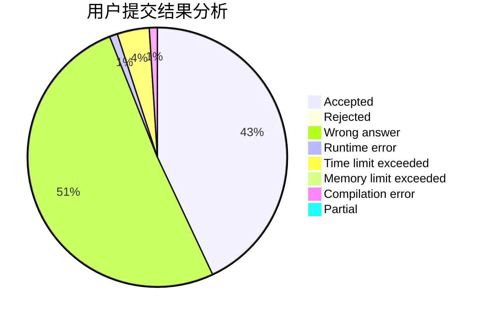
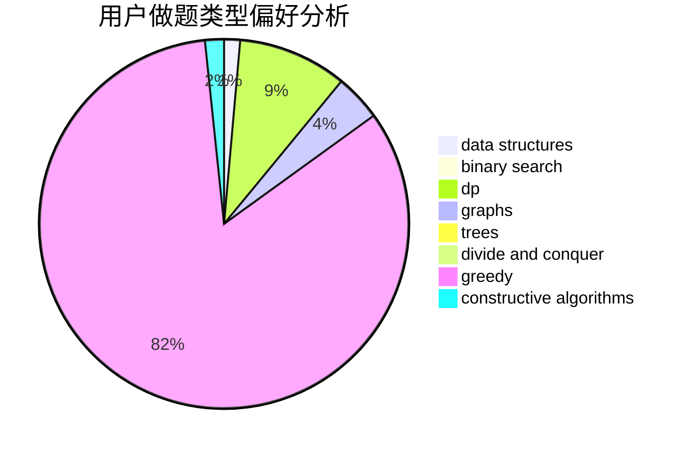

# Hobodog_Jo
<!-- tabs:start -->
#### **用户提交结果分析**

#### **用户做题类型偏好分析**

#### **用户错题知识点分析**

<!-- tabs:end -->
# 推荐题目
[Puzzle From the Future](http://codeforces.com/problemset/problem/1474/A)		greedy		  
[Case of Fugitive](http://codeforces.com/problemset/problem/555/B)		data structures,
                        greedy,
                        sortings		  
[April Fools' Problem (hard)](http://codeforces.com/problemset/problem/802/O)		binary search,
                        data structures,
                        flows		  
[Xor Tree](https://codeforces.com/contest/1447/problem/E)		binary search,
                        bitmasks,
                        data structures,
                        divide and conquer,
                        dp,
                        trees		  
[Nearest Minimums](http://codeforces.com/problemset/problem/911/A)		implementation		  
[Water Tree](http://codeforces.com/problemset/problem/343/D)		data structures,
                        dfs and similar,
                        graphs,
                        trees		  
[Desk Disorder](http://codeforces.com/problemset/problem/859/E)		combinatorics,
                        dfs and similar,
                        dsu,
                        graphs,
                        trees		  
[Coupons and Discounts](http://codeforces.com/problemset/problem/731/B)		constructive algorithms,
                        greedy		  
[Cubes](https://codeforces.com/contest/521/problem/B)		games,
                        greedy,
                        implementation		  
[Door Frames](http://codeforces.com/problemset/problem/910/B)		greedy,
                        implementation		  
<!-- tabs:start -->
#### **data structures**
[Puzzle From the Future](http://codeforces.com/problemset/problem/555/B)		data structures,
                        greedy,
                        sortings		  
[Case of Fugitive](http://codeforces.com/problemset/problem/802/O)		binary search,
                        data structures,
                        flows		  
[April Fools' Problem (hard)](https://codeforces.com/contest/1447/problem/E)		binary search,
                        bitmasks,
                        data structures,
                        divide and conquer,
                        dp,
                        trees		  
[Xor Tree](http://codeforces.com/problemset/problem/343/D)		data structures,
                        dfs and similar,
                        graphs,
                        trees		  
[Nearest Minimums](http://codeforces.com/problemset/problem/364/A)		combinatorics,
                        data structures,
                        implementation		  
[Water Tree](http://codeforces.com/problemset/problem/1167/E)		binary search,
                        combinatorics,
                        data structures,
                        two pointers		  
[Desk Disorder](http://codeforces.com/problemset/problem/1346/F)		*special problem,
                        data structures,
                        greedy,
                        math		  
[Coupons and Discounts](http://codeforces.com/problemset/problem/1185/C2)		brute force,
                        data structures,
                        greedy,
                        math		  
[Cubes](http://codeforces.com/problemset/problem/1007/D)		2-sat,
                        data structures,
                        trees		  
[Door Frames](http://codeforces.com/problemset/problem/1282/E)		constructive algorithms,
                        data structures,
                        dfs and similar,
                        graphs		  
#### **binary search**
[Puzzle From the Future](http://codeforces.com/problemset/problem/802/O)		binary search,
                        data structures,
                        flows		  
[Case of Fugitive](https://codeforces.com/contest/1447/problem/E)		binary search,
                        bitmasks,
                        data structures,
                        divide and conquer,
                        dp,
                        trees		  
[April Fools' Problem (hard)](http://codeforces.com/problemset/problem/1167/E)		binary search,
                        combinatorics,
                        data structures,
                        two pointers		  
[Xor Tree](http://codeforces.com/problemset/problem/1329/E)		binary search,
                        greedy		  
[Nearest Minimums](http://codeforces.com/problemset/problem/1367/F2)		binary search,
                        data structures,
                        dp,
                        greedy,
                        sortings,
                        two pointers		  
[Water Tree](http://codeforces.com/problemset/problem/6/E)		binary search,
                        data structures,
                        dsu,
                        trees,
                        two pointers		  
[Desk Disorder](http://codeforces.com/problemset/problem/1117/C)		binary search		  
[Coupons and Discounts](http://codeforces.com/problemset/problem/570/D)		binary search,
                        bitmasks,
                        constructive algorithms,
                        dfs and similar,
                        graphs,
                        trees		  
[Cubes](http://codeforces.com/problemset/problem/1463/A)		binary search,
                        math		  
[Door Frames](http://codeforces.com/problemset/problem/1492/C)		binary search,
                        data structures,
                        dp,
                        greedy,
                        two pointers		  
#### **dp**
[Puzzle From the Future](https://codeforces.com/contest/1447/problem/E)		binary search,
                        bitmasks,
                        data structures,
                        divide and conquer,
                        dp,
                        trees		  
[Case of Fugitive](https://codeforces.com/contest/236/problem/D)		dp,
                        math,
                        probabilities		  
[April Fools' Problem (hard)](http://codeforces.com/problemset/problem/1367/E)		brute force,
                        dfs and similar,
                        dp,
                        graphs,
                        greedy,
                        number theory		  
[Xor Tree](http://codeforces.com/problemset/problem/1367/F2)		binary search,
                        data structures,
                        dp,
                        greedy,
                        sortings,
                        two pointers		  
[Nearest Minimums](http://codeforces.com/problemset/problem/835/D)		brute force,
                        dp,
                        hashing,
                        strings		  
[Water Tree](http://codeforces.com/problemset/problem/720/D)		data structures,
                        dp,
                        sortings		  
[Desk Disorder](http://codeforces.com/problemset/problem/176/B)		dp		  
[Coupons and Discounts](http://codeforces.com/problemset/problem/1499/B)		brute force,
                        dp,
                        greedy,
                        implementation		  
[Cubes](http://codeforces.com/problemset/problem/1110/D)		dp		  
[Door Frames](http://codeforces.com/problemset/problem/1372/E)		dp,
                        greedy,
                        two pointers		  
#### **graph**
[Puzzle From the Future](http://codeforces.com/problemset/problem/343/D)		data structures,
                        dfs and similar,
                        graphs,
                        trees		  
[Case of Fugitive](http://codeforces.com/problemset/problem/859/E)		combinatorics,
                        dfs and similar,
                        dsu,
                        graphs,
                        trees		  
[April Fools' Problem (hard)](http://codeforces.com/problemset/problem/1367/E)		brute force,
                        dfs and similar,
                        dp,
                        graphs,
                        greedy,
                        number theory		  
[Xor Tree](http://codeforces.com/problemset/problem/1268/D)		brute force,
                        divide and conquer,
                        graphs,
                        math		  
[Nearest Minimums](http://codeforces.com/problemset/problem/1282/E)		constructive algorithms,
                        data structures,
                        dfs and similar,
                        graphs		  
[Water Tree](http://codeforces.com/problemset/problem/570/D)		binary search,
                        bitmasks,
                        constructive algorithms,
                        dfs and similar,
                        graphs,
                        trees		  
[Desk Disorder](http://codeforces.com/problemset/problem/1487/C)		brute force,
                        constructive algorithms,
                        dfs and similar,
                        graphs,
                        greedy,
                        implementation,
                        math		  
[Coupons and Discounts](http://codeforces.com/problemset/problem/1437/C)		dp,
                        flows,
                        graph matchings,
                        greedy,
                        math,
                        sortings		  
[Cubes](http://codeforces.com/problemset/problem/1470/D)		constructive algorithms,
                        dfs and similar,
                        graph matchings,
                        graphs,
                        greedy		  
[Door Frames](http://codeforces.com/problemset/problem/1476/C)		dp,
                        graphs,
                        greedy		  
#### **trees**
[Puzzle From the Future](https://codeforces.com/contest/1447/problem/E)		binary search,
                        bitmasks,
                        data structures,
                        divide and conquer,
                        dp,
                        trees		  
[Case of Fugitive](http://codeforces.com/problemset/problem/343/D)		data structures,
                        dfs and similar,
                        graphs,
                        trees		  
[April Fools' Problem (hard)](http://codeforces.com/problemset/problem/859/E)		combinatorics,
                        dfs and similar,
                        dsu,
                        graphs,
                        trees		  
[Xor Tree](http://codeforces.com/problemset/problem/1007/D)		2-sat,
                        data structures,
                        trees		  
[Nearest Minimums](http://codeforces.com/problemset/problem/6/E)		binary search,
                        data structures,
                        dsu,
                        trees,
                        two pointers		  
[Water Tree](http://codeforces.com/problemset/problem/570/D)		binary search,
                        bitmasks,
                        constructive algorithms,
                        dfs and similar,
                        graphs,
                        trees		  
[Desk Disorder](http://codeforces.com/problemset/problem/1479/D)		binary search,
                        bitmasks,
                        brute force,
                        data structures,
                        probabilities,
                        trees		  
[Coupons and Discounts](http://codeforces.com/problemset/problem/1511/C)		brute force,
                        data structures,
                        implementation,
                        trees		  
[Cubes](http://codeforces.com/problemset/problem/1499/F)		combinatorics,
                        dfs and similar,
                        dp,
                        trees		  
[Door Frames](http://codeforces.com/problemset/problem/1491/E)		brute force,
                        dfs and similar,
                        divide and conquer,
                        number theory,
                        trees		  
#### **divide and conquer**
[Puzzle From the Future](https://codeforces.com/contest/1447/problem/E)		binary search,
                        bitmasks,
                        data structures,
                        divide and conquer,
                        dp,
                        trees		  
[Case of Fugitive](http://codeforces.com/problemset/problem/1268/D)		brute force,
                        divide and conquer,
                        graphs,
                        math		  
[April Fools' Problem (hard)](http://codeforces.com/problemset/problem/1167/B)		brute force,
                        divide and conquer,
                        interactive,
                        math		  
[Xor Tree](http://codeforces.com/problemset/problem/1461/D)		binary search,
                        brute force,
                        data structures,
                        divide and conquer,
                        implementation,
                        sortings		  
[Nearest Minimums](http://codeforces.com/problemset/problem/1466/G)		combinatorics,
                        divide and conquer,
                        hashing,
                        math,
                        string suffix structures,
                        strings		  
[Water Tree](http://codeforces.com/problemset/problem/1490/D)		dfs and similar,
                        divide and conquer,
                        implementation		  
[Desk Disorder](https://codeforces.com/contest/1483/problem/C)		data structures,
                        divide and conquer,
                        dp		  
[Coupons and Discounts](http://codeforces.com/problemset/problem/1491/E)		brute force,
                        dfs and similar,
                        divide and conquer,
                        number theory,
                        trees		  
[Cubes](http://codeforces.com/problemset/problem/1303/G)		data structures,
                        divide and conquer,
                        geometry,
                        trees		  
[Door Frames](http://codeforces.com/problemset/problem/1494/D)		constructive algorithms,
                        data structures,
                        dfs and similar,
                        divide and conquer,
                        dsu,
                        greedy,
                        sortings,
                        trees		  
#### **greedy**
[Puzzle From the Future](http://codeforces.com/problemset/problem/1474/A)		greedy		  
[Case of Fugitive](http://codeforces.com/problemset/problem/555/B)		data structures,
                        greedy,
                        sortings		  
[April Fools' Problem (hard)](http://codeforces.com/problemset/problem/731/B)		constructive algorithms,
                        greedy		  
[Xor Tree](https://codeforces.com/contest/521/problem/B)		games,
                        greedy,
                        implementation		  
[Nearest Minimums](http://codeforces.com/problemset/problem/910/B)		greedy,
                        implementation		  
[Water Tree](http://codeforces.com/problemset/problem/1346/F)		*special problem,
                        data structures,
                        greedy,
                        math		  
[Desk Disorder](http://codeforces.com/problemset/problem/1185/C2)		brute force,
                        data structures,
                        greedy,
                        math		  
[Coupons and Discounts](http://codeforces.com/problemset/problem/1367/E)		brute force,
                        dfs and similar,
                        dp,
                        graphs,
                        greedy,
                        number theory		  
[Cubes](http://codeforces.com/problemset/problem/1329/E)		binary search,
                        greedy		  
[Door Frames](http://codeforces.com/problemset/problem/1367/F2)		binary search,
                        data structures,
                        dp,
                        greedy,
                        sortings,
                        two pointers		  
#### **constructive algorithms**
[Puzzle From the Future](http://codeforces.com/problemset/problem/731/B)		constructive algorithms,
                        greedy		  
[Case of Fugitive](http://codeforces.com/problemset/problem/1282/E)		constructive algorithms,
                        data structures,
                        dfs and similar,
                        graphs		  
[April Fools' Problem (hard)](http://codeforces.com/problemset/problem/1419/B)		brute force,
                        constructive algorithms,
                        greedy,
                        implementation,
                        math		  
[Xor Tree](https://codeforces.com/contest/1382/problem/C2)		constructive algorithms,
                        data structures,
                        implementation,
                        strings,
                        two pointers		  
[Nearest Minimums](http://codeforces.com/problemset/problem/570/D)		binary search,
                        bitmasks,
                        constructive algorithms,
                        dfs and similar,
                        graphs,
                        trees		  
[Water Tree](http://codeforces.com/problemset/problem/1497/C2)		constructive algorithms,
                        math		  
[Desk Disorder](http://codeforces.com/problemset/problem/305/A)		brute force,
                        constructive algorithms,
                        implementation		  
[Coupons and Discounts](http://codeforces.com/problemset/problem/1045/E)		constructive algorithms,
                        geometry		  
[Cubes](https://codeforces.com/contest/1480/problem/D1)		constructive algorithms,
                        data structures,
                        dp,
                        greedy,
                        implementation		  
[Door Frames](http://codeforces.com/problemset/problem/1493/A)		constructive algorithms,
                        greedy		  
#### **sortings**
[Puzzle From the Future](http://codeforces.com/problemset/problem/555/B)		data structures,
                        greedy,
                        sortings		  
[Case of Fugitive](http://codeforces.com/problemset/problem/1367/F2)		binary search,
                        data structures,
                        dp,
                        greedy,
                        sortings,
                        two pointers		  
[April Fools' Problem (hard)](http://codeforces.com/problemset/problem/720/D)		data structures,
                        dp,
                        sortings		  
[Xor Tree](https://codeforces.com/contest/1496/problem/C)		geometry,
                        greedy,
                        math,
                        sortings		  
[Nearest Minimums](http://codeforces.com/problemset/problem/1495/A)		geometry,
                        greedy,
                        math,
                        sortings		  
[Water Tree](http://codeforces.com/problemset/problem/1497/A)		brute force,
                        data structures,
                        greedy,
                        sortings		  
[Desk Disorder](http://codeforces.com/problemset/problem/1427/A)		math,
                        sortings		  
[Coupons and Discounts](http://codeforces.com/problemset/problem/1461/D)		binary search,
                        brute force,
                        data structures,
                        divide and conquer,
                        implementation,
                        sortings		  
[Cubes](http://codeforces.com/problemset/problem/1437/C)		dp,
                        flows,
                        graph matchings,
                        greedy,
                        math,
                        sortings		  
[Door Frames](http://codeforces.com/problemset/problem/1473/A)		greedy,
                        implementation,
                        math,
                        sortings		  
<!-- tabs:end -->
