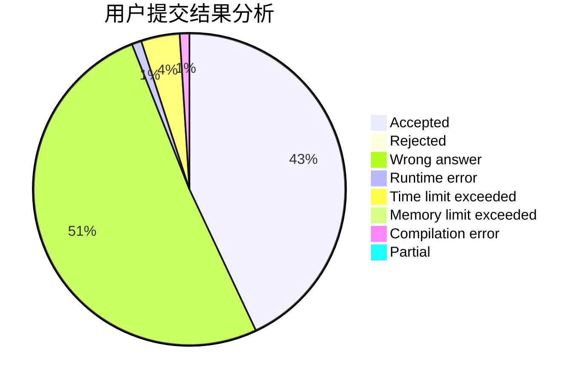
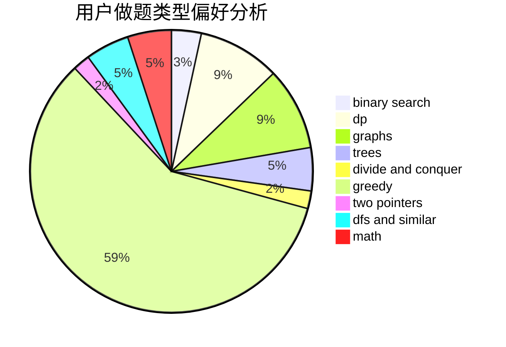

# Hobodog_Jo

<!-- tabs:start -->

#### **用户提交结果分析**

#### **用户做题类型偏好分析**

<!-- tabs:end -->
# 推荐题目
[1119B](https://codeforces.com/contest/1119/problem/B)
[25A](https://codeforces.com/contest/25/problem/A)
[1374B](https://codeforces.com/contest/1374/problem/B)
[1060E](https://codeforces.com/contest/1060/problem/E)
[591A](https://codeforces.com/contest/591/problem/A)
[920E](https://codeforces.com/contest/920/problem/E)
[717I](https://codeforces.com/contest/717/problem/I)
[128C](https://codeforces.com/contest/128/problem/C)
[1285D](https://codeforces.com/contest/1285/problem/D)
[877B](https://codeforces.com/contest/877/problem/B)
