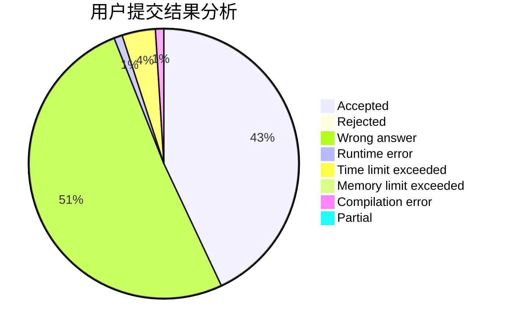
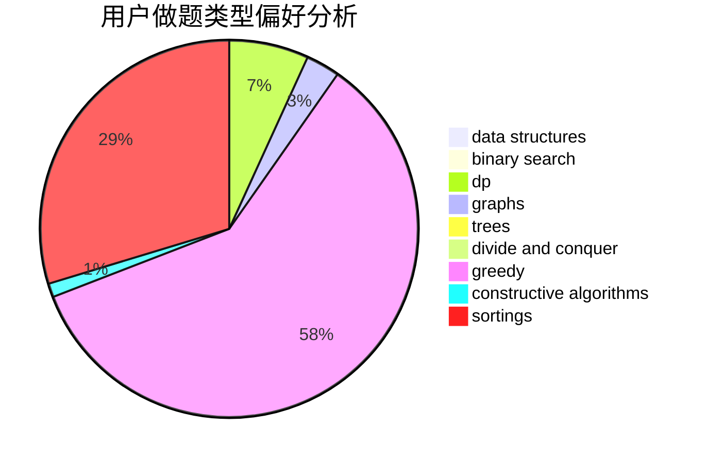
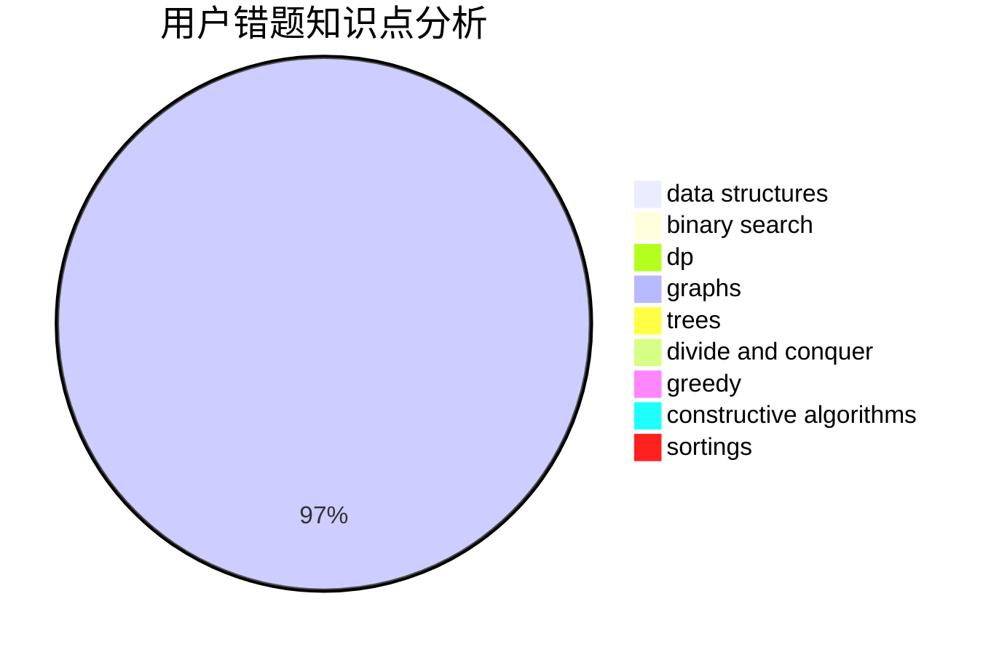

# Hobodog_Jo
<!-- tabs:start -->
#### **用户提交结果分析**

#### **用户做题类型偏好分析**

#### **用户错题知识点分析**

<!-- tabs:end -->
# 推荐题目
[1474A](http://codeforces.com/problemset/problem/1474/A)		greedy		  
[555B](http://codeforces.com/problemset/problem/555/B)		data structures,
                        greedy,
                        sortings		  
[802O](http://codeforces.com/problemset/problem/802/O)		binary search,
                        data structures,
                        flows		  
[1447E](https://codeforces.com/contest/1447/problem/E)		binary search,
                        bitmasks,
                        data structures,
                        divide and conquer,
                        dp,
                        trees		  
[911A](http://codeforces.com/problemset/problem/911/A)		implementation		  
[343D](http://codeforces.com/problemset/problem/343/D)		data structures,
                        dfs and similar,
                        graphs,
                        trees		  
[859E](http://codeforces.com/problemset/problem/859/E)		combinatorics,
                        dfs and similar,
                        dsu,
                        graphs,
                        trees		  
[731B](http://codeforces.com/problemset/problem/731/B)		constructive algorithms,
                        greedy		  
[521B](https://codeforces.com/contest/521/problem/B)		games,
                        greedy,
                        implementation		  
[910B](http://codeforces.com/problemset/problem/910/B)		greedy,
                        implementation		  
<!-- tabs:start -->
#### **data structures**
[555B](http://codeforces.com/problemset/problem/555/B)		data structures,
                        greedy,
                        sortings		  
[802O](http://codeforces.com/problemset/problem/802/O)		binary search,
                        data structures,
                        flows		  
[1447E](https://codeforces.com/contest/1447/problem/E)		binary search,
                        bitmasks,
                        data structures,
                        divide and conquer,
                        dp,
                        trees		  
[343D](http://codeforces.com/problemset/problem/343/D)		data structures,
                        dfs and similar,
                        graphs,
                        trees		  
[364A](http://codeforces.com/problemset/problem/364/A)		combinatorics,
                        data structures,
                        implementation		  
[1167E](http://codeforces.com/problemset/problem/1167/E)		binary search,
                        combinatorics,
                        data structures,
                        two pointers		  
[1346F](http://codeforces.com/problemset/problem/1346/F)		*special problem,
                        data structures,
                        greedy,
                        math		  
[1185C2](http://codeforces.com/problemset/problem/1185/C2)		brute force,
                        data structures,
                        greedy,
                        math		  
[1007D](http://codeforces.com/problemset/problem/1007/D)		2-sat,
                        data structures,
                        trees		  
[1282E](http://codeforces.com/problemset/problem/1282/E)		constructive algorithms,
                        data structures,
                        dfs and similar,
                        graphs		  
#### **binary search**
[802O](http://codeforces.com/problemset/problem/802/O)		binary search,
                        data structures,
                        flows		  
[1447E](https://codeforces.com/contest/1447/problem/E)		binary search,
                        bitmasks,
                        data structures,
                        divide and conquer,
                        dp,
                        trees		  
[1167E](http://codeforces.com/problemset/problem/1167/E)		binary search,
                        combinatorics,
                        data structures,
                        two pointers		  
[1329E](http://codeforces.com/problemset/problem/1329/E)		binary search,
                        greedy		  
[1367F2](http://codeforces.com/problemset/problem/1367/F2)		binary search,
                        data structures,
                        dp,
                        greedy,
                        sortings,
                        two pointers		  
[6E](http://codeforces.com/problemset/problem/6/E)		binary search,
                        data structures,
                        dsu,
                        trees,
                        two pointers		  
[1117C](http://codeforces.com/problemset/problem/1117/C)		binary search		  
[570D](http://codeforces.com/problemset/problem/570/D)		binary search,
                        bitmasks,
                        constructive algorithms,
                        dfs and similar,
                        graphs,
                        trees		  
[1463A](http://codeforces.com/problemset/problem/1463/A)		binary search,
                        math		  
[1492C](http://codeforces.com/problemset/problem/1492/C)		binary search,
                        data structures,
                        dp,
                        greedy,
                        two pointers		  
#### **dp**
[1447E](https://codeforces.com/contest/1447/problem/E)		binary search,
                        bitmasks,
                        data structures,
                        divide and conquer,
                        dp,
                        trees		  
[236D](https://codeforces.com/contest/236/problem/D)		dp,
                        math,
                        probabilities		  
[1367E](http://codeforces.com/problemset/problem/1367/E)		brute force,
                        dfs and similar,
                        dp,
                        graphs,
                        greedy,
                        number theory		  
[1367F2](http://codeforces.com/problemset/problem/1367/F2)		binary search,
                        data structures,
                        dp,
                        greedy,
                        sortings,
                        two pointers		  
[835D](http://codeforces.com/problemset/problem/835/D)		brute force,
                        dp,
                        hashing,
                        strings		  
[720D](http://codeforces.com/problemset/problem/720/D)		data structures,
                        dp,
                        sortings		  
[176B](http://codeforces.com/problemset/problem/176/B)		dp		  
[1499B](http://codeforces.com/problemset/problem/1499/B)		brute force,
                        dp,
                        greedy,
                        implementation		  
[1110D](http://codeforces.com/problemset/problem/1110/D)		dp		  
[1372E](http://codeforces.com/problemset/problem/1372/E)		dp,
                        greedy,
                        two pointers		  
#### **graph**
[343D](http://codeforces.com/problemset/problem/343/D)		data structures,
                        dfs and similar,
                        graphs,
                        trees		  
[859E](http://codeforces.com/problemset/problem/859/E)		combinatorics,
                        dfs and similar,
                        dsu,
                        graphs,
                        trees		  
[1367E](http://codeforces.com/problemset/problem/1367/E)		brute force,
                        dfs and similar,
                        dp,
                        graphs,
                        greedy,
                        number theory		  
[1268D](http://codeforces.com/problemset/problem/1268/D)		brute force,
                        divide and conquer,
                        graphs,
                        math		  
[1282E](http://codeforces.com/problemset/problem/1282/E)		constructive algorithms,
                        data structures,
                        dfs and similar,
                        graphs		  
[570D](http://codeforces.com/problemset/problem/570/D)		binary search,
                        bitmasks,
                        constructive algorithms,
                        dfs and similar,
                        graphs,
                        trees		  
[1487C](http://codeforces.com/problemset/problem/1487/C)		brute force,
                        constructive algorithms,
                        dfs and similar,
                        graphs,
                        greedy,
                        implementation,
                        math		  
[1437C](http://codeforces.com/problemset/problem/1437/C)		dp,
                        flows,
                        graph matchings,
                        greedy,
                        math,
                        sortings		  
[1470D](http://codeforces.com/problemset/problem/1470/D)		constructive algorithms,
                        dfs and similar,
                        graph matchings,
                        graphs,
                        greedy		  
[1476C](http://codeforces.com/problemset/problem/1476/C)		dp,
                        graphs,
                        greedy		  
#### **trees**
[1447E](https://codeforces.com/contest/1447/problem/E)		binary search,
                        bitmasks,
                        data structures,
                        divide and conquer,
                        dp,
                        trees		  
[343D](http://codeforces.com/problemset/problem/343/D)		data structures,
                        dfs and similar,
                        graphs,
                        trees		  
[859E](http://codeforces.com/problemset/problem/859/E)		combinatorics,
                        dfs and similar,
                        dsu,
                        graphs,
                        trees		  
[1007D](http://codeforces.com/problemset/problem/1007/D)		2-sat,
                        data structures,
                        trees		  
[6E](http://codeforces.com/problemset/problem/6/E)		binary search,
                        data structures,
                        dsu,
                        trees,
                        two pointers		  
[570D](http://codeforces.com/problemset/problem/570/D)		binary search,
                        bitmasks,
                        constructive algorithms,
                        dfs and similar,
                        graphs,
                        trees		  
[1479D](http://codeforces.com/problemset/problem/1479/D)		binary search,
                        bitmasks,
                        brute force,
                        data structures,
                        probabilities,
                        trees		  
[1511C](http://codeforces.com/problemset/problem/1511/C)		brute force,
                        data structures,
                        implementation,
                        trees		  
[1499F](http://codeforces.com/problemset/problem/1499/F)		combinatorics,
                        dfs and similar,
                        dp,
                        trees		  
[1491E](http://codeforces.com/problemset/problem/1491/E)		brute force,
                        dfs and similar,
                        divide and conquer,
                        number theory,
                        trees		  
#### **divide and conquer**
[1447E](https://codeforces.com/contest/1447/problem/E)		binary search,
                        bitmasks,
                        data structures,
                        divide and conquer,
                        dp,
                        trees		  
[1268D](http://codeforces.com/problemset/problem/1268/D)		brute force,
                        divide and conquer,
                        graphs,
                        math		  
[1167B](http://codeforces.com/problemset/problem/1167/B)		brute force,
                        divide and conquer,
                        interactive,
                        math		  
[1461D](http://codeforces.com/problemset/problem/1461/D)		binary search,
                        brute force,
                        data structures,
                        divide and conquer,
                        implementation,
                        sortings		  
[1466G](http://codeforces.com/problemset/problem/1466/G)		combinatorics,
                        divide and conquer,
                        hashing,
                        math,
                        string suffix structures,
                        strings		  
[1490D](http://codeforces.com/problemset/problem/1490/D)		dfs and similar,
                        divide and conquer,
                        implementation		  
[1483C](https://codeforces.com/contest/1483/problem/C)		data structures,
                        divide and conquer,
                        dp		  
[1491E](http://codeforces.com/problemset/problem/1491/E)		brute force,
                        dfs and similar,
                        divide and conquer,
                        number theory,
                        trees		  
[1303G](http://codeforces.com/problemset/problem/1303/G)		data structures,
                        divide and conquer,
                        geometry,
                        trees		  
[1494D](http://codeforces.com/problemset/problem/1494/D)		constructive algorithms,
                        data structures,
                        dfs and similar,
                        divide and conquer,
                        dsu,
                        greedy,
                        sortings,
                        trees		  
#### **greedy**
[1474A](http://codeforces.com/problemset/problem/1474/A)		greedy		  
[555B](http://codeforces.com/problemset/problem/555/B)		data structures,
                        greedy,
                        sortings		  
[731B](http://codeforces.com/problemset/problem/731/B)		constructive algorithms,
                        greedy		  
[521B](https://codeforces.com/contest/521/problem/B)		games,
                        greedy,
                        implementation		  
[910B](http://codeforces.com/problemset/problem/910/B)		greedy,
                        implementation		  
[1346F](http://codeforces.com/problemset/problem/1346/F)		*special problem,
                        data structures,
                        greedy,
                        math		  
[1185C2](http://codeforces.com/problemset/problem/1185/C2)		brute force,
                        data structures,
                        greedy,
                        math		  
[1367E](http://codeforces.com/problemset/problem/1367/E)		brute force,
                        dfs and similar,
                        dp,
                        graphs,
                        greedy,
                        number theory		  
[1329E](http://codeforces.com/problemset/problem/1329/E)		binary search,
                        greedy		  
[1367F2](http://codeforces.com/problemset/problem/1367/F2)		binary search,
                        data structures,
                        dp,
                        greedy,
                        sortings,
                        two pointers		  
#### **constructive algorithms**
[731B](http://codeforces.com/problemset/problem/731/B)		constructive algorithms,
                        greedy		  
[1282E](http://codeforces.com/problemset/problem/1282/E)		constructive algorithms,
                        data structures,
                        dfs and similar,
                        graphs		  
[1419B](http://codeforces.com/problemset/problem/1419/B)		brute force,
                        constructive algorithms,
                        greedy,
                        implementation,
                        math		  
[1382C2](https://codeforces.com/contest/1382/problem/C2)		constructive algorithms,
                        data structures,
                        implementation,
                        strings,
                        two pointers		  
[570D](http://codeforces.com/problemset/problem/570/D)		binary search,
                        bitmasks,
                        constructive algorithms,
                        dfs and similar,
                        graphs,
                        trees		  
[1497C2](http://codeforces.com/problemset/problem/1497/C2)		constructive algorithms,
                        math		  
[305A](http://codeforces.com/problemset/problem/305/A)		brute force,
                        constructive algorithms,
                        implementation		  
[1045E](http://codeforces.com/problemset/problem/1045/E)		constructive algorithms,
                        geometry		  
[1480D1](https://codeforces.com/contest/1480/problem/D1)		constructive algorithms,
                        data structures,
                        dp,
                        greedy,
                        implementation		  
[1493A](http://codeforces.com/problemset/problem/1493/A)		constructive algorithms,
                        greedy		  
#### **sortings**
[555B](http://codeforces.com/problemset/problem/555/B)		data structures,
                        greedy,
                        sortings		  
[1367F2](http://codeforces.com/problemset/problem/1367/F2)		binary search,
                        data structures,
                        dp,
                        greedy,
                        sortings,
                        two pointers		  
[720D](http://codeforces.com/problemset/problem/720/D)		data structures,
                        dp,
                        sortings		  
[1496C](https://codeforces.com/contest/1496/problem/C)		geometry,
                        greedy,
                        math,
                        sortings		  
[1495A](http://codeforces.com/problemset/problem/1495/A)		geometry,
                        greedy,
                        math,
                        sortings		  
[1497A](http://codeforces.com/problemset/problem/1497/A)		brute force,
                        data structures,
                        greedy,
                        sortings		  
[1427A](http://codeforces.com/problemset/problem/1427/A)		math,
                        sortings		  
[1461D](http://codeforces.com/problemset/problem/1461/D)		binary search,
                        brute force,
                        data structures,
                        divide and conquer,
                        implementation,
                        sortings		  
[1437C](http://codeforces.com/problemset/problem/1437/C)		dp,
                        flows,
                        graph matchings,
                        greedy,
                        math,
                        sortings		  
[1473A](http://codeforces.com/problemset/problem/1473/A)		greedy,
                        implementation,
                        math,
                        sortings		  
<!-- tabs:end -->
