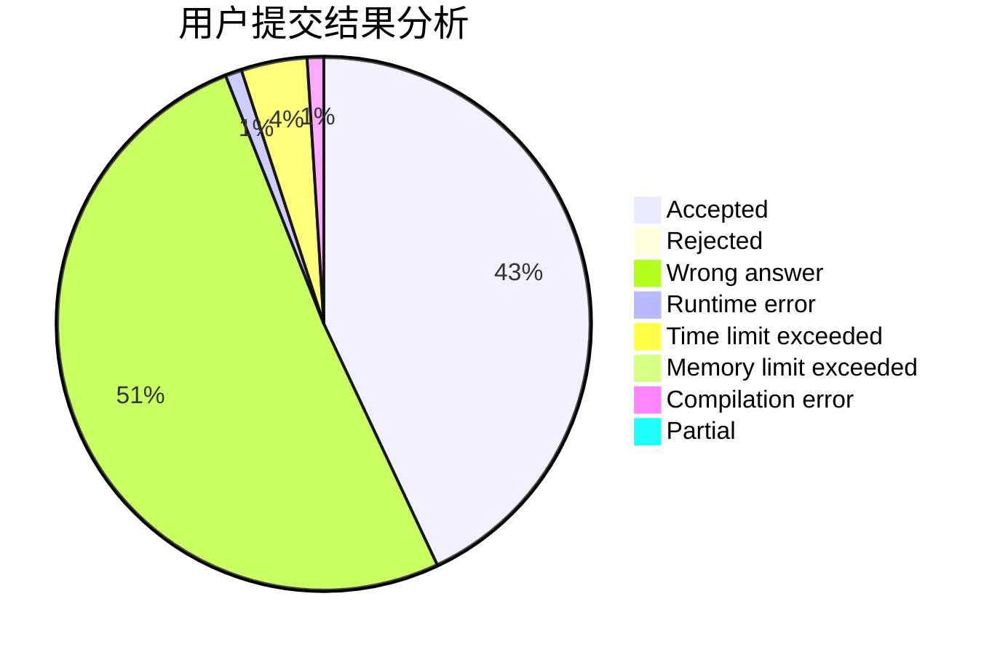
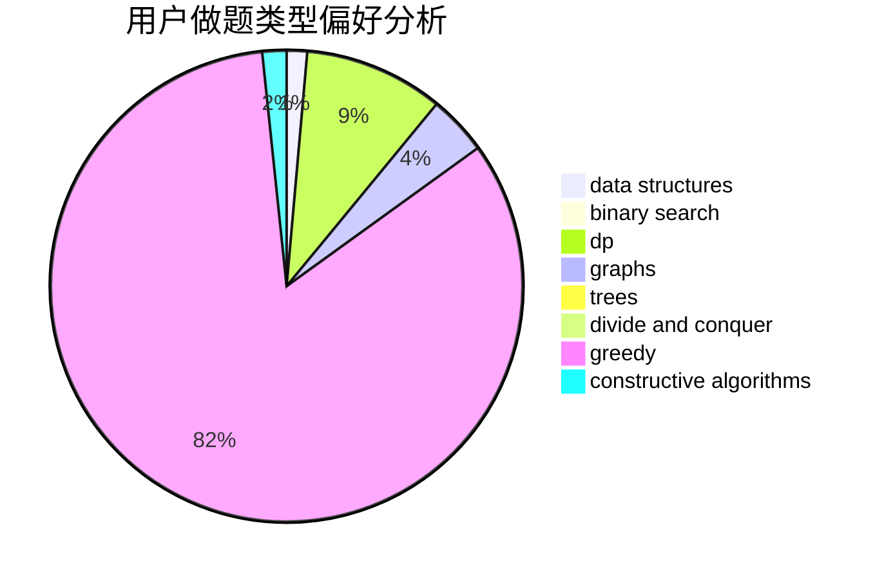

# Hobodog_Jo

<!-- tabs:start -->

#### **用户提交结果分析**

#### **用户做题类型偏好分析**

#### **用户错题知识点分析**

<!-- tabs:end -->
# 推荐题目
[1117C](https://codeforces.com/contest/1117/problem/C)		binary search		  
[236D](https://codeforces.com/contest/236/problem/D)		dsu,graphs,sortings,trees		  
[1367E](https://codeforces.com/contest/1367/problem/E)		brute force,
                        dfs and similar,
                        dp,
                        graphs,
                        greedy,
                        number theory		  
[1060B](https://codeforces.com/contest/1060/problem/B)		greedy		  
[570D](https://codeforces.com/contest/570/problem/D)		binary search,
                        bitmasks,
                        constructive algorithms,
                        dfs and similar,
                        graphs,
                        trees		  
[907A](https://codeforces.com/contest/907/problem/A)		brute force,
                        implementation		  
[6E](https://codeforces.com/contest/6/problem/E)		binary search,
                        data structures,
                        dsu,
                        trees,
                        two pointers		  
[1282E](https://codeforces.com/contest/1282/problem/E)		constructive algorithms,
                        data structures,
                        dfs and similar,
                        graphs		  
[1279C](https://codeforces.com/contest/1279/problem/C)		data structures,
                        implementation		  
[859E](https://codeforces.com/contest/859/problem/E)		combinatorics,
                        dfs and similar,
                        dsu,
                        graphs,
                        trees		  
