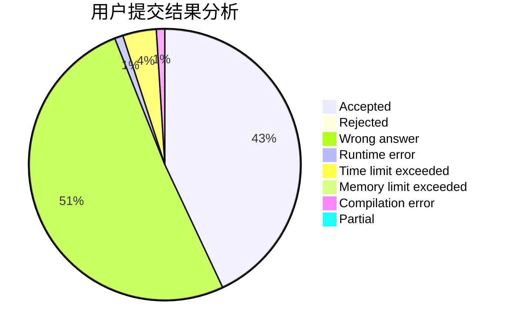
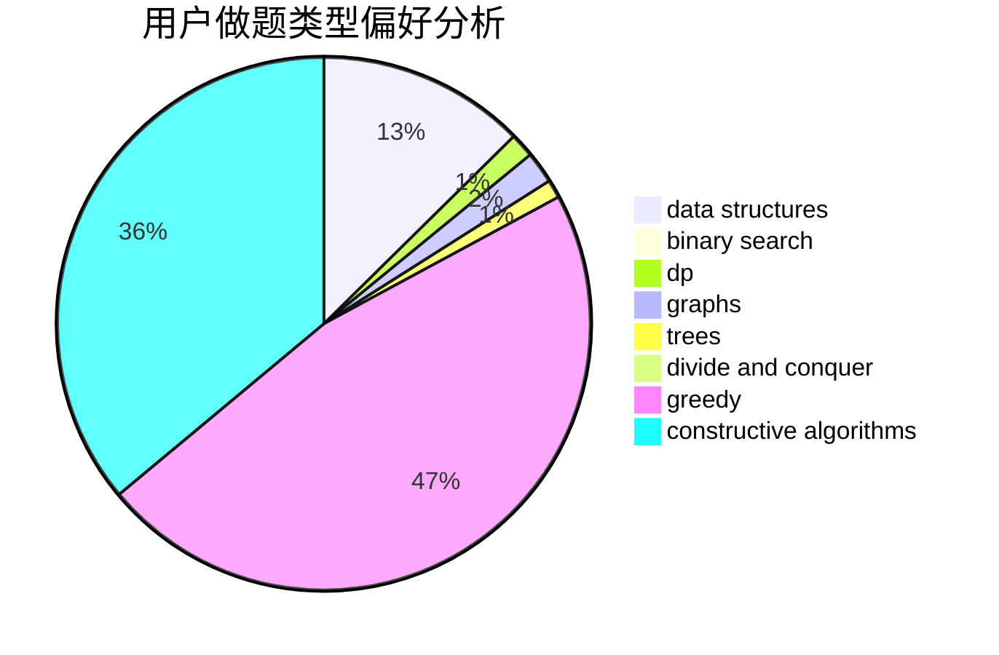
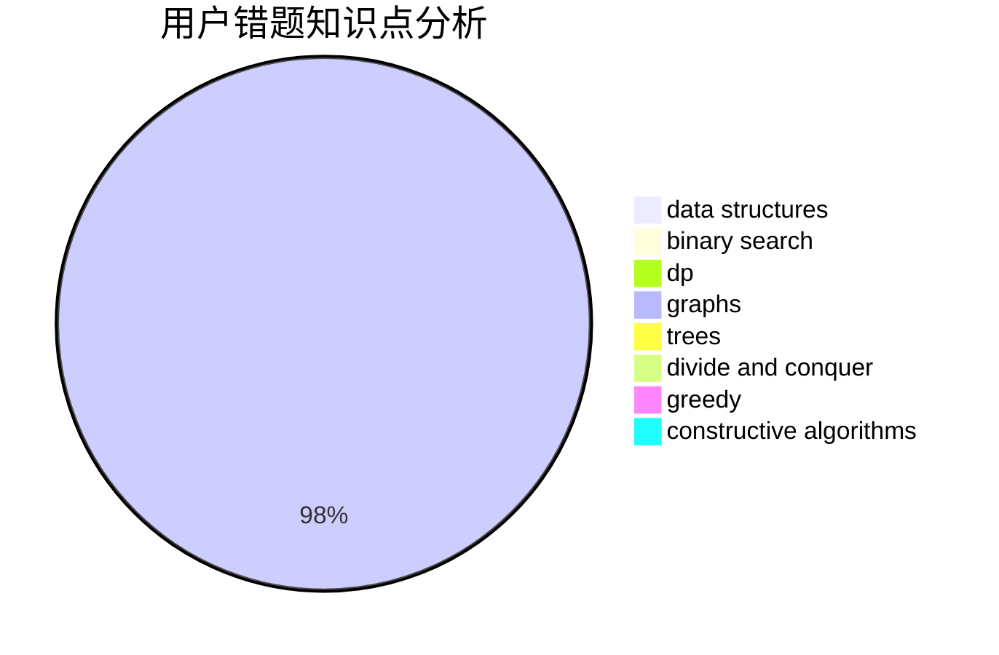

# Hobodog_Jo

<!-- tabs:start -->

#### **用户提交结果分析**

#### **用户做题类型偏好分析**

#### **用户错题知识点分析**

<!-- tabs:end -->
# 推荐题目
[1119B](https://codeforces.com/contest/1119/problem/B)		binary search,
                        flows,
                        greedy,
                        sortings		  
[25A](https://codeforces.com/contest/25/problem/A)		brute force		  
[1374B](https://codeforces.com/contest/1374/problem/B)		math		  
[1060E](https://codeforces.com/contest/1060/problem/E)		dfs and similar,
                        dp,
                        trees		  
[591A](https://codeforces.com/contest/591/problem/A)		implementation,
                        math		  
[920E](https://codeforces.com/contest/920/problem/E)		data structures,
                        dfs and similar,
                        dsu,
                        graphs		  
[717I](https://codeforces.com/contest/717/problem/I)		geometry		  
[128C](https://codeforces.com/contest/128/problem/C)		combinatorics,
                        dp		  
[1285D](https://codeforces.com/contest/1285/problem/D)		bitmasks,
                        brute force,
                        dfs and similar,
                        divide and conquer,
                        dp,
                        greedy,
                        strings,
                        trees		  
[877B](https://codeforces.com/contest/877/problem/B)		brute force,
                        dp		  
