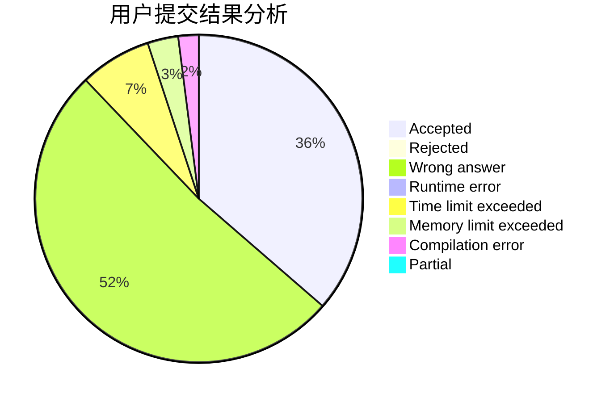
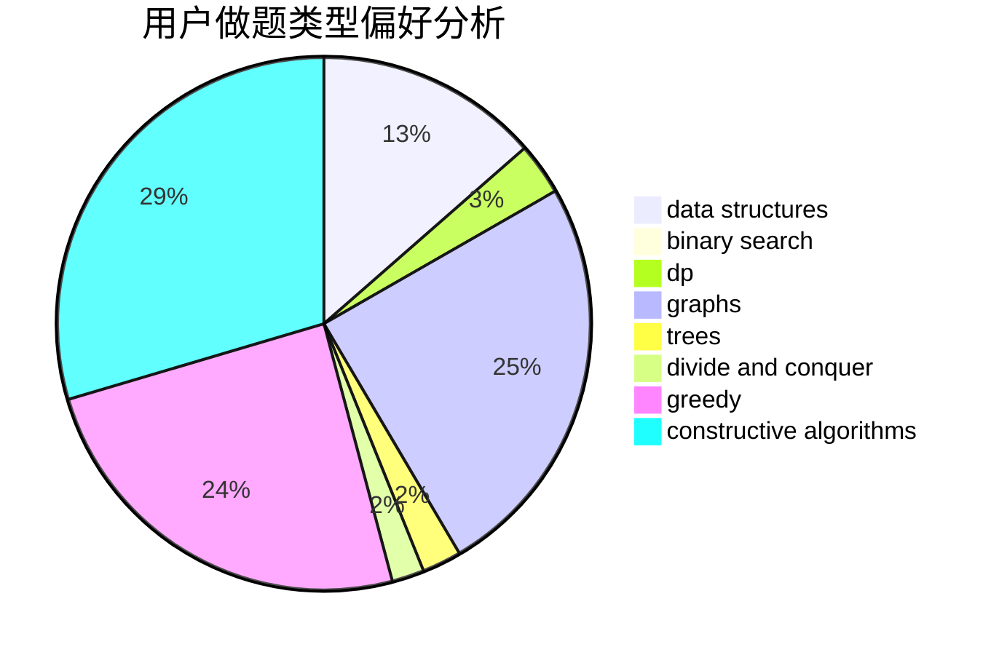
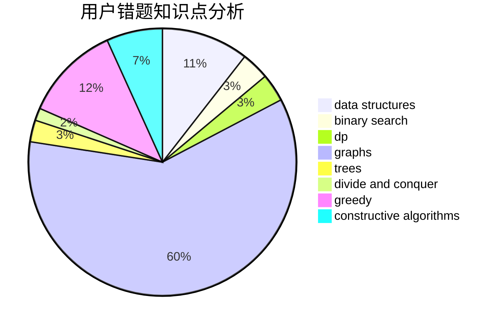

# 24680esz

<!-- tabs:start -->

#### **用户提交结果分析**

#### **用户做题类型偏好分析**

#### **用户错题知识点分析**

<!-- tabs:end -->
# 推荐题目
[1323D](https://codeforces.com/contest/1323/problem/D)		dsu,graphs,sortings,trees		  
[1322C](https://codeforces.com/contest/1322/problem/C)		graphs,
                        hashing,
                        math,
                        number theory		  
[1203D1](https://codeforces.com/contest/1203D/problem/1)		greedy,
                        implementation		  
[1028C](https://codeforces.com/contest/1028/problem/C)		geometry,
                        implementation,
                        sortings		  
[1322D](https://codeforces.com/contest/1322/problem/D)		bitmasks,
                        dp		  
[1322F](https://codeforces.com/contest/1322/problem/F)		dp,
                        trees		  
[1321E](https://codeforces.com/contest/1321/problem/E)		dsu,graphs,sortings,trees		  
[1323A](https://codeforces.com/contest/1323/problem/A)		brute force,
                        dp,
                        greedy,
                        implementation		  
[1321D](https://codeforces.com/contest/1321/problem/D)		dsu,graphs,sortings,trees		  
[101D](https://codeforces.com/contest/101/problem/D)		dp,
                        greedy,
                        probabilities,
                        sortings,
                        trees		  
