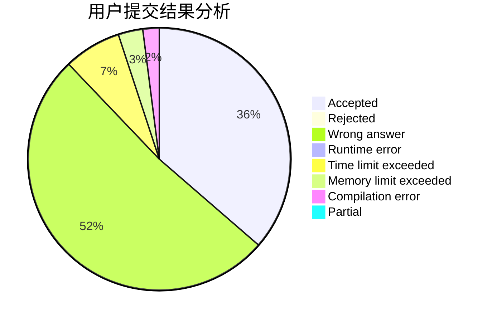
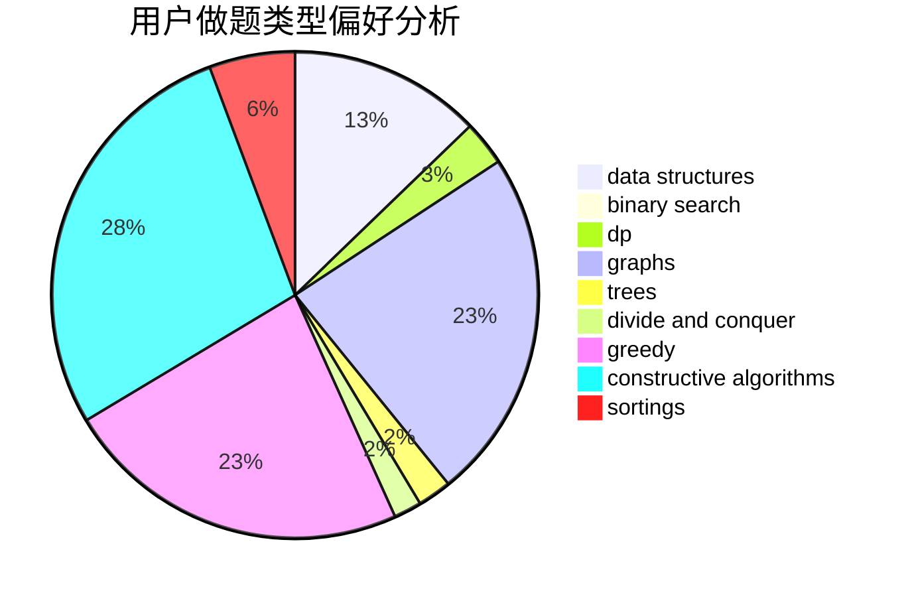
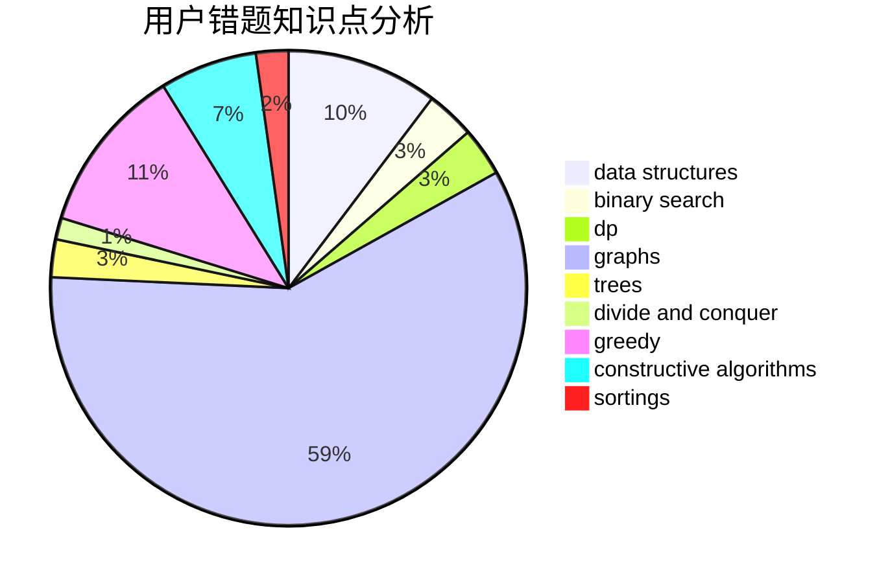

# 24680esz
<!-- tabs:start -->
#### **用户提交结果分析**

#### **用户做题类型偏好分析**

#### **用户错题知识点分析**

<!-- tabs:end -->
# 推荐题目
[1323D](https://codeforces.com/contest/1323/problem/D)		binary search,
                        bitmasks,
                        constructive algorithms,
                        data structures,
                        math,
                        sortings		  
[1322C](http://codeforces.com/problemset/problem/1322/C)		graphs,
                        hashing,
                        math,
                        number theory		  
[1321E](https://codeforces.com/contest/1321/problem/E)		brute force,
                        data structures,
                        sortings		  
[1203D1](http://codeforces.com/problemset/problem/1203/D1)		greedy,
                        implementation		  
[1028C](http://codeforces.com/problemset/problem/1028/C)		geometry,
                        implementation,
                        sortings		  
[1321D](https://codeforces.com/contest/1321/problem/D)		dfs and similar,
                        graphs,
                        shortest paths		  
[1322D](http://codeforces.com/problemset/problem/1322/D)		bitmasks,
                        dp		  
[1322E](http://codeforces.com/problemset/problem/1322/E)		data structures		  
[1324C](http://codeforces.com/problemset/problem/1324/C)		binary search,
                        data structures,
                        dfs and similar,
                        greedy,
                        implementation		  
[1323B](http://codeforces.com/problemset/problem/1323/B)		binary search,
                        greedy,
                        implementation		  
<!-- tabs:start -->
#### **data structures**
[1323D](https://codeforces.com/contest/1323/problem/D)		binary search,
                        bitmasks,
                        constructive algorithms,
                        data structures,
                        math,
                        sortings		  
[1321E](https://codeforces.com/contest/1321/problem/E)		brute force,
                        data structures,
                        sortings		  
[1322E](http://codeforces.com/problemset/problem/1322/E)		data structures		  
[1324C](http://codeforces.com/problemset/problem/1324/C)		binary search,
                        data structures,
                        dfs and similar,
                        greedy,
                        implementation		  
[1321F](https://codeforces.com/contest/1321/problem/F)		data structures,
                        hashing,
                        strings		  
[1321B](https://codeforces.com/contest/1321/problem/B)		data structures,
                        dp,
                        greedy,
                        math,
                        sortings		  
[1143E](https://codeforces.com/contest/1143/problem/E)		data structures,
                        dfs and similar,
                        dp,
                        math,
                        trees		  
[1324D](http://codeforces.com/problemset/problem/1324/D)		binary search,
                        data structures,
                        sortings,
                        two pointers		  
[1322B](http://codeforces.com/problemset/problem/1322/B)		binary search,
                        bitmasks,
                        constructive algorithms,
                        data structures,
                        math,
                        sortings		  
[1492C](http://codeforces.com/problemset/problem/1492/C)		binary search,
                        data structures,
                        dp,
                        greedy,
                        two pointers		  
#### **binary search**
[1323D](https://codeforces.com/contest/1323/problem/D)		binary search,
                        bitmasks,
                        constructive algorithms,
                        data structures,
                        math,
                        sortings		  
[1324C](http://codeforces.com/problemset/problem/1324/C)		binary search,
                        data structures,
                        dfs and similar,
                        greedy,
                        implementation		  
[1323B](http://codeforces.com/problemset/problem/1323/B)		binary search,
                        greedy,
                        implementation		  
[1100C](http://codeforces.com/problemset/problem/1100/C)		binary search,
                        geometry,
                        math		  
[1324D](http://codeforces.com/problemset/problem/1324/D)		binary search,
                        data structures,
                        sortings,
                        two pointers		  
[1322B](http://codeforces.com/problemset/problem/1322/B)		binary search,
                        bitmasks,
                        constructive algorithms,
                        data structures,
                        math,
                        sortings		  
[1492C](http://codeforces.com/problemset/problem/1492/C)		binary search,
                        data structures,
                        dp,
                        greedy,
                        two pointers		  
[1463D](http://codeforces.com/problemset/problem/1463/D)		binary search,
                        constructive algorithms,
                        greedy,
                        two pointers		  
[1490G](http://codeforces.com/problemset/problem/1490/G)		binary search,
                        data structures,
                        math		  
[1479D](http://codeforces.com/problemset/problem/1479/D)		binary search,
                        bitmasks,
                        brute force,
                        data structures,
                        probabilities,
                        trees		  
#### **dp**
[1322D](http://codeforces.com/problemset/problem/1322/D)		bitmasks,
                        dp		  
[1322F](http://codeforces.com/problemset/problem/1322/F)		dp,
                        trees		  
[1253C](http://codeforces.com/problemset/problem/1253/C)		dp,
                        greedy,
                        math,
                        sortings		  
[101D](http://codeforces.com/problemset/problem/101/D)		dp,
                        greedy,
                        probabilities,
                        sortings,
                        trees		  
[1321B](https://codeforces.com/contest/1321/problem/B)		data structures,
                        dp,
                        greedy,
                        math,
                        sortings		  
[1143E](https://codeforces.com/contest/1143/problem/E)		data structures,
                        dfs and similar,
                        dp,
                        math,
                        trees		  
[1323A](http://codeforces.com/problemset/problem/1323/A)		brute force,
                        dp,
                        greedy,
                        implementation		  
[1492C](http://codeforces.com/problemset/problem/1492/C)		binary search,
                        data structures,
                        dp,
                        greedy,
                        two pointers		  
[1457C](https://codeforces.com/contest/1457/problem/C)		brute force,
                        dp,
                        implementation		  
[1491C](http://codeforces.com/problemset/problem/1491/C)		brute force,
                        data structures,
                        dp,
                        greedy,
                        implementation		  
#### **graph**
[1322C](http://codeforces.com/problemset/problem/1322/C)		graphs,
                        hashing,
                        math,
                        number theory		  
[1321D](https://codeforces.com/contest/1321/problem/D)		dfs and similar,
                        graphs,
                        shortest paths		  
[1270G](http://codeforces.com/problemset/problem/1270/G)		constructive algorithms,
                        dfs and similar,
                        graphs,
                        math		  
[1487C](http://codeforces.com/problemset/problem/1487/C)		brute force,
                        constructive algorithms,
                        dfs and similar,
                        graphs,
                        greedy,
                        implementation,
                        math		  
[1437C](http://codeforces.com/problemset/problem/1437/C)		dp,
                        flows,
                        graph matchings,
                        greedy,
                        math,
                        sortings		  
[1470D](http://codeforces.com/problemset/problem/1470/D)		constructive algorithms,
                        dfs and similar,
                        graph matchings,
                        graphs,
                        greedy		  
[1476C](http://codeforces.com/problemset/problem/1476/C)		dp,
                        graphs,
                        greedy		  
[1304D](http://codeforces.com/problemset/problem/1304/D)		constructive algorithms,
                        graphs,
                        greedy,
                        two pointers		  
[1475C](http://codeforces.com/problemset/problem/1475/C)		combinatorics,
                        graphs,
                        math		  
[553E](http://codeforces.com/problemset/problem/553/E)		dp,
                        fft,
                        graphs,
                        math,
                        probabilities		  
#### **trees**
[1322F](http://codeforces.com/problemset/problem/1322/F)		dp,
                        trees		  
[101D](http://codeforces.com/problemset/problem/101/D)		dp,
                        greedy,
                        probabilities,
                        sortings,
                        trees		  
[1143E](https://codeforces.com/contest/1143/problem/E)		data structures,
                        dfs and similar,
                        dp,
                        math,
                        trees		  
[1479D](http://codeforces.com/problemset/problem/1479/D)		binary search,
                        bitmasks,
                        brute force,
                        data structures,
                        probabilities,
                        trees		  
[1511C](http://codeforces.com/problemset/problem/1511/C)		brute force,
                        data structures,
                        implementation,
                        trees		  
[1499F](http://codeforces.com/problemset/problem/1499/F)		combinatorics,
                        dfs and similar,
                        dp,
                        trees		  
[1491E](http://codeforces.com/problemset/problem/1491/E)		brute force,
                        dfs and similar,
                        divide and conquer,
                        number theory,
                        trees		  
[1466D](http://codeforces.com/problemset/problem/1466/D)		data structures,
                        greedy,
                        sortings,
                        trees		  
[1495D](http://codeforces.com/problemset/problem/1495/D)		combinatorics,
                        dfs and similar,
                        graphs,
                        math,
                        shortest paths,
                        trees		  
[1303G](http://codeforces.com/problemset/problem/1303/G)		data structures,
                        divide and conquer,
                        geometry,
                        trees		  
#### **divide and conquer**
[1461D](http://codeforces.com/problemset/problem/1461/D)		binary search,
                        brute force,
                        data structures,
                        divide and conquer,
                        implementation,
                        sortings		  
[1466G](http://codeforces.com/problemset/problem/1466/G)		combinatorics,
                        divide and conquer,
                        hashing,
                        math,
                        string suffix structures,
                        strings		  
[1490D](http://codeforces.com/problemset/problem/1490/D)		dfs and similar,
                        divide and conquer,
                        implementation		  
[1483C](https://codeforces.com/contest/1483/problem/C)		data structures,
                        divide and conquer,
                        dp		  
[1491E](http://codeforces.com/problemset/problem/1491/E)		brute force,
                        dfs and similar,
                        divide and conquer,
                        number theory,
                        trees		  
[1303G](http://codeforces.com/problemset/problem/1303/G)		data structures,
                        divide and conquer,
                        geometry,
                        trees		  
[1494D](http://codeforces.com/problemset/problem/1494/D)		constructive algorithms,
                        data structures,
                        dfs and similar,
                        divide and conquer,
                        dsu,
                        greedy,
                        sortings,
                        trees		  
[1482E](http://codeforces.com/problemset/problem/1482/E)		data structures,
                        divide and conquer,
                        dp		  
[566C](http://codeforces.com/problemset/problem/566/C)		dfs and similar,
                        divide and conquer,
                        trees		  
[1428F](http://codeforces.com/problemset/problem/1428/F)		binary search,
                        data structures,
                        divide and conquer,
                        dp,
                        two pointers		  
#### **greedy**
[1203D1](http://codeforces.com/problemset/problem/1203/D1)		greedy,
                        implementation		  
[1324C](http://codeforces.com/problemset/problem/1324/C)		binary search,
                        data structures,
                        dfs and similar,
                        greedy,
                        implementation		  
[1323B](http://codeforces.com/problemset/problem/1323/B)		binary search,
                        greedy,
                        implementation		  
[1253C](http://codeforces.com/problemset/problem/1253/C)		dp,
                        greedy,
                        math,
                        sortings		  
[1323C](https://codeforces.com/contest/1323/problem/C)		greedy		  
[1017C](http://codeforces.com/problemset/problem/1017/C)		constructive algorithms,
                        greedy		  
[101D](http://codeforces.com/problemset/problem/101/D)		dp,
                        greedy,
                        probabilities,
                        sortings,
                        trees		  
[1321B](https://codeforces.com/contest/1321/problem/B)		data structures,
                        dp,
                        greedy,
                        math,
                        sortings		  
[1323A](http://codeforces.com/problemset/problem/1323/A)		brute force,
                        dp,
                        greedy,
                        implementation		  
[1321C](http://codeforces.com/problemset/problem/1321/C)		brute force,
                        constructive algorithms,
                        greedy,
                        strings		  
#### **constructive algorithms**
[1323D](https://codeforces.com/contest/1323/problem/D)		binary search,
                        bitmasks,
                        constructive algorithms,
                        data structures,
                        math,
                        sortings		  
[1270G](http://codeforces.com/problemset/problem/1270/G)		constructive algorithms,
                        dfs and similar,
                        graphs,
                        math		  
[1017C](http://codeforces.com/problemset/problem/1017/C)		constructive algorithms,
                        greedy		  
[1321C](http://codeforces.com/problemset/problem/1321/C)		brute force,
                        constructive algorithms,
                        greedy,
                        strings		  
[1322B](http://codeforces.com/problemset/problem/1322/B)		binary search,
                        bitmasks,
                        constructive algorithms,
                        data structures,
                        math,
                        sortings		  
[1493A](http://codeforces.com/problemset/problem/1493/A)		constructive algorithms,
                        greedy		  
[1463D](http://codeforces.com/problemset/problem/1463/D)		binary search,
                        constructive algorithms,
                        greedy,
                        two pointers		  
[1456B](https://codeforces.com/contest/1456/problem/B)		bitmasks,
                        brute force,
                        constructive algorithms		  
[1492D](http://codeforces.com/problemset/problem/1492/D)		bitmasks,
                        constructive algorithms,
                        greedy,
                        math		  
[1504D](https://codeforces.com/contest/1504/problem/D)		constructive algorithms,
                        games,
                        interactive		  
#### **sortings**
[1323D](https://codeforces.com/contest/1323/problem/D)		binary search,
                        bitmasks,
                        constructive algorithms,
                        data structures,
                        math,
                        sortings		  
[1321E](https://codeforces.com/contest/1321/problem/E)		brute force,
                        data structures,
                        sortings		  
[1028C](http://codeforces.com/problemset/problem/1028/C)		geometry,
                        implementation,
                        sortings		  
[1253C](http://codeforces.com/problemset/problem/1253/C)		dp,
                        greedy,
                        math,
                        sortings		  
[101D](http://codeforces.com/problemset/problem/101/D)		dp,
                        greedy,
                        probabilities,
                        sortings,
                        trees		  
[1321B](https://codeforces.com/contest/1321/problem/B)		data structures,
                        dp,
                        greedy,
                        math,
                        sortings		  
[1324D](http://codeforces.com/problemset/problem/1324/D)		binary search,
                        data structures,
                        sortings,
                        two pointers		  
[1322B](http://codeforces.com/problemset/problem/1322/B)		binary search,
                        bitmasks,
                        constructive algorithms,
                        data structures,
                        math,
                        sortings		  
[1496C](https://codeforces.com/contest/1496/problem/C)		geometry,
                        greedy,
                        math,
                        sortings		  
[1495A](http://codeforces.com/problemset/problem/1495/A)		geometry,
                        greedy,
                        math,
                        sortings		  
<!-- tabs:end -->
