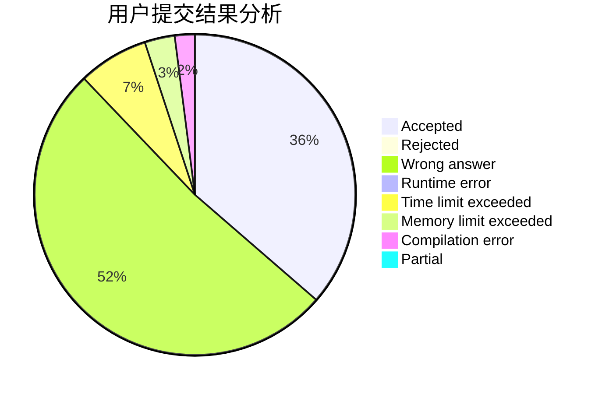
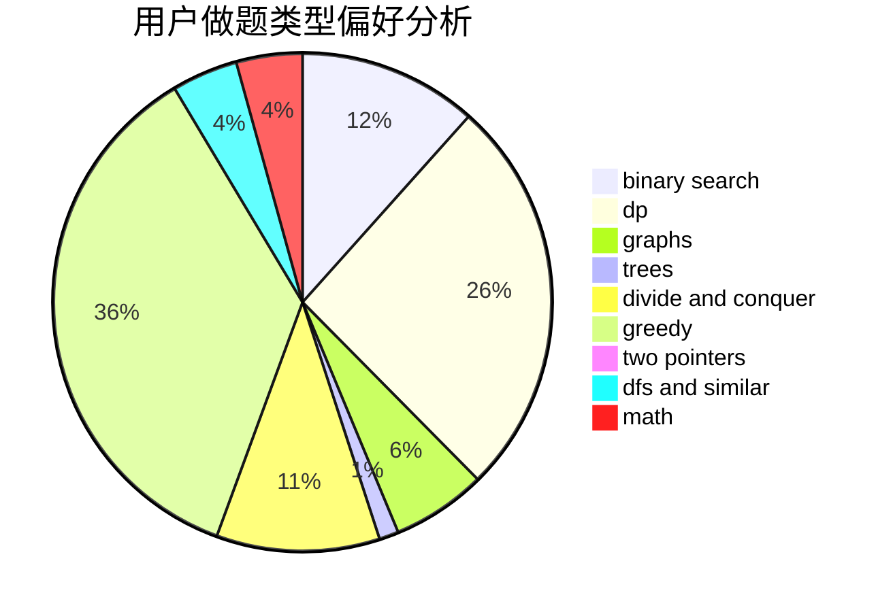

# 24680esz

<!-- tabs:start -->

#### **用户提交结果分析**

#### **用户做题类型偏好分析**

<!-- tabs:end -->
# 推荐题目
[1330B](https://codeforces.com/contest/1330/problem/B)
[1329B](https://codeforces.com/contest/1329/problem/B)
[1208A](https://codeforces.com/contest/1208/problem/A)
[1028G](https://codeforces.com/contest/1028/problem/G)
[1329C](https://codeforces.com/contest/1329/problem/C)
[1329E](https://codeforces.com/contest/1329/problem/E)
[1328D](https://codeforces.com/contest/1328/problem/D)
[132C](https://codeforces.com/contest/132/problem/C)
[1328C](https://codeforces.com/contest/1328/problem/C)
[1020C](https://codeforces.com/contest/1020/problem/C)
