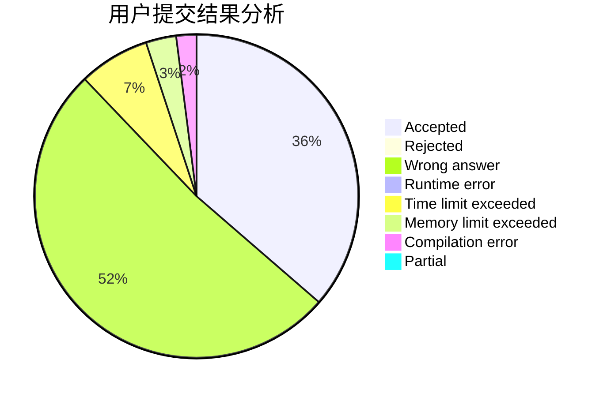
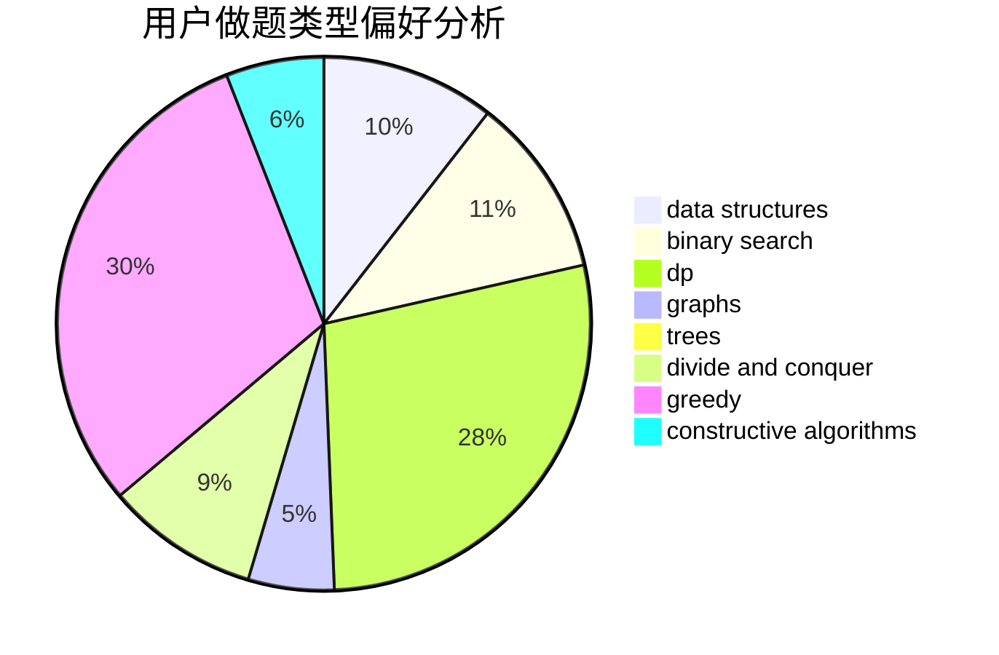
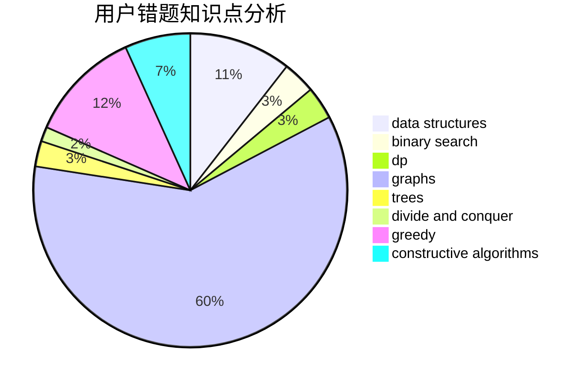

# 24680esz

<!-- tabs:start -->

#### **用户提交结果分析**

#### **用户做题类型偏好分析**

#### **用户错题知识点分析**

<!-- tabs:end -->
# 推荐题目
[1330B](https://codeforces.com/contest/1330/problem/B)		implementation,
                        math		  
[1329B](https://codeforces.com/contest/1329/problem/B)		bitmasks,
                        combinatorics,
                        math		  
[1208A](https://codeforces.com/contest/1208/problem/A)		math		  
[1028G](https://codeforces.com/contest/1028/problem/G)		dp,
                        interactive		  
[1329C](https://codeforces.com/contest/1329/problem/C)		constructive algorithms,
                        data structures,
                        greedy,
                        implementation		  
[1329E](https://codeforces.com/contest/1329/problem/E)		binary search,
                        greedy		  
[1328D](https://codeforces.com/contest/1328/problem/D)		constructive algorithms,
                        dp,
                        graphs,
                        greedy,
                        math		  
[132C](https://codeforces.com/contest/132/problem/C)		dp		  
[1328C](https://codeforces.com/contest/1328/problem/C)		greedy,
                        implementation		  
[1020C](https://codeforces.com/contest/1020/problem/C)		dsu,graphs,sortings,trees		  
