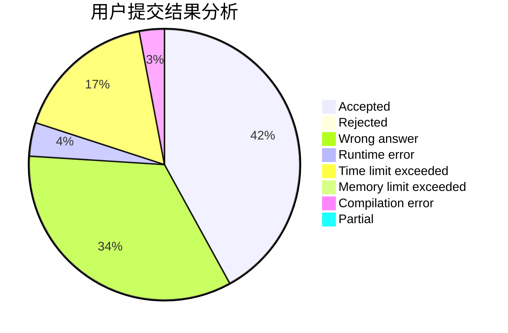
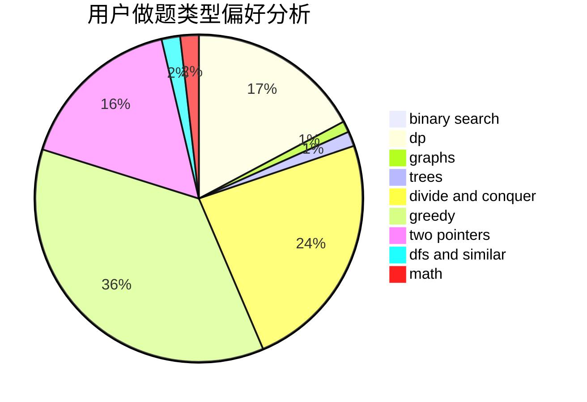

# Holmesee

<!-- tabs:start -->

#### **用户提交结果分析**

#### **用户做题类型偏好分析**

<!-- tabs:end -->
# 推荐题目
[10C](https://codeforces.com/contest/10/problem/C)
[1017G](https://codeforces.com/contest/1017/problem/G)
[243C](https://codeforces.com/contest/243/problem/C)
[1019E](https://codeforces.com/contest/1019/problem/E)
[280B](https://codeforces.com/contest/280/problem/B)
[609C](https://codeforces.com/contest/609/problem/C)
[116C](https://codeforces.com/contest/116/problem/C)
[26D](https://codeforces.com/contest/26/problem/D)
[682B](https://codeforces.com/contest/682/problem/B)
[1120F](https://codeforces.com/contest/1120/problem/F)
