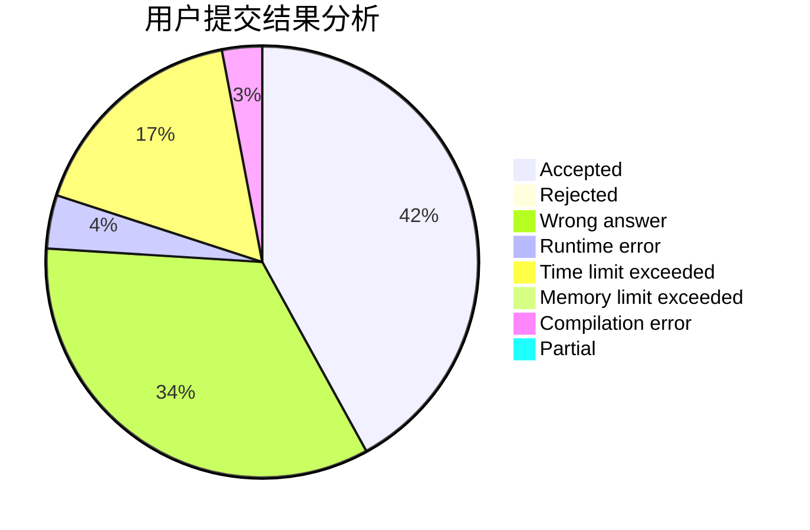
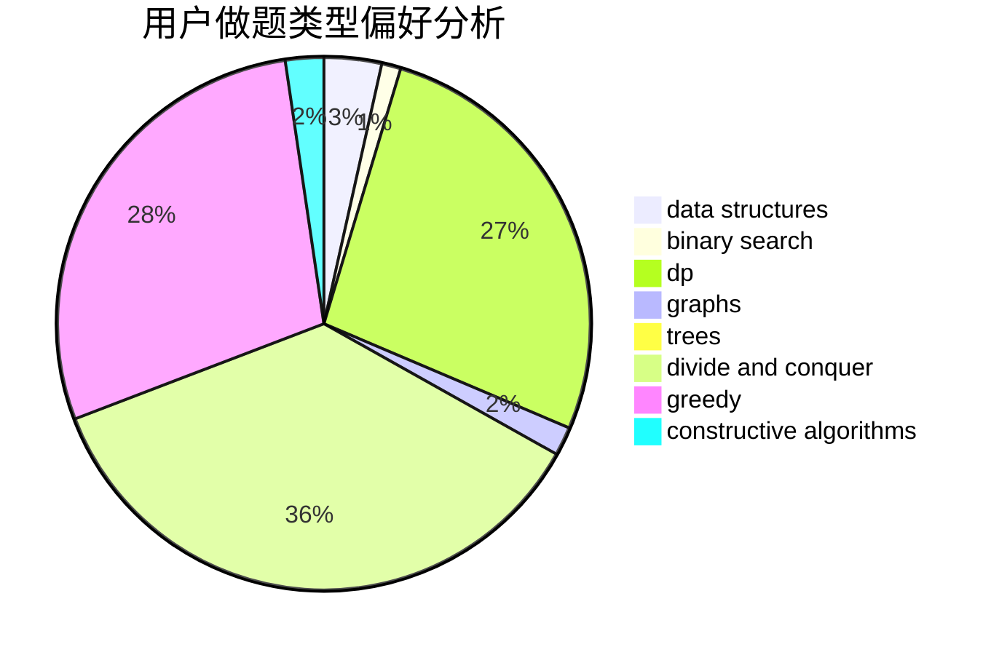
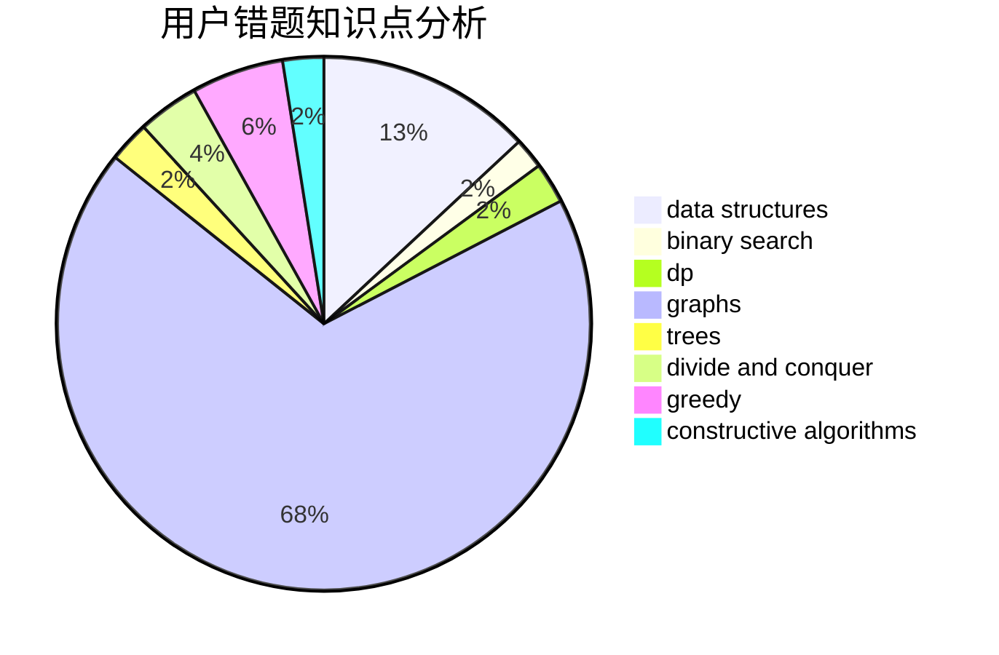

# Holmesee

<!-- tabs:start -->

#### **用户提交结果分析**

#### **用户做题类型偏好分析**

#### **用户错题知识点分析**

<!-- tabs:end -->
# 推荐题目
[10C](https://codeforces.com/contest/10/problem/C)		number theory		  
[1017G](https://codeforces.com/contest/1017/problem/G)		data structures		  
[243C](https://codeforces.com/contest/243/problem/C)		dfs and similar,
                        implementation		  
[1019E](https://codeforces.com/contest/1019/problem/E)		data structures,
                        divide and conquer,
                        trees		  
[280B](https://codeforces.com/contest/280/problem/B)		data structures,
                        implementation,
                        two pointers		  
[609C](https://codeforces.com/contest/609/problem/C)		implementation,
                        math		  
[116C](https://codeforces.com/contest/116/problem/C)		dsu,graphs,sortings,trees		  
[26D](https://codeforces.com/contest/26/problem/D)		combinatorics,
                        math,
                        probabilities		  
[682B](https://codeforces.com/contest/682/problem/B)		sortings		  
[1120F](https://codeforces.com/contest/1120/problem/F)		data structures,
                        dp,
                        greedy		  
