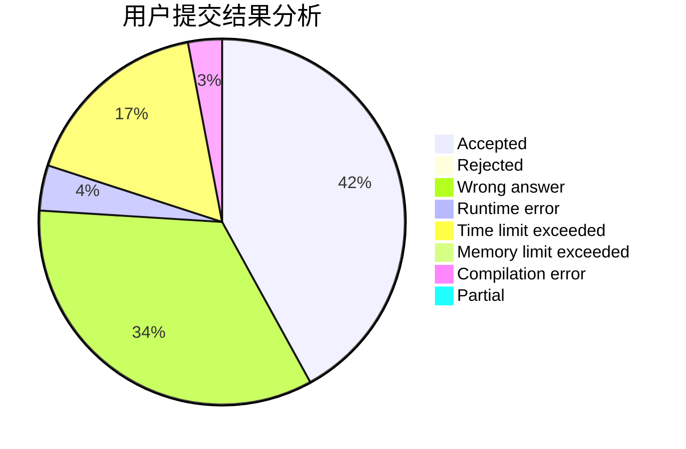
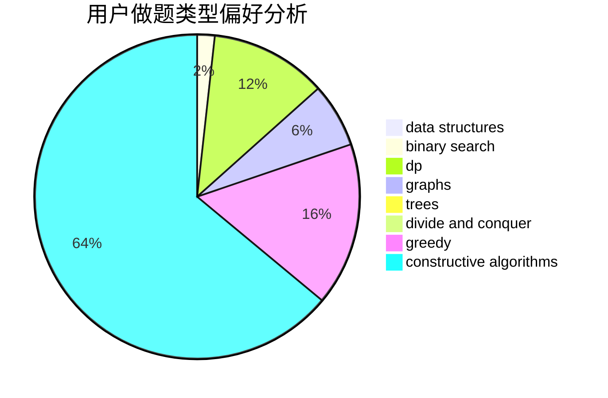
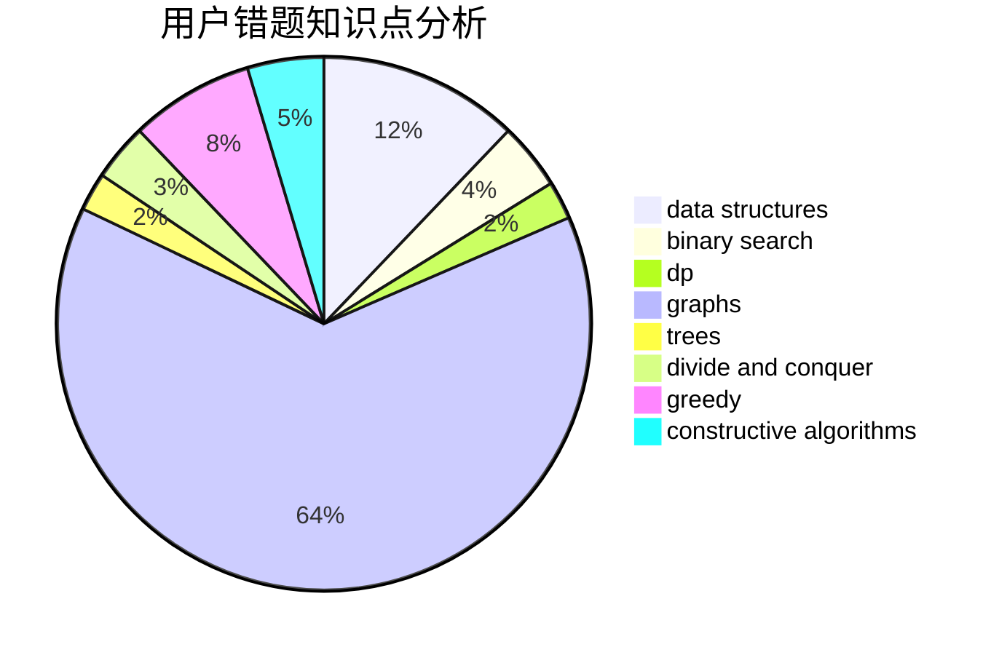

# Holmesee

<!-- tabs:start -->

#### **用户提交结果分析**

#### **用户做题类型偏好分析**

#### **用户错题知识点分析**

<!-- tabs:end -->
# 推荐题目
[109A](https://codeforces.com/contest/109/problem/A)		brute force,
                        implementation		  
[1017D](https://codeforces.com/contest/1017/problem/D)		bitmasks,
                        brute force,
                        data structures		  
[225C](https://codeforces.com/contest/225/problem/C)		dp,
                        matrices		  
[1019A](https://codeforces.com/contest/1019/problem/A)		brute force,
                        greedy		  
[264B](https://codeforces.com/contest/264/problem/B)		dp,
                        number theory		  
[58B](https://codeforces.com/contest/58/problem/B)		greedy		  
[1166F](https://codeforces.com/contest/1166/problem/F)		data structures,
                        dsu,
                        graphs,
                        hashing		  
[253A](https://codeforces.com/contest/253/problem/A)		greedy		  
[662B](https://codeforces.com/contest/662/problem/B)		dfs and similar,
                        graphs		  
[1118F2](https://codeforces.com/contest/1118F/problem/2)		combinatorics,
                        dfs and similar,
                        dp,
                        trees		  
