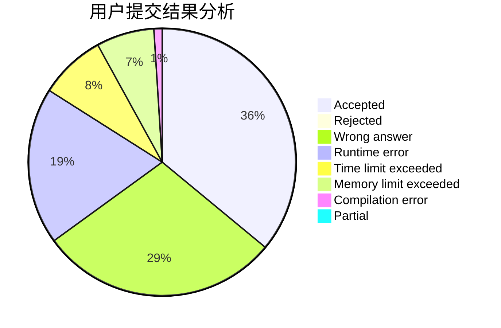
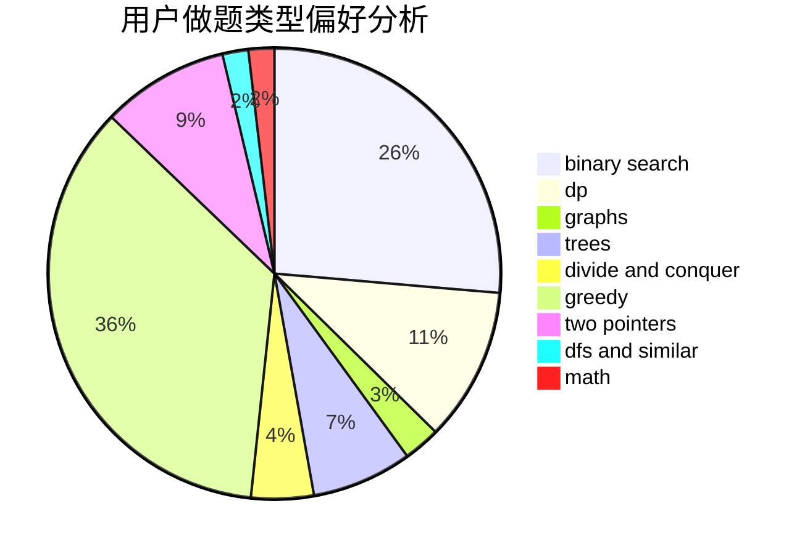

# HolyK

<!-- tabs:start -->

#### **用户提交结果分析**

#### **用户做题类型偏好分析**

<!-- tabs:end -->
# 推荐题目
[928B](https://codeforces.com/contest/928/problem/B)
[288E](https://codeforces.com/contest/288/problem/E)
[1366B](https://codeforces.com/contest/1366/problem/B)
[612A](https://codeforces.com/contest/612/problem/A)
[251D](https://codeforces.com/contest/251/problem/D)
[591B](https://codeforces.com/contest/591/problem/B)
[1245D](https://codeforces.com/contest/1245/problem/D)
[180C](https://codeforces.com/contest/180/problem/C)
[216D](https://codeforces.com/contest/216/problem/D)
[50D](https://codeforces.com/contest/50/problem/D)
