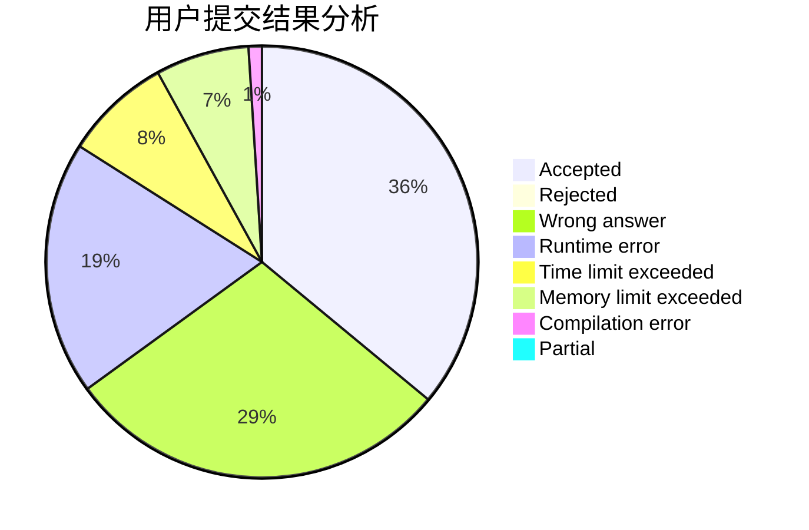
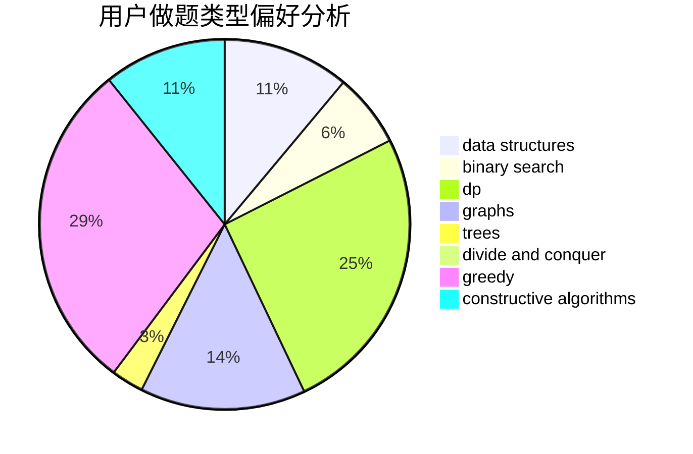
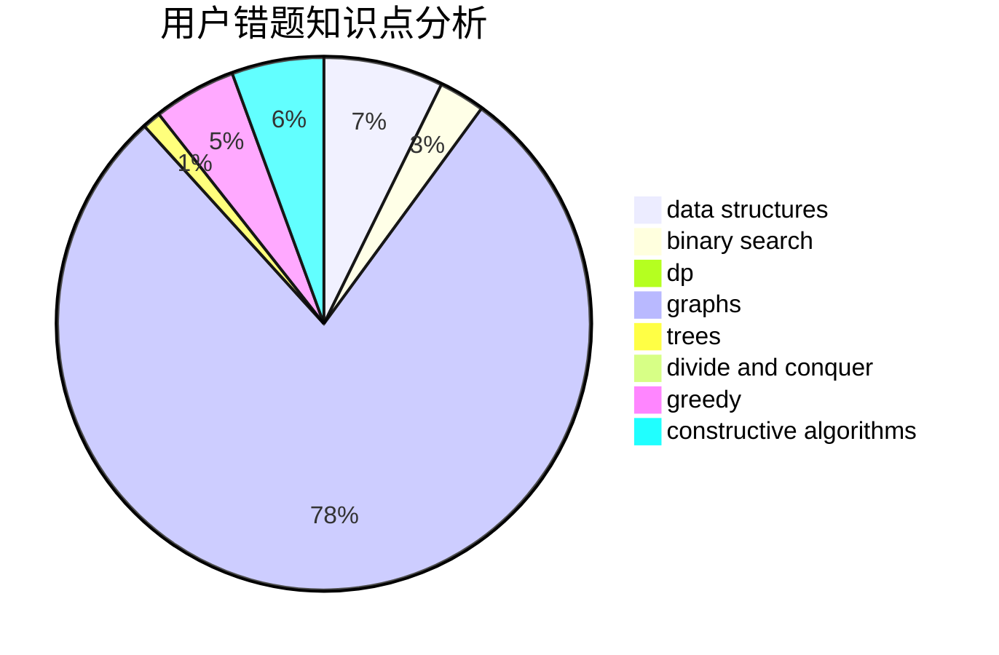

# HolyK

<!-- tabs:start -->

#### **用户提交结果分析**

#### **用户做题类型偏好分析**

#### **用户错题知识点分析**

<!-- tabs:end -->
# 推荐题目
[911C](https://codeforces.com/contest/911/problem/C)		brute force,
                        constructive algorithms		  
[272E](https://codeforces.com/contest/272/problem/E)		combinatorics,
                        constructive algorithms,
                        graphs		  
[1357E2](https://codeforces.com/contest/1357E/problem/2)		nan		  
[593D](https://codeforces.com/contest/593/problem/D)		data structures,
                        dfs and similar,
                        graphs,
                        math,
                        trees		  
[231A](https://codeforces.com/contest/231/problem/A)		brute force,
                        greedy		  
[570E](https://codeforces.com/contest/570/problem/E)		combinatorics,
                        dp		  
[1240A](https://codeforces.com/contest/1240/problem/A)		dsu,graphs,sortings,trees		  
[158C](https://codeforces.com/contest/158/problem/C)		*special problem,
                        data structures,
                        implementation		  
[193C](https://codeforces.com/contest/193/problem/C)		constructive algorithms,
                        greedy,
                        math,
                        matrices		  
[489F](https://codeforces.com/contest/489/problem/F)		combinatorics,
                        dp		  
