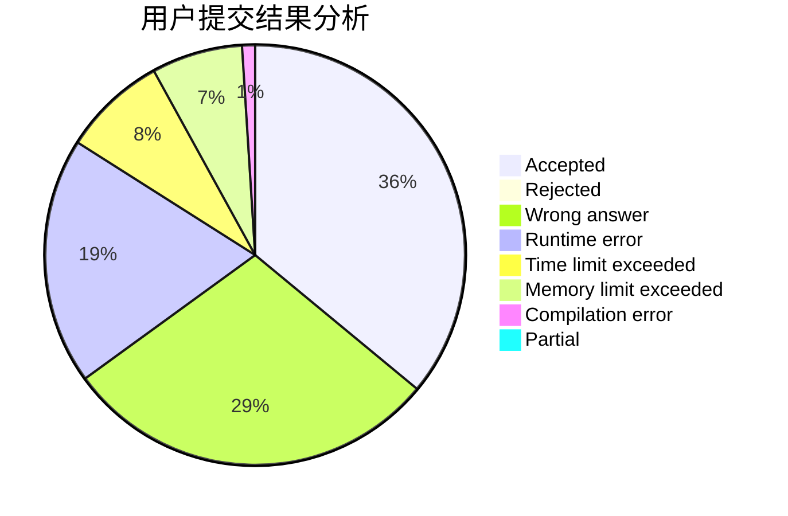
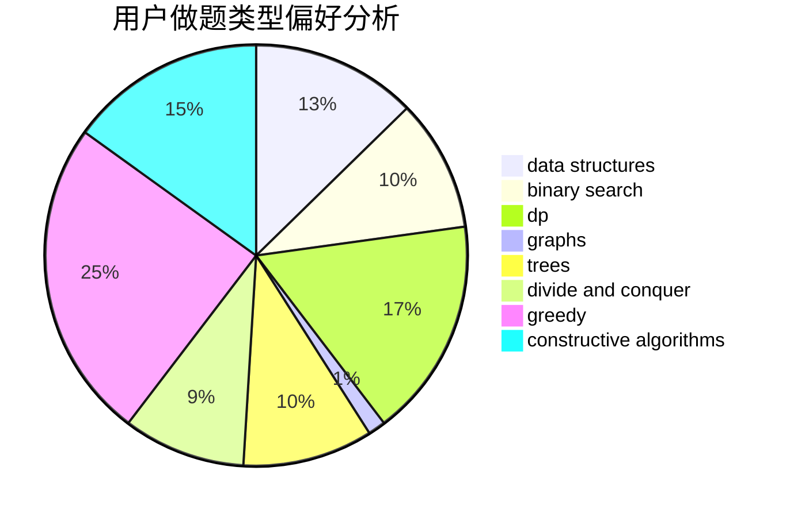
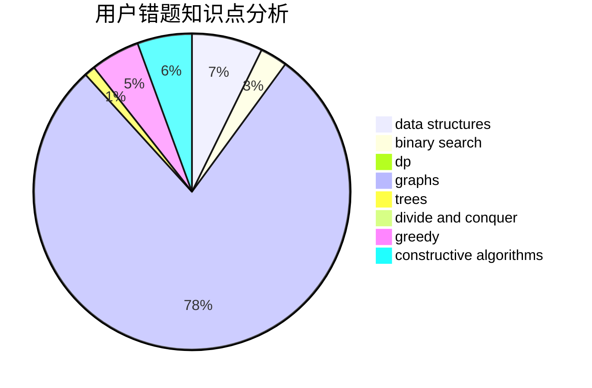

# HolyK

<!-- tabs:start -->

#### **用户提交结果分析**

#### **用户做题类型偏好分析**

#### **用户错题知识点分析**

<!-- tabs:end -->
# 推荐题目
[928B](https://codeforces.com/contest/928/problem/B)		*special problem,
                        dp		  
[288E](https://codeforces.com/contest/288/problem/E)		dp,
                        implementation,
                        math		  
[1366B](https://codeforces.com/contest/1366/problem/B)		math,
                        two pointers		  
[612A](https://codeforces.com/contest/612/problem/A)		brute force,
                        implementation,
                        strings		  
[251D](https://codeforces.com/contest/251/problem/D)		bitmasks,
                        math		  
[591B](https://codeforces.com/contest/591/problem/B)		implementation,
                        strings		  
[1245D](https://codeforces.com/contest/1245/problem/D)		dsu,
                        graphs,
                        greedy,
                        shortest paths,
                        trees		  
[180C](https://codeforces.com/contest/180/problem/C)		dp		  
[216D](https://codeforces.com/contest/216/problem/D)		binary search,
                        sortings,
                        two pointers		  
[50D](https://codeforces.com/contest/50/problem/D)		binary search,
                        dp,
                        probabilities		  
