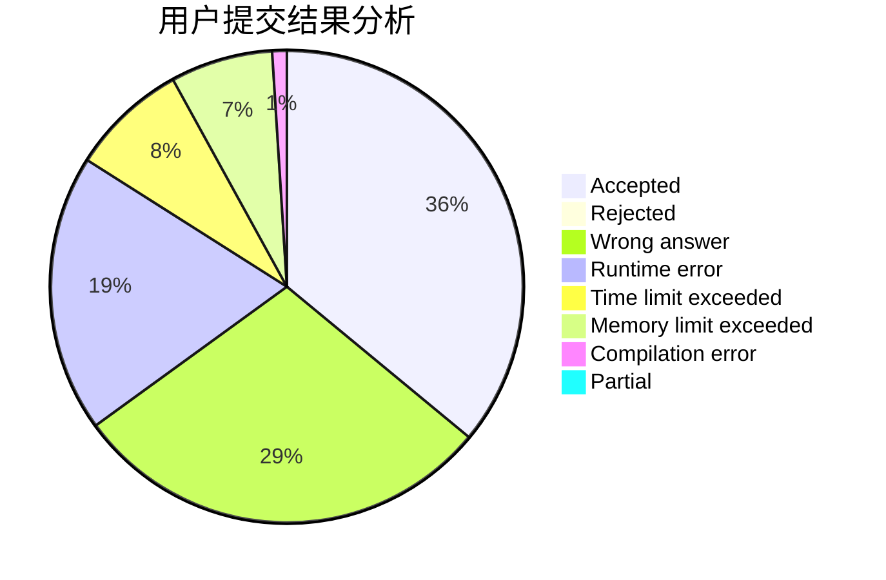
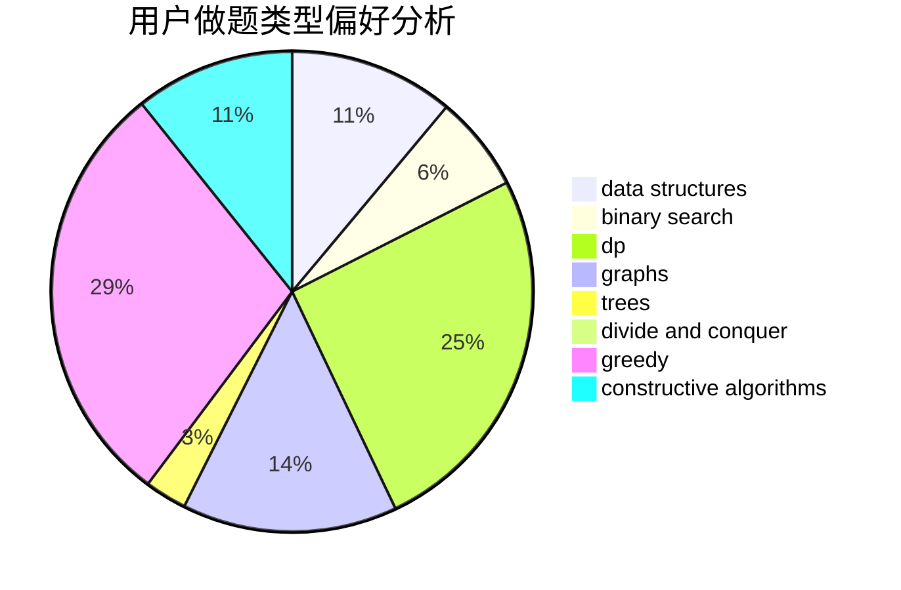
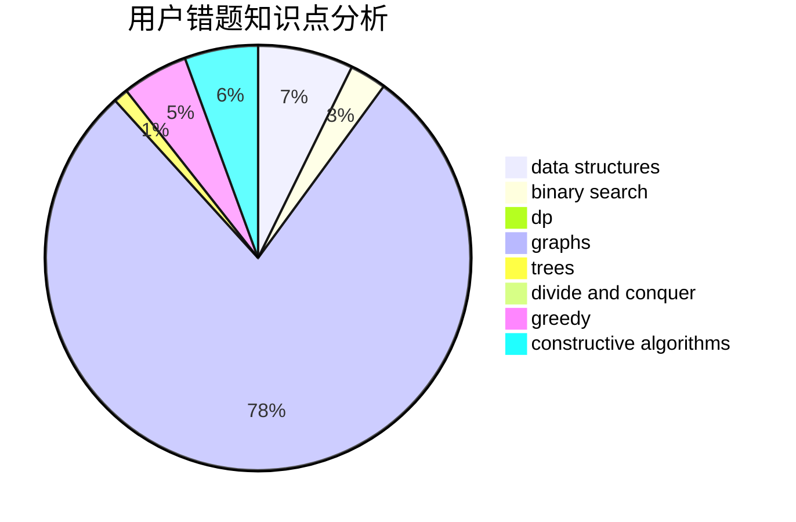

# HolyK
<!-- tabs:start -->
#### **用户提交结果分析**

#### **用户做题类型偏好分析**

#### **用户错题知识点分析**

<!-- tabs:end -->
# 推荐题目
[Root of quantum Fourier transform](http://codeforces.com/problemset/problem/1357/E2)		nan		  
[Team](http://codeforces.com/problemset/problem/231/A)		brute force,
                        greedy		  
[Three Garlands](http://codeforces.com/problemset/problem/911/C)		brute force,
                        constructive algorithms		  
[Double Cola](http://codeforces.com/problemset/problem/82/A)		implementation,
                        math		  
[Boboniu Walks on Graph](https://codeforces.com/contest/1395/problem/E)		brute force,
                        dfs and similar,
                        graphs,
                        hashing		  
[Pig and Palindromes](http://codeforces.com/problemset/problem/570/E)		combinatorics,
                        dp		  
[Happy Tree Party](http://codeforces.com/problemset/problem/593/D)		data structures,
                        dfs and similar,
                        graphs,
                        math,
                        trees		  
[Blown Garland](http://codeforces.com/problemset/problem/758/B)		brute force,
                        implementation,
                        number theory		  
[PFAST Inc.](http://codeforces.com/problemset/problem/114/B)		bitmasks,
                        brute force,
                        graphs		  
[Strange Game On Matrix](http://codeforces.com/problemset/problem/873/C)		greedy,
                        two pointers		  
<!-- tabs:start -->
#### **data structures**
[Root of quantum Fourier transform](http://codeforces.com/problemset/problem/593/D)		data structures,
                        dfs and similar,
                        graphs,
                        math,
                        trees		  
[Team](http://codeforces.com/problemset/problem/158/C)		*special problem,
                        data structures,
                        implementation		  
[Three Garlands](http://codeforces.com/problemset/problem/746/F)		data structures,
                        greedy,
                        two pointers		  
[Double Cola](https://codeforces.com/contest/1447/problem/E)		binary search,
                        bitmasks,
                        data structures,
                        divide and conquer,
                        dp,
                        trees		  
[Boboniu Walks on Graph](http://codeforces.com/problemset/problem/1492/C)		binary search,
                        data structures,
                        dp,
                        greedy,
                        two pointers		  
[Pig and Palindromes](http://codeforces.com/problemset/problem/1490/G)		binary search,
                        data structures,
                        math		  
[Happy Tree Party](http://codeforces.com/problemset/problem/1479/D)		binary search,
                        bitmasks,
                        brute force,
                        data structures,
                        probabilities,
                        trees		  
[Blown Garland](http://codeforces.com/problemset/problem/1497/A)		brute force,
                        data structures,
                        greedy,
                        sortings		  
[PFAST Inc.](http://codeforces.com/problemset/problem/1491/C)		brute force,
                        data structures,
                        dp,
                        greedy,
                        implementation		  
[Strange Game On Matrix](http://codeforces.com/problemset/problem/1492/B)		data structures,
                        greedy,
                        math		  
#### **binary search**
[Root of quantum Fourier transform](https://codeforces.com/contest/1240/problem/A)		binary search,
                        greedy		  
[Team](http://codeforces.com/problemset/problem/911/B)		binary search,
                        brute force,
                        implementation		  
[Three Garlands](https://codeforces.com/contest/1447/problem/E)		binary search,
                        bitmasks,
                        data structures,
                        divide and conquer,
                        dp,
                        trees		  
[Double Cola](http://codeforces.com/problemset/problem/1492/C)		binary search,
                        data structures,
                        dp,
                        greedy,
                        two pointers		  
[Boboniu Walks on Graph](http://codeforces.com/problemset/problem/1463/D)		binary search,
                        constructive algorithms,
                        greedy,
                        two pointers		  
[Pig and Palindromes](http://codeforces.com/problemset/problem/1490/G)		binary search,
                        data structures,
                        math		  
[Happy Tree Party](http://codeforces.com/problemset/problem/1479/D)		binary search,
                        bitmasks,
                        brute force,
                        data structures,
                        probabilities,
                        trees		  
[Blown Garland](http://codeforces.com/problemset/problem/1436/E)		binary search,
                        data structures,
                        two pointers		  
[PFAST Inc.](http://codeforces.com/problemset/problem/1461/D)		binary search,
                        brute force,
                        data structures,
                        divide and conquer,
                        implementation,
                        sortings		  
[Strange Game On Matrix](http://codeforces.com/problemset/problem/1493/C)		binary search,
                        brute force,
                        constructive algorithms,
                        greedy,
                        strings		  
#### **dp**
[Root of quantum Fourier transform](http://codeforces.com/problemset/problem/570/E)		combinatorics,
                        dp		  
[Team](http://codeforces.com/problemset/problem/1253/C)		dp,
                        greedy,
                        math,
                        sortings		  
[Three Garlands](https://codeforces.com/contest/1447/problem/E)		binary search,
                        bitmasks,
                        data structures,
                        divide and conquer,
                        dp,
                        trees		  
[Double Cola](http://codeforces.com/problemset/problem/489/F)		combinatorics,
                        dp		  
[Boboniu Walks on Graph](http://codeforces.com/problemset/problem/1492/C)		binary search,
                        data structures,
                        dp,
                        greedy,
                        two pointers		  
[Pig and Palindromes](https://codeforces.com/contest/1457/problem/C)		brute force,
                        dp,
                        implementation		  
[Happy Tree Party](http://codeforces.com/problemset/problem/1491/C)		brute force,
                        data structures,
                        dp,
                        greedy,
                        implementation		  
[Blown Garland](http://codeforces.com/problemset/problem/1437/C)		dp,
                        flows,
                        graph matchings,
                        greedy,
                        math,
                        sortings		  
[PFAST Inc.](http://codeforces.com/problemset/problem/1499/B)		brute force,
                        dp,
                        greedy,
                        implementation		  
[Strange Game On Matrix](http://codeforces.com/problemset/problem/1491/D)		bitmasks,
                        constructive algorithms,
                        dp,
                        greedy,
                        math		  
#### **graph**
[Root of quantum Fourier transform](https://codeforces.com/contest/1395/problem/E)		brute force,
                        dfs and similar,
                        graphs,
                        hashing		  
[Team](http://codeforces.com/problemset/problem/593/D)		data structures,
                        dfs and similar,
                        graphs,
                        math,
                        trees		  
[Three Garlands](http://codeforces.com/problemset/problem/114/B)		bitmasks,
                        brute force,
                        graphs		  
[Double Cola](http://codeforces.com/problemset/problem/272/E)		combinatorics,
                        constructive algorithms,
                        graphs		  
[Boboniu Walks on Graph](http://codeforces.com/problemset/problem/780/C)		dfs and similar,
                        graphs,
                        greedy,
                        trees		  
[Pig and Palindromes](http://codeforces.com/problemset/problem/1487/C)		brute force,
                        constructive algorithms,
                        dfs and similar,
                        graphs,
                        greedy,
                        implementation,
                        math		  
[Happy Tree Party](http://codeforces.com/problemset/problem/1437/C)		dp,
                        flows,
                        graph matchings,
                        greedy,
                        math,
                        sortings		  
[Blown Garland](http://codeforces.com/problemset/problem/1470/D)		constructive algorithms,
                        dfs and similar,
                        graph matchings,
                        graphs,
                        greedy		  
[PFAST Inc.](http://codeforces.com/problemset/problem/1476/C)		dp,
                        graphs,
                        greedy		  
[Strange Game On Matrix](http://codeforces.com/problemset/problem/1304/D)		constructive algorithms,
                        graphs,
                        greedy,
                        two pointers		  
#### **trees**
[Root of quantum Fourier transform](http://codeforces.com/problemset/problem/593/D)		data structures,
                        dfs and similar,
                        graphs,
                        math,
                        trees		  
[Team](http://codeforces.com/problemset/problem/780/C)		dfs and similar,
                        graphs,
                        greedy,
                        trees		  
[Three Garlands](https://codeforces.com/contest/1447/problem/E)		binary search,
                        bitmasks,
                        data structures,
                        divide and conquer,
                        dp,
                        trees		  
[Double Cola](http://codeforces.com/problemset/problem/1479/D)		binary search,
                        bitmasks,
                        brute force,
                        data structures,
                        probabilities,
                        trees		  
[Boboniu Walks on Graph](http://codeforces.com/problemset/problem/1511/C)		brute force,
                        data structures,
                        implementation,
                        trees		  
[Pig and Palindromes](http://codeforces.com/problemset/problem/1499/F)		combinatorics,
                        dfs and similar,
                        dp,
                        trees		  
[Happy Tree Party](http://codeforces.com/problemset/problem/1491/E)		brute force,
                        dfs and similar,
                        divide and conquer,
                        number theory,
                        trees		  
[Blown Garland](http://codeforces.com/problemset/problem/1466/D)		data structures,
                        greedy,
                        sortings,
                        trees		  
[PFAST Inc.](http://codeforces.com/problemset/problem/1495/D)		combinatorics,
                        dfs and similar,
                        graphs,
                        math,
                        shortest paths,
                        trees		  
[Strange Game On Matrix](http://codeforces.com/problemset/problem/1303/G)		data structures,
                        divide and conquer,
                        geometry,
                        trees		  
#### **divide and conquer**
[Root of quantum Fourier transform](https://codeforces.com/contest/1447/problem/E)		binary search,
                        bitmasks,
                        data structures,
                        divide and conquer,
                        dp,
                        trees		  
[Team](http://codeforces.com/problemset/problem/1461/D)		binary search,
                        brute force,
                        data structures,
                        divide and conquer,
                        implementation,
                        sortings		  
[Three Garlands](http://codeforces.com/problemset/problem/1466/G)		combinatorics,
                        divide and conquer,
                        hashing,
                        math,
                        string suffix structures,
                        strings		  
[Double Cola](http://codeforces.com/problemset/problem/1490/D)		dfs and similar,
                        divide and conquer,
                        implementation		  
[Boboniu Walks on Graph](https://codeforces.com/contest/1483/problem/C)		data structures,
                        divide and conquer,
                        dp		  
[Pig and Palindromes](http://codeforces.com/problemset/problem/1491/E)		brute force,
                        dfs and similar,
                        divide and conquer,
                        number theory,
                        trees		  
[Happy Tree Party](http://codeforces.com/problemset/problem/1303/G)		data structures,
                        divide and conquer,
                        geometry,
                        trees		  
[Blown Garland](http://codeforces.com/problemset/problem/1494/D)		constructive algorithms,
                        data structures,
                        dfs and similar,
                        divide and conquer,
                        dsu,
                        greedy,
                        sortings,
                        trees		  
[PFAST Inc.](http://codeforces.com/problemset/problem/1482/E)		data structures,
                        divide and conquer,
                        dp		  
[Strange Game On Matrix](http://codeforces.com/problemset/problem/566/C)		dfs and similar,
                        divide and conquer,
                        trees		  
#### **greedy**
[Root of quantum Fourier transform](http://codeforces.com/problemset/problem/231/A)		brute force,
                        greedy		  
[Team](http://codeforces.com/problemset/problem/873/C)		greedy,
                        two pointers		  
[Three Garlands](http://codeforces.com/problemset/problem/892/A)		greedy,
                        implementation		  
[Double Cola](https://codeforces.com/contest/1240/problem/A)		binary search,
                        greedy		  
[Boboniu Walks on Graph](http://codeforces.com/problemset/problem/746/F)		data structures,
                        greedy,
                        two pointers		  
[Pig and Palindromes](http://codeforces.com/problemset/problem/1253/C)		dp,
                        greedy,
                        math,
                        sortings		  
[Happy Tree Party](http://codeforces.com/problemset/problem/780/C)		dfs and similar,
                        graphs,
                        greedy,
                        trees		  
[Blown Garland](http://codeforces.com/problemset/problem/193/C)		constructive algorithms,
                        greedy,
                        math,
                        matrices		  
[PFAST Inc.](http://codeforces.com/problemset/problem/1468/H)		constructive algorithms,
                        greedy,
                        math		  
[Strange Game On Matrix](http://codeforces.com/problemset/problem/1408/B)		constructive algorithms,
                        greedy,
                        math		  
#### **constructive algorithms**
[Root of quantum Fourier transform](http://codeforces.com/problemset/problem/911/C)		brute force,
                        constructive algorithms		  
[Team](http://codeforces.com/problemset/problem/272/E)		combinatorics,
                        constructive algorithms,
                        graphs		  
[Three Garlands](http://codeforces.com/problemset/problem/814/B)		constructive algorithms		  
[Double Cola](https://codeforces.com/contest/1173/problem/F)		constructive algorithms		  
[Boboniu Walks on Graph](http://codeforces.com/problemset/problem/193/C)		constructive algorithms,
                        greedy,
                        math,
                        matrices		  
[Pig and Palindromes](http://codeforces.com/problemset/problem/1468/H)		constructive algorithms,
                        greedy,
                        math		  
[Happy Tree Party](http://codeforces.com/problemset/problem/1408/B)		constructive algorithms,
                        greedy,
                        math		  
[Blown Garland](http://codeforces.com/problemset/problem/1266/C)		constructive algorithms,
                        greedy,
                        math,
                        number theory		  
[PFAST Inc.](http://codeforces.com/problemset/problem/1493/A)		constructive algorithms,
                        greedy		  
[Strange Game On Matrix](http://codeforces.com/problemset/problem/1463/D)		binary search,
                        constructive algorithms,
                        greedy,
                        two pointers		  
#### **sortings**
[Root of quantum Fourier transform](http://codeforces.com/problemset/problem/1253/C)		dp,
                        greedy,
                        math,
                        sortings		  
[Team](https://codeforces.com/contest/1496/problem/C)		geometry,
                        greedy,
                        math,
                        sortings		  
[Three Garlands](http://codeforces.com/problemset/problem/1495/A)		geometry,
                        greedy,
                        math,
                        sortings		  
[Double Cola](http://codeforces.com/problemset/problem/1497/A)		brute force,
                        data structures,
                        greedy,
                        sortings		  
[Boboniu Walks on Graph](http://codeforces.com/problemset/problem/1427/A)		math,
                        sortings		  
[Pig and Palindromes](http://codeforces.com/problemset/problem/1461/D)		binary search,
                        brute force,
                        data structures,
                        divide and conquer,
                        implementation,
                        sortings		  
[Happy Tree Party](http://codeforces.com/problemset/problem/1437/C)		dp,
                        flows,
                        graph matchings,
                        greedy,
                        math,
                        sortings		  
[Blown Garland](http://codeforces.com/problemset/problem/1473/A)		greedy,
                        implementation,
                        math,
                        sortings		  
[PFAST Inc.](http://codeforces.com/problemset/problem/1486/B)		binary search,
                        geometry,
                        shortest paths,
                        sortings		  
[Strange Game On Matrix](http://codeforces.com/problemset/problem/1480/B)		greedy,
                        implementation,
                        sortings		  
<!-- tabs:end -->
