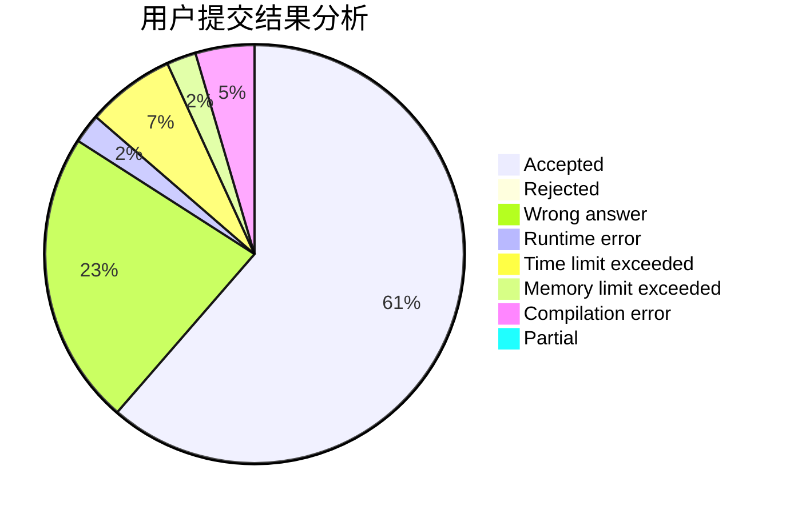
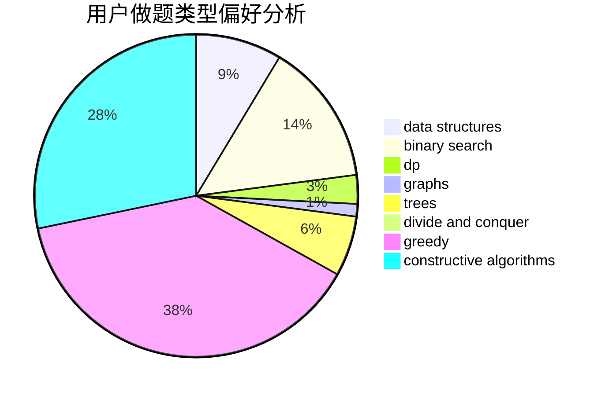
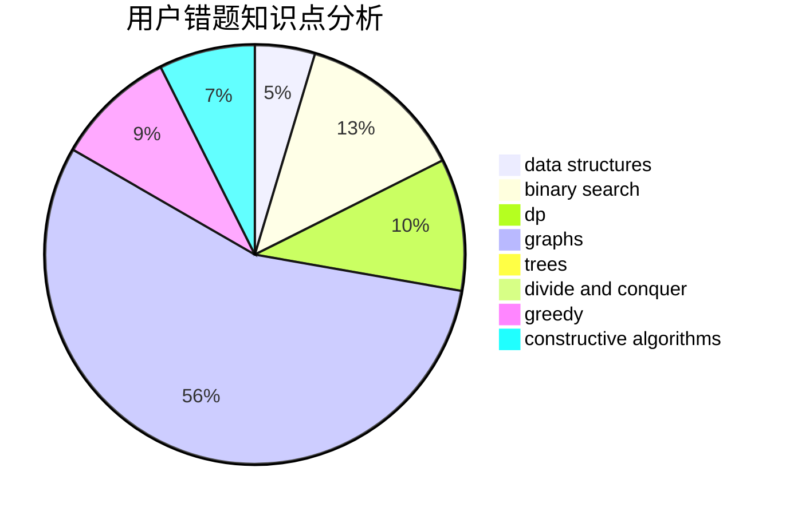

# Hong_Shiba
<!-- tabs:start -->
#### **用户提交结果分析**

#### **用户做题类型偏好分析**

#### **用户错题知识点分析**

<!-- tabs:end -->
# 推荐题目
[Important Exam](http://codeforces.com/problemset/problem/1201/A)		implementation,
                        strings		  
[Rotate, Flip and Zoom](http://codeforces.com/problemset/problem/523/A)		*special problem,
                        implementation		  
[Little Elephant and Sorting](http://codeforces.com/problemset/problem/205/B)		brute force,
                        greedy		  
[Inversion Counting](http://codeforces.com/problemset/problem/911/D)		brute force,
                        math		  
[Coat of Anticubism](http://codeforces.com/problemset/problem/667/B)		constructive algorithms,
                        geometry		  
[Table](http://codeforces.com/problemset/problem/232/B)		bitmasks,
                        combinatorics,
                        dp,
                        math		  
[Infinite Sequence](http://codeforces.com/problemset/problem/622/A)		implementation,
                        math		  
[Distinguish four 2-qubit states - 2](http://codeforces.com/problemset/problem/1002/B4)		nan		  
[Santa Claus and Robot](http://codeforces.com/problemset/problem/748/C)		constructive algorithms,
                        math		  
[Pipes](http://codeforces.com/problemset/problem/1234/C)		dp,
                        implementation		  
<!-- tabs:start -->
#### **data structures**
[Mass Change Queries](http://codeforces.com/problemset/problem/911/G)		data structures		  
[Inversions After Shuffle](http://codeforces.com/problemset/problem/749/E)		data structures,
                        probabilities		  
[Median Mountain Range](http://codeforces.com/problemset/problem/1322/E)		data structures		  
[Restore Permutation](http://codeforces.com/problemset/problem/1208/D)		binary search,
                        data structures,
                        greedy,
                        implementation		  
[Three Sequences](http://codeforces.com/problemset/problem/1406/D)		constructive algorithms,
                        data structures,
                        greedy,
                        math		  
[Stack Sorting](http://codeforces.com/problemset/problem/911/E)		constructive algorithms,
                        data structures,
                        greedy,
                        implementation		  
[Maximum width](http://codeforces.com/problemset/problem/1492/C)		binary search,
                        data structures,
                        dp,
                        greedy,
                        two pointers		  
[Old Floppy Drive](http://codeforces.com/problemset/problem/1490/G)		binary search,
                        data structures,
                        math		  
[Odd Mineral Resource](http://codeforces.com/problemset/problem/1479/D)		binary search,
                        bitmasks,
                        brute force,
                        data structures,
                        probabilities,
                        trees		  
[Meximization](http://codeforces.com/problemset/problem/1497/A)		brute force,
                        data structures,
                        greedy,
                        sortings		  
#### **binary search**
[As Fast As Possible](https://codeforces.com/contest/701/problem/D)		binary search,
                        math		  
[Restore Permutation](http://codeforces.com/problemset/problem/1208/D)		binary search,
                        data structures,
                        greedy,
                        implementation		  
[Boxes Packing](http://codeforces.com/problemset/problem/1066/D)		binary search,
                        implementation		  
[The Number Of Good Substrings](http://codeforces.com/problemset/problem/1217/C)		binary search,
                        bitmasks,
                        brute force		  
[Maximum width](http://codeforces.com/problemset/problem/1492/C)		binary search,
                        data structures,
                        dp,
                        greedy,
                        two pointers		  
[Pairs](http://codeforces.com/problemset/problem/1463/D)		binary search,
                        constructive algorithms,
                        greedy,
                        two pointers		  
[Old Floppy Drive](http://codeforces.com/problemset/problem/1490/G)		binary search,
                        data structures,
                        math		  
[Odd Mineral Resource](http://codeforces.com/problemset/problem/1479/D)		binary search,
                        bitmasks,
                        brute force,
                        data structures,
                        probabilities,
                        trees		  
[Complicated Computations](http://codeforces.com/problemset/problem/1436/E)		binary search,
                        data structures,
                        two pointers		  
[Divide and Summarize](http://codeforces.com/problemset/problem/1461/D)		binary search,
                        brute force,
                        data structures,
                        divide and conquer,
                        implementation,
                        sortings		  
#### **dp**
[Table](http://codeforces.com/problemset/problem/232/B)		bitmasks,
                        combinatorics,
                        dp,
                        math		  
[Pipes](http://codeforces.com/problemset/problem/1234/C)		dp,
                        implementation		  
[Bear and Tree Jumps](http://codeforces.com/problemset/problem/771/C)		dfs and similar,
                        dp,
                        trees		  
[Diameter Cuts](http://codeforces.com/problemset/problem/1499/F)		combinatorics,
                        dfs and similar,
                        dp,
                        trees		  
[Boredom](http://codeforces.com/problemset/problem/455/A)		dp		  
[Museums Tour](http://codeforces.com/problemset/problem/1137/C)		dp,
                        graphs,
                        implementation		  
[Vanya and Scales](http://codeforces.com/problemset/problem/552/C)		brute force,
                        dp,
                        greedy,
                        math,
                        meet-in-the-middle,
                        number theory		  
[Bears and Juice](http://codeforces.com/problemset/problem/643/F)		dp,
                        math,
                        meet-in-the-middle		  
[Density of subarrays](http://codeforces.com/problemset/problem/1158/F)		dp,
                        math		  
[Send the Fool Further! (medium)](http://codeforces.com/problemset/problem/802/K)		dp,
                        trees		  
#### **graph**
[Museums Tour](http://codeforces.com/problemset/problem/1137/C)		dp,
                        graphs,
                        implementation		  
[Kefa and Park](http://codeforces.com/problemset/problem/580/C)		dfs and similar,
                        graphs,
                        trees		  
[Tree Destruction](http://codeforces.com/problemset/problem/911/F)		constructive algorithms,
                        dfs and similar,
                        graphs,
                        greedy,
                        trees		  
[Policeman and a Tree](http://codeforces.com/problemset/problem/868/E)		dp,
                        graphs,
                        trees		  
[Minimum Ties](http://codeforces.com/problemset/problem/1487/C)		brute force,
                        constructive algorithms,
                        dfs and similar,
                        graphs,
                        greedy,
                        implementation,
                        math		  
[Chef Monocarp](http://codeforces.com/problemset/problem/1437/C)		dp,
                        flows,
                        graph matchings,
                        greedy,
                        math,
                        sortings		  
[Strange Housing](http://codeforces.com/problemset/problem/1470/D)		constructive algorithms,
                        dfs and similar,
                        graph matchings,
                        graphs,
                        greedy		  
[Longest Simple Cycle](http://codeforces.com/problemset/problem/1476/C)		dp,
                        graphs,
                        greedy		  
[Shortest and Longest LIS](http://codeforces.com/problemset/problem/1304/D)		constructive algorithms,
                        graphs,
                        greedy,
                        two pointers		  
[Ball in Berland](http://codeforces.com/problemset/problem/1475/C)		combinatorics,
                        graphs,
                        math		  
#### **trees**
[Bear and Tree Jumps](http://codeforces.com/problemset/problem/771/C)		dfs and similar,
                        dp,
                        trees		  
[Diameter Cuts](http://codeforces.com/problemset/problem/1499/F)		combinatorics,
                        dfs and similar,
                        dp,
                        trees		  
[Kefa and Park](http://codeforces.com/problemset/problem/580/C)		dfs and similar,
                        graphs,
                        trees		  
[Tree Destruction](http://codeforces.com/problemset/problem/911/F)		constructive algorithms,
                        dfs and similar,
                        graphs,
                        greedy,
                        trees		  
[Send the Fool Further! (medium)](http://codeforces.com/problemset/problem/802/K)		dp,
                        trees		  
[Policeman and a Tree](http://codeforces.com/problemset/problem/868/E)		dp,
                        graphs,
                        trees		  
[Odd Mineral Resource](http://codeforces.com/problemset/problem/1479/D)		binary search,
                        bitmasks,
                        brute force,
                        data structures,
                        probabilities,
                        trees		  
[Yet Another Card Deck](http://codeforces.com/problemset/problem/1511/C)		brute force,
                        data structures,
                        implementation,
                        trees		  
[Fib-tree](http://codeforces.com/problemset/problem/1491/E)		brute force,
                        dfs and similar,
                        divide and conquer,
                        number theory,
                        trees		  
[13th Labour of Heracles](http://codeforces.com/problemset/problem/1466/D)		data structures,
                        greedy,
                        sortings,
                        trees		  
#### **divide and conquer**
[Divide and Summarize](http://codeforces.com/problemset/problem/1461/D)		binary search,
                        brute force,
                        data structures,
                        divide and conquer,
                        implementation,
                        sortings		  
[Song of the Sirens](http://codeforces.com/problemset/problem/1466/G)		combinatorics,
                        divide and conquer,
                        hashing,
                        math,
                        string suffix structures,
                        strings		  
[Permutation Transformation](http://codeforces.com/problemset/problem/1490/D)		dfs and similar,
                        divide and conquer,
                        implementation		  
[Skyline Photo](https://codeforces.com/contest/1483/problem/C)		data structures,
                        divide and conquer,
                        dp		  
[Fib-tree](http://codeforces.com/problemset/problem/1491/E)		brute force,
                        dfs and similar,
                        divide and conquer,
                        number theory,
                        trees		  
[Sum of Prefix Sums](http://codeforces.com/problemset/problem/1303/G)		data structures,
                        divide and conquer,
                        geometry,
                        trees		  
[Dogeforces](http://codeforces.com/problemset/problem/1494/D)		constructive algorithms,
                        data structures,
                        dfs and similar,
                        divide and conquer,
                        dsu,
                        greedy,
                        sortings,
                        trees		  
[Logistical Questions](http://codeforces.com/problemset/problem/566/C)		dfs and similar,
                        divide and conquer,
                        trees		  
[Fruit Sequences](http://codeforces.com/problemset/problem/1428/F)		binary search,
                        data structures,
                        divide and conquer,
                        dp,
                        two pointers		  
[Dr. Evil Underscores](http://codeforces.com/problemset/problem/1285/D)		bitmasks,
                        brute force,
                        dfs and similar,
                        divide and conquer,
                        dp,
                        greedy,
                        strings,
                        trees		  
#### **greedy**
[Little Elephant and Sorting](http://codeforces.com/problemset/problem/205/B)		brute force,
                        greedy		  
[Restore Permutation](http://codeforces.com/problemset/problem/1208/D)		binary search,
                        data structures,
                        greedy,
                        implementation		  
[Good Numbers (easy version)](http://codeforces.com/problemset/problem/1249/C1)		brute force,
                        greedy,
                        implementation		  
[Vanya and Scales](http://codeforces.com/problemset/problem/552/C)		brute force,
                        dp,
                        greedy,
                        math,
                        meet-in-the-middle,
                        number theory		  
[Tree Destruction](http://codeforces.com/problemset/problem/911/F)		constructive algorithms,
                        dfs and similar,
                        graphs,
                        greedy,
                        trees		  
[Three Sequences](http://codeforces.com/problemset/problem/1406/D)		constructive algorithms,
                        data structures,
                        greedy,
                        math		  
[Stack Sorting](http://codeforces.com/problemset/problem/911/E)		constructive algorithms,
                        data structures,
                        greedy,
                        implementation		  
[Contest for Robots](http://codeforces.com/problemset/problem/1321/A)		greedy		  
[The Struggling Contestant](http://codeforces.com/problemset/problem/1450/F)		constructive algorithms,
                        greedy		  
[Maximum width](http://codeforces.com/problemset/problem/1492/C)		binary search,
                        data structures,
                        dp,
                        greedy,
                        two pointers		  
#### **constructive algorithms**
[Coat of Anticubism](http://codeforces.com/problemset/problem/667/B)		constructive algorithms,
                        geometry		  
[Santa Claus and Robot](http://codeforces.com/problemset/problem/748/C)		constructive algorithms,
                        math		  
[Three Piles of Candies](http://codeforces.com/problemset/problem/1196/A)		brute force,
                        constructive algorithms,
                        math		  
[Mister B and Angle in Polygon](http://codeforces.com/problemset/problem/820/B)		constructive algorithms,
                        geometry,
                        math		  
[Tree Destruction](http://codeforces.com/problemset/problem/911/F)		constructive algorithms,
                        dfs and similar,
                        graphs,
                        greedy,
                        trees		  
[Three Sequences](http://codeforces.com/problemset/problem/1406/D)		constructive algorithms,
                        data structures,
                        greedy,
                        math		  
[Stack Sorting](http://codeforces.com/problemset/problem/911/E)		constructive algorithms,
                        data structures,
                        greedy,
                        implementation		  
[The Struggling Contestant](http://codeforces.com/problemset/problem/1450/F)		constructive algorithms,
                        greedy		  
[Anti-knapsack](http://codeforces.com/problemset/problem/1493/A)		constructive algorithms,
                        greedy		  
[Pairs](http://codeforces.com/problemset/problem/1463/D)		binary search,
                        constructive algorithms,
                        greedy,
                        two pointers		  
#### **sortings**
[Currency System in Geraldion](http://codeforces.com/problemset/problem/560/A)		implementation,
                        sortings		  
[Anton and Lines](http://codeforces.com/problemset/problem/593/B)		geometry,
                        sortings		  
[Diamond Miner](https://codeforces.com/contest/1496/problem/C)		geometry,
                        greedy,
                        math,
                        sortings		  
[Meximization](http://codeforces.com/problemset/problem/1497/A)		brute force,
                        data structures,
                        greedy,
                        sortings		  
[Avoiding Zero](http://codeforces.com/problemset/problem/1427/A)		math,
                        sortings		  
[Divide and Summarize](http://codeforces.com/problemset/problem/1461/D)		binary search,
                        brute force,
                        data structures,
                        divide and conquer,
                        implementation,
                        sortings		  
[Chef Monocarp](http://codeforces.com/problemset/problem/1437/C)		dp,
                        flows,
                        graph matchings,
                        greedy,
                        math,
                        sortings		  
[Replacing Elements](http://codeforces.com/problemset/problem/1473/A)		greedy,
                        implementation,
                        math,
                        sortings		  
[Eastern Exhibition](http://codeforces.com/problemset/problem/1486/B)		binary search,
                        geometry,
                        shortest paths,
                        sortings		  
[The Great Hero](http://codeforces.com/problemset/problem/1480/B)		greedy,
                        implementation,
                        sortings		  
<!-- tabs:end -->
