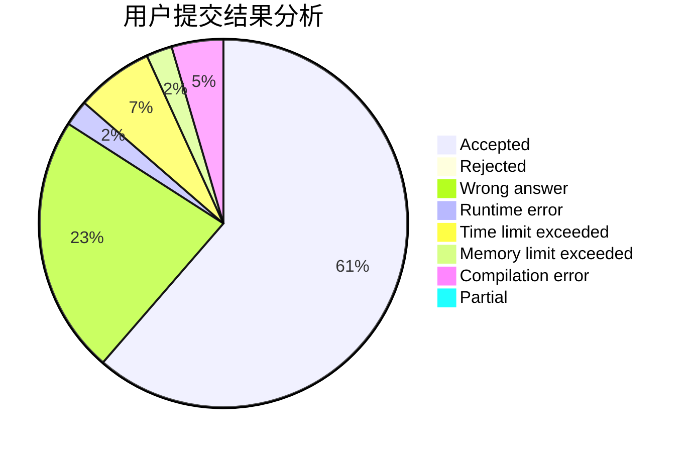
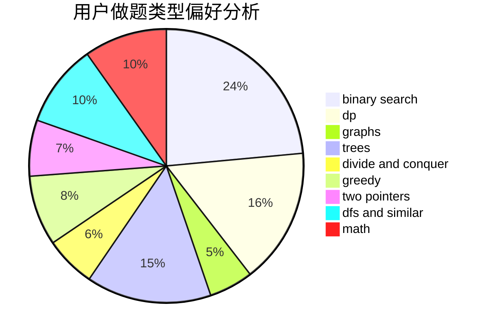

# Hong_Shiba

<!-- tabs:start -->

#### **用户提交结果分析**

#### **用户做题类型偏好分析**

<!-- tabs:end -->
# 推荐题目
[814C](https://codeforces.com/contest/814/problem/C)
[1205E](https://codeforces.com/contest/1205/problem/E)
[254A](https://codeforces.com/contest/254/problem/A)
[229D](https://codeforces.com/contest/229/problem/D)
[1509F](https://codeforces.com/contest/1509/problem/F)
[1007A](https://codeforces.com/contest/1007/problem/A)
[548B](https://codeforces.com/contest/548/problem/B)
[689B](https://codeforces.com/contest/689/problem/B)
[10023](https://codeforces.com/contest/1002/problem/3)
[577E](https://codeforces.com/contest/577/problem/E)
