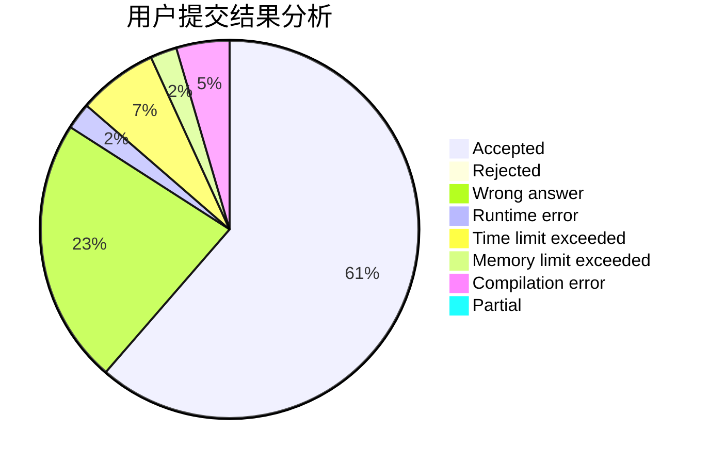
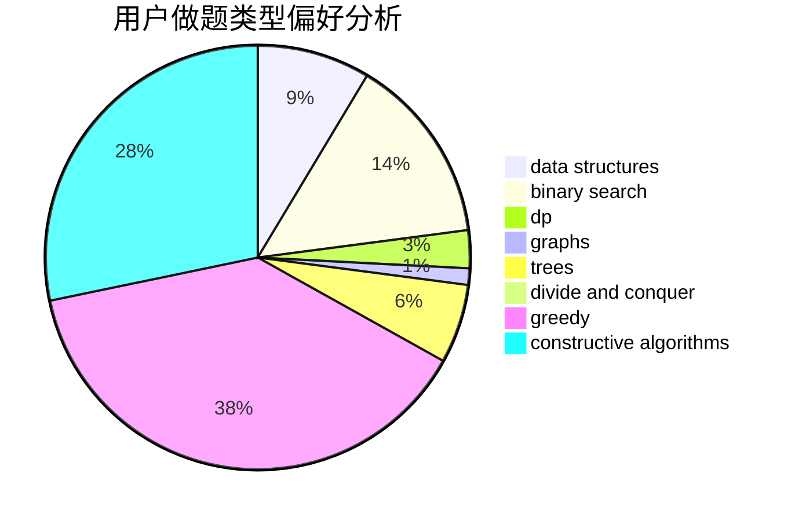
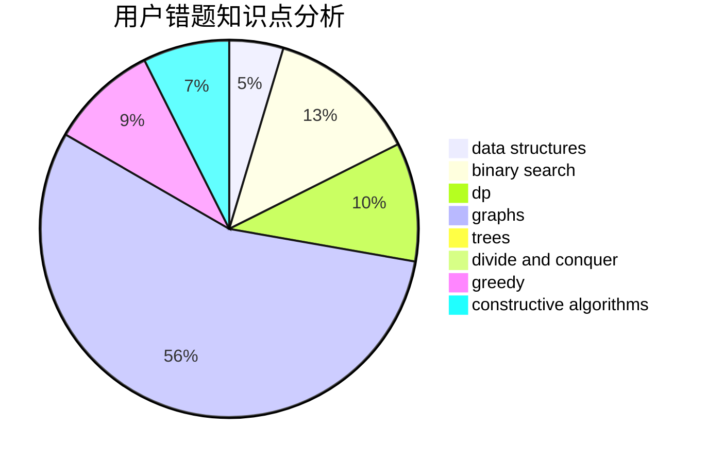

# Hong_Shiba

<!-- tabs:start -->

#### **用户提交结果分析**

#### **用户做题类型偏好分析**

#### **用户错题知识点分析**

<!-- tabs:end -->
# 推荐题目
[7B](https://codeforces.com/contest/7/problem/B)		implementation		  
[1201A](https://codeforces.com/contest/1201/problem/A)		implementation,
                        strings		  
[232B](https://codeforces.com/contest/232/problem/B)		bitmasks,
                        combinatorics,
                        dp,
                        math		  
[205B](https://codeforces.com/contest/205/problem/B)		brute force,
                        greedy		  
[1499F](https://codeforces.com/contest/1499/problem/F)		combinatorics,
                        dfs and similar,
                        dp,
                        trees		  
[1006D](https://codeforces.com/contest/1006/problem/D)		implementation		  
[523A](https://codeforces.com/contest/523/problem/A)		*special problem,
                        implementation		  
[667B](https://codeforces.com/contest/667/problem/B)		constructive algorithms,
                        geometry		  
[1002B4](https://codeforces.com/contest/1002B/problem/4)		nan		  
[552C](https://codeforces.com/contest/552/problem/C)		brute force,
                        dp,
                        greedy,
                        math,
                        meet-in-the-middle,
                        number theory		  
