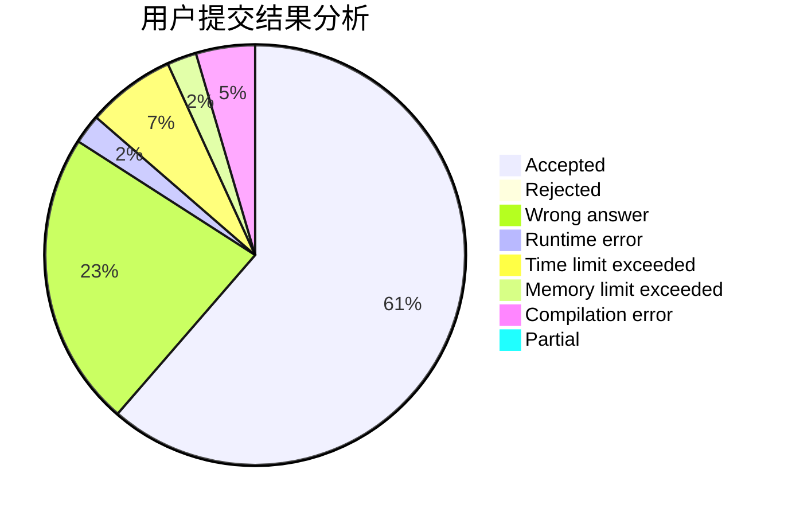
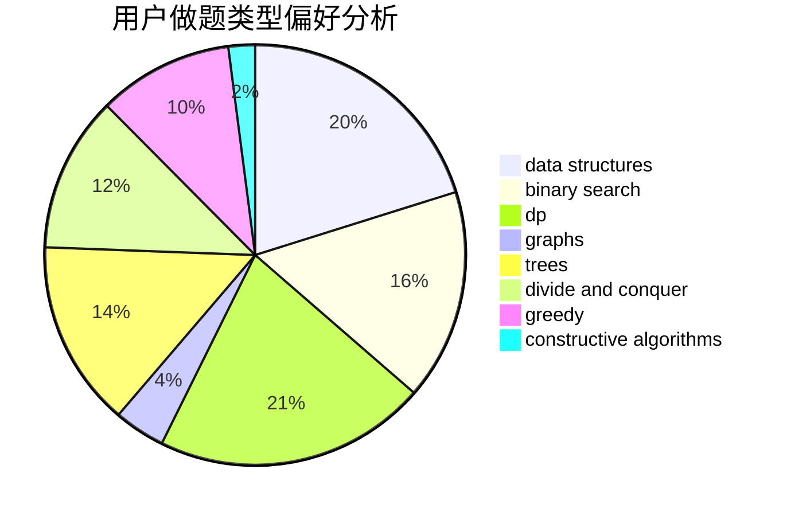
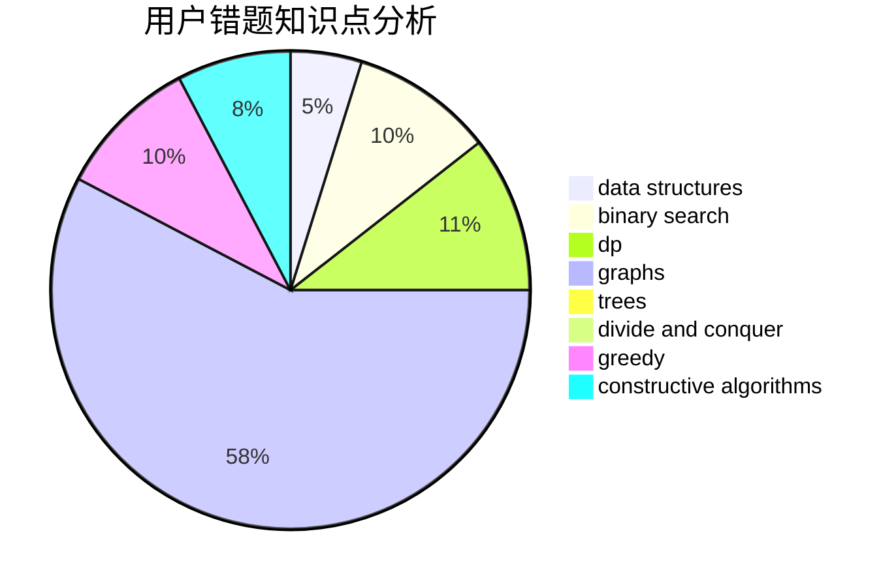

# Hong_Shiba

<!-- tabs:start -->

#### **用户提交结果分析**

#### **用户做题类型偏好分析**

#### **用户错题知识点分析**

<!-- tabs:end -->
# 推荐题目
[814C](https://codeforces.com/contest/814/problem/C)		brute force,
                        dp,
                        strings,
                        two pointers		  
[1205E](https://codeforces.com/contest/1205/problem/E)		combinatorics,
                        strings		  
[254A](https://codeforces.com/contest/254/problem/A)		constructive algorithms,
                        sortings		  
[229D](https://codeforces.com/contest/229/problem/D)		dp,
                        greedy,
                        two pointers		  
[1509F](https://codeforces.com/contest/1509/problem/F)		dsu,graphs,sortings,trees		  
[1007A](https://codeforces.com/contest/1007/problem/A)		combinatorics,
                        data structures,
                        math,
                        sortings,
                        two pointers		  
[548B](https://codeforces.com/contest/548/problem/B)		brute force,
                        dp,
                        greedy,
                        implementation		  
[689B](https://codeforces.com/contest/689/problem/B)		dfs and similar,
                        graphs,
                        greedy,
                        shortest paths		  
[10023](https://codeforces.com/contest/1002/problem/3)		dsu,graphs,sortings,trees		  
[577E](https://codeforces.com/contest/577/problem/E)		dsu,graphs,sortings,trees		  
