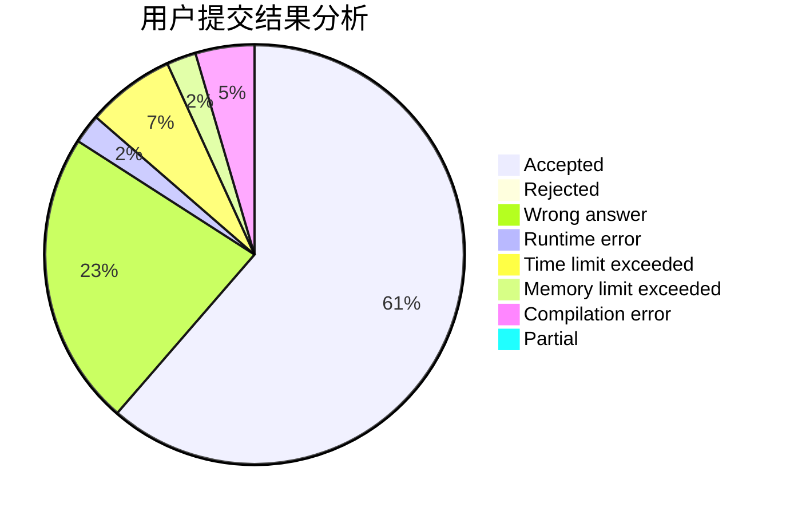
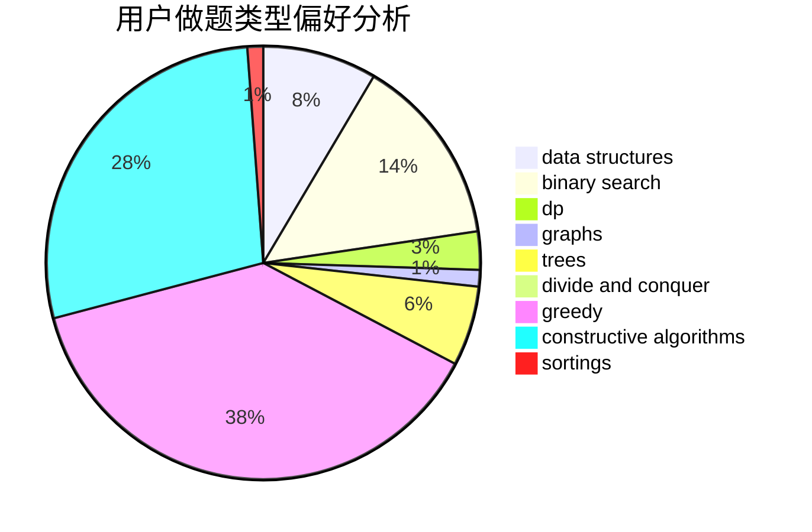
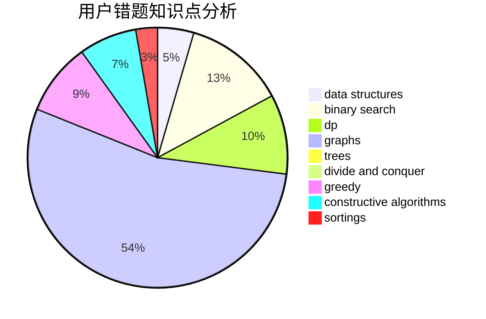

# Hong_Shiba
<!-- tabs:start -->
#### **用户提交结果分析**

#### **用户做题类型偏好分析**

#### **用户错题知识点分析**

<!-- tabs:end -->
# 推荐题目
[1201A](http://codeforces.com/problemset/problem/1201/A)		implementation,
                        strings		  
[523A](http://codeforces.com/problemset/problem/523/A)		*special problem,
                        implementation		  
[205B](http://codeforces.com/problemset/problem/205/B)		brute force,
                        greedy		  
[911D](http://codeforces.com/problemset/problem/911/D)		brute force,
                        math		  
[667B](http://codeforces.com/problemset/problem/667/B)		constructive algorithms,
                        geometry		  
[232B](http://codeforces.com/problemset/problem/232/B)		bitmasks,
                        combinatorics,
                        dp,
                        math		  
[622A](http://codeforces.com/problemset/problem/622/A)		implementation,
                        math		  
[1002B4](http://codeforces.com/problemset/problem/1002/B4)		nan		  
[748C](http://codeforces.com/problemset/problem/748/C)		constructive algorithms,
                        math		  
[1234C](http://codeforces.com/problemset/problem/1234/C)		dp,
                        implementation		  
<!-- tabs:start -->
#### **data structures**
[911G](http://codeforces.com/problemset/problem/911/G)		data structures		  
[749E](http://codeforces.com/problemset/problem/749/E)		data structures,
                        probabilities		  
[1322E](http://codeforces.com/problemset/problem/1322/E)		data structures		  
[1208D](http://codeforces.com/problemset/problem/1208/D)		binary search,
                        data structures,
                        greedy,
                        implementation		  
[1406D](http://codeforces.com/problemset/problem/1406/D)		constructive algorithms,
                        data structures,
                        greedy,
                        math		  
[911E](http://codeforces.com/problemset/problem/911/E)		constructive algorithms,
                        data structures,
                        greedy,
                        implementation		  
[1492C](http://codeforces.com/problemset/problem/1492/C)		binary search,
                        data structures,
                        dp,
                        greedy,
                        two pointers		  
[1490G](http://codeforces.com/problemset/problem/1490/G)		binary search,
                        data structures,
                        math		  
[1479D](http://codeforces.com/problemset/problem/1479/D)		binary search,
                        bitmasks,
                        brute force,
                        data structures,
                        probabilities,
                        trees		  
[1497A](http://codeforces.com/problemset/problem/1497/A)		brute force,
                        data structures,
                        greedy,
                        sortings		  
#### **binary search**
[701D](https://codeforces.com/contest/701/problem/D)		binary search,
                        math		  
[1208D](http://codeforces.com/problemset/problem/1208/D)		binary search,
                        data structures,
                        greedy,
                        implementation		  
[1066D](http://codeforces.com/problemset/problem/1066/D)		binary search,
                        implementation		  
[1217C](http://codeforces.com/problemset/problem/1217/C)		binary search,
                        bitmasks,
                        brute force		  
[1492C](http://codeforces.com/problemset/problem/1492/C)		binary search,
                        data structures,
                        dp,
                        greedy,
                        two pointers		  
[1463D](http://codeforces.com/problemset/problem/1463/D)		binary search,
                        constructive algorithms,
                        greedy,
                        two pointers		  
[1490G](http://codeforces.com/problemset/problem/1490/G)		binary search,
                        data structures,
                        math		  
[1479D](http://codeforces.com/problemset/problem/1479/D)		binary search,
                        bitmasks,
                        brute force,
                        data structures,
                        probabilities,
                        trees		  
[1436E](http://codeforces.com/problemset/problem/1436/E)		binary search,
                        data structures,
                        two pointers		  
[1461D](http://codeforces.com/problemset/problem/1461/D)		binary search,
                        brute force,
                        data structures,
                        divide and conquer,
                        implementation,
                        sortings		  
#### **dp**
[232B](http://codeforces.com/problemset/problem/232/B)		bitmasks,
                        combinatorics,
                        dp,
                        math		  
[1234C](http://codeforces.com/problemset/problem/1234/C)		dp,
                        implementation		  
[771C](http://codeforces.com/problemset/problem/771/C)		dfs and similar,
                        dp,
                        trees		  
[1499F](http://codeforces.com/problemset/problem/1499/F)		combinatorics,
                        dfs and similar,
                        dp,
                        trees		  
[455A](http://codeforces.com/problemset/problem/455/A)		dp		  
[1137C](http://codeforces.com/problemset/problem/1137/C)		dp,
                        graphs,
                        implementation		  
[552C](http://codeforces.com/problemset/problem/552/C)		brute force,
                        dp,
                        greedy,
                        math,
                        meet-in-the-middle,
                        number theory		  
[643F](http://codeforces.com/problemset/problem/643/F)		dp,
                        math,
                        meet-in-the-middle		  
[1158F](http://codeforces.com/problemset/problem/1158/F)		dp,
                        math		  
[802K](http://codeforces.com/problemset/problem/802/K)		dp,
                        trees		  
#### **graph**
[1137C](http://codeforces.com/problemset/problem/1137/C)		dp,
                        graphs,
                        implementation		  
[580C](http://codeforces.com/problemset/problem/580/C)		dfs and similar,
                        graphs,
                        trees		  
[911F](http://codeforces.com/problemset/problem/911/F)		constructive algorithms,
                        dfs and similar,
                        graphs,
                        greedy,
                        trees		  
[868E](http://codeforces.com/problemset/problem/868/E)		dp,
                        graphs,
                        trees		  
[1487C](http://codeforces.com/problemset/problem/1487/C)		brute force,
                        constructive algorithms,
                        dfs and similar,
                        graphs,
                        greedy,
                        implementation,
                        math		  
[1437C](http://codeforces.com/problemset/problem/1437/C)		dp,
                        flows,
                        graph matchings,
                        greedy,
                        math,
                        sortings		  
[1470D](http://codeforces.com/problemset/problem/1470/D)		constructive algorithms,
                        dfs and similar,
                        graph matchings,
                        graphs,
                        greedy		  
[1476C](http://codeforces.com/problemset/problem/1476/C)		dp,
                        graphs,
                        greedy		  
[1304D](http://codeforces.com/problemset/problem/1304/D)		constructive algorithms,
                        graphs,
                        greedy,
                        two pointers		  
[1475C](http://codeforces.com/problemset/problem/1475/C)		combinatorics,
                        graphs,
                        math		  
#### **trees**
[771C](http://codeforces.com/problemset/problem/771/C)		dfs and similar,
                        dp,
                        trees		  
[1499F](http://codeforces.com/problemset/problem/1499/F)		combinatorics,
                        dfs and similar,
                        dp,
                        trees		  
[580C](http://codeforces.com/problemset/problem/580/C)		dfs and similar,
                        graphs,
                        trees		  
[911F](http://codeforces.com/problemset/problem/911/F)		constructive algorithms,
                        dfs and similar,
                        graphs,
                        greedy,
                        trees		  
[802K](http://codeforces.com/problemset/problem/802/K)		dp,
                        trees		  
[868E](http://codeforces.com/problemset/problem/868/E)		dp,
                        graphs,
                        trees		  
[1479D](http://codeforces.com/problemset/problem/1479/D)		binary search,
                        bitmasks,
                        brute force,
                        data structures,
                        probabilities,
                        trees		  
[1511C](http://codeforces.com/problemset/problem/1511/C)		brute force,
                        data structures,
                        implementation,
                        trees		  
[1499F](http://codeforces.com/problemset/problem/1499/F)		combinatorics,
                        dfs and similar,
                        dp,
                        trees		  
[1491E](http://codeforces.com/problemset/problem/1491/E)		brute force,
                        dfs and similar,
                        divide and conquer,
                        number theory,
                        trees		  
#### **divide and conquer**
[1461D](http://codeforces.com/problemset/problem/1461/D)		binary search,
                        brute force,
                        data structures,
                        divide and conquer,
                        implementation,
                        sortings		  
[1466G](http://codeforces.com/problemset/problem/1466/G)		combinatorics,
                        divide and conquer,
                        hashing,
                        math,
                        string suffix structures,
                        strings		  
[1490D](http://codeforces.com/problemset/problem/1490/D)		dfs and similar,
                        divide and conquer,
                        implementation		  
[1483C](https://codeforces.com/contest/1483/problem/C)		data structures,
                        divide and conquer,
                        dp		  
[1491E](http://codeforces.com/problemset/problem/1491/E)		brute force,
                        dfs and similar,
                        divide and conquer,
                        number theory,
                        trees		  
[1303G](http://codeforces.com/problemset/problem/1303/G)		data structures,
                        divide and conquer,
                        geometry,
                        trees		  
[1494D](http://codeforces.com/problemset/problem/1494/D)		constructive algorithms,
                        data structures,
                        dfs and similar,
                        divide and conquer,
                        dsu,
                        greedy,
                        sortings,
                        trees		  
[1482E](http://codeforces.com/problemset/problem/1482/E)		data structures,
                        divide and conquer,
                        dp		  
[566C](http://codeforces.com/problemset/problem/566/C)		dfs and similar,
                        divide and conquer,
                        trees		  
[1428F](http://codeforces.com/problemset/problem/1428/F)		binary search,
                        data structures,
                        divide and conquer,
                        dp,
                        two pointers		  
#### **greedy**
[205B](http://codeforces.com/problemset/problem/205/B)		brute force,
                        greedy		  
[1208D](http://codeforces.com/problemset/problem/1208/D)		binary search,
                        data structures,
                        greedy,
                        implementation		  
[1249C1](http://codeforces.com/problemset/problem/1249/C1)		brute force,
                        greedy,
                        implementation		  
[552C](http://codeforces.com/problemset/problem/552/C)		brute force,
                        dp,
                        greedy,
                        math,
                        meet-in-the-middle,
                        number theory		  
[911F](http://codeforces.com/problemset/problem/911/F)		constructive algorithms,
                        dfs and similar,
                        graphs,
                        greedy,
                        trees		  
[1406D](http://codeforces.com/problemset/problem/1406/D)		constructive algorithms,
                        data structures,
                        greedy,
                        math		  
[911E](http://codeforces.com/problemset/problem/911/E)		constructive algorithms,
                        data structures,
                        greedy,
                        implementation		  
[1321A](http://codeforces.com/problemset/problem/1321/A)		greedy		  
[1450F](http://codeforces.com/problemset/problem/1450/F)		constructive algorithms,
                        greedy		  
[1492C](http://codeforces.com/problemset/problem/1492/C)		binary search,
                        data structures,
                        dp,
                        greedy,
                        two pointers		  
#### **constructive algorithms**
[667B](http://codeforces.com/problemset/problem/667/B)		constructive algorithms,
                        geometry		  
[748C](http://codeforces.com/problemset/problem/748/C)		constructive algorithms,
                        math		  
[1196A](http://codeforces.com/problemset/problem/1196/A)		brute force,
                        constructive algorithms,
                        math		  
[820B](http://codeforces.com/problemset/problem/820/B)		constructive algorithms,
                        geometry,
                        math		  
[911F](http://codeforces.com/problemset/problem/911/F)		constructive algorithms,
                        dfs and similar,
                        graphs,
                        greedy,
                        trees		  
[1406D](http://codeforces.com/problemset/problem/1406/D)		constructive algorithms,
                        data structures,
                        greedy,
                        math		  
[911E](http://codeforces.com/problemset/problem/911/E)		constructive algorithms,
                        data structures,
                        greedy,
                        implementation		  
[1450F](http://codeforces.com/problemset/problem/1450/F)		constructive algorithms,
                        greedy		  
[1493A](http://codeforces.com/problemset/problem/1493/A)		constructive algorithms,
                        greedy		  
[1463D](http://codeforces.com/problemset/problem/1463/D)		binary search,
                        constructive algorithms,
                        greedy,
                        two pointers		  
#### **sortings**
[560A](http://codeforces.com/problemset/problem/560/A)		implementation,
                        sortings		  
[593B](http://codeforces.com/problemset/problem/593/B)		geometry,
                        sortings		  
[1496C](https://codeforces.com/contest/1496/problem/C)		geometry,
                        greedy,
                        math,
                        sortings		  
[1495A](http://codeforces.com/problemset/problem/1495/A)		geometry,
                        greedy,
                        math,
                        sortings		  
[1497A](http://codeforces.com/problemset/problem/1497/A)		brute force,
                        data structures,
                        greedy,
                        sortings		  
[1427A](http://codeforces.com/problemset/problem/1427/A)		math,
                        sortings		  
[1461D](http://codeforces.com/problemset/problem/1461/D)		binary search,
                        brute force,
                        data structures,
                        divide and conquer,
                        implementation,
                        sortings		  
[1437C](http://codeforces.com/problemset/problem/1437/C)		dp,
                        flows,
                        graph matchings,
                        greedy,
                        math,
                        sortings		  
[1473A](http://codeforces.com/problemset/problem/1473/A)		greedy,
                        implementation,
                        math,
                        sortings		  
[1486B](http://codeforces.com/problemset/problem/1486/B)		binary search,
                        geometry,
                        shortest paths,
                        sortings		  
<!-- tabs:end -->
