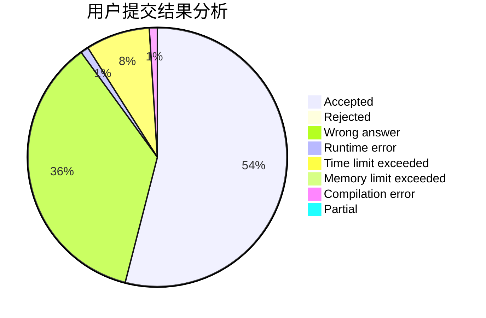
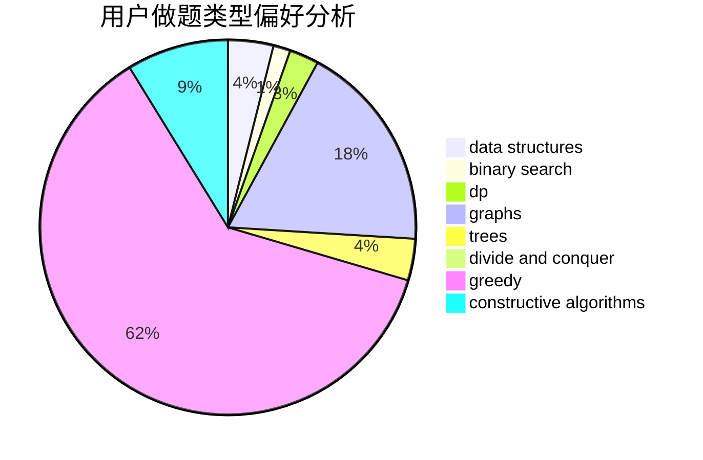
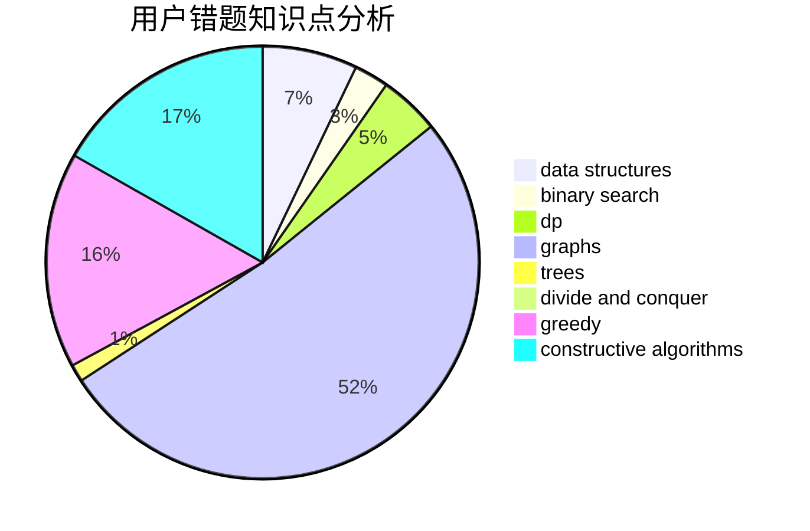

# Hongzy

<!-- tabs:start -->

#### **用户提交结果分析**

#### **用户做题类型偏好分析**

#### **用户错题知识点分析**

<!-- tabs:end -->
# 推荐题目
[569A](https://codeforces.com/contest/569/problem/A)		implementation,
                        math		  
[629E](https://codeforces.com/contest/629/problem/E)		combinatorics,
                        data structures,
                        dfs and similar,
                        dp,
                        probabilities,
                        trees		  
[1346A](https://codeforces.com/contest/1346/problem/A)		*special problem,
                        math		  
[665F](https://codeforces.com/contest/665/problem/F)		data structures,
                        dp,
                        math,
                        number theory,
                        sortings,
                        two pointers		  
[659G](https://codeforces.com/contest/659/problem/G)		combinatorics,
                        dp,
                        number theory		  
[11962](https://codeforces.com/contest/1196/problem/2)		dsu,graphs,sortings,trees		  
[300B](https://codeforces.com/contest/300/problem/B)		brute force,
                        dfs and similar,
                        graphs		  
[482C](https://codeforces.com/contest/482/problem/C)		bitmasks,
                        dp,
                        probabilities		  
[931A](https://codeforces.com/contest/931/problem/A)		brute force,
                        greedy,
                        implementation,
                        math		  
[852I](https://codeforces.com/contest/852/problem/I)		brute force,
                        dfs and similar,
                        graphs,
                        trees		  
