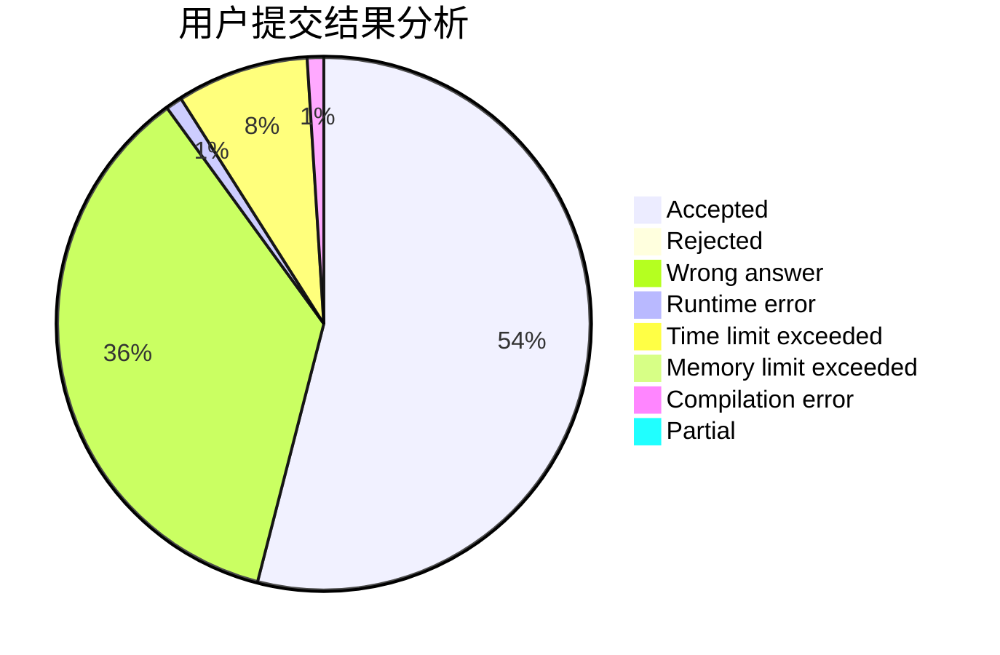
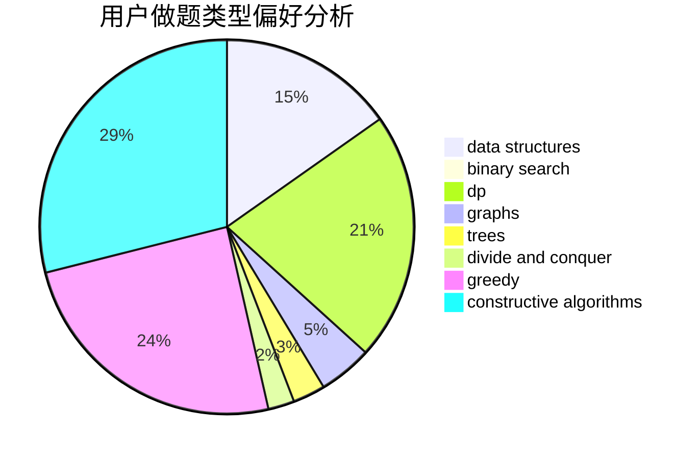
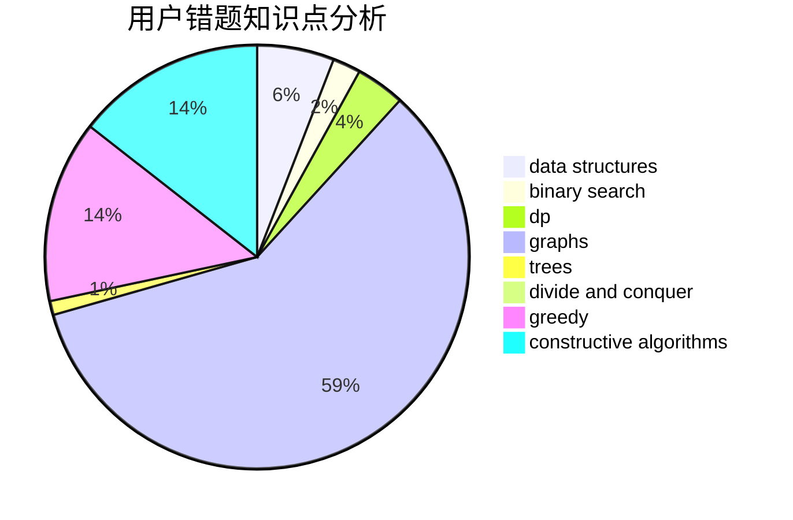

# Hongzy

<!-- tabs:start -->

#### **用户提交结果分析**

#### **用户做题类型偏好分析**

#### **用户错题知识点分析**

<!-- tabs:end -->
# 推荐题目
[544D](https://codeforces.com/contest/544/problem/D)		dsu,graphs,sortings,trees		  
[610C](https://codeforces.com/contest/610/problem/C)		constructive algorithms		  
[1339A](https://codeforces.com/contest/1339/problem/A)		brute force,
                        dp,
                        implementation,
                        math		  
[633D](https://codeforces.com/contest/633/problem/D)		brute force,
                        dp,
                        hashing,
                        implementation,
                        math		  
[62E](https://codeforces.com/contest/62/problem/E)		dp,
                        flows		  
[1190B](https://codeforces.com/contest/1190/problem/B)		games		  
[286A](https://codeforces.com/contest/286/problem/A)		constructive algorithms,
                        math		  
[462C](https://codeforces.com/contest/462/problem/C)		dsu,graphs,sortings,trees		  
[912C](https://codeforces.com/contest/912/problem/C)		brute force,
                        greedy,
                        sortings		  
[835B](https://codeforces.com/contest/835/problem/B)		greedy		  
