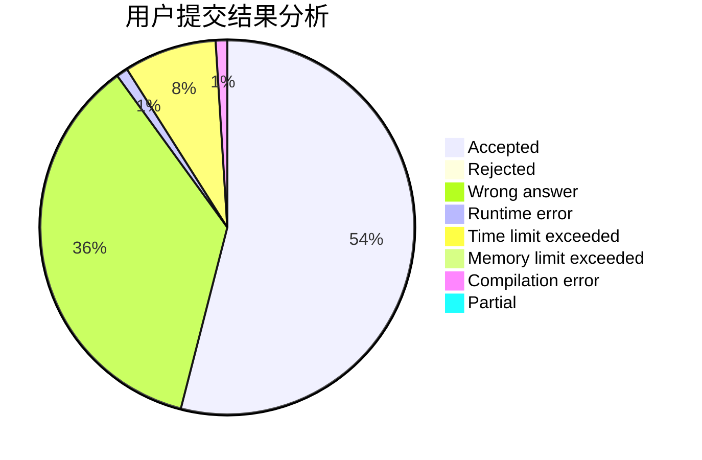
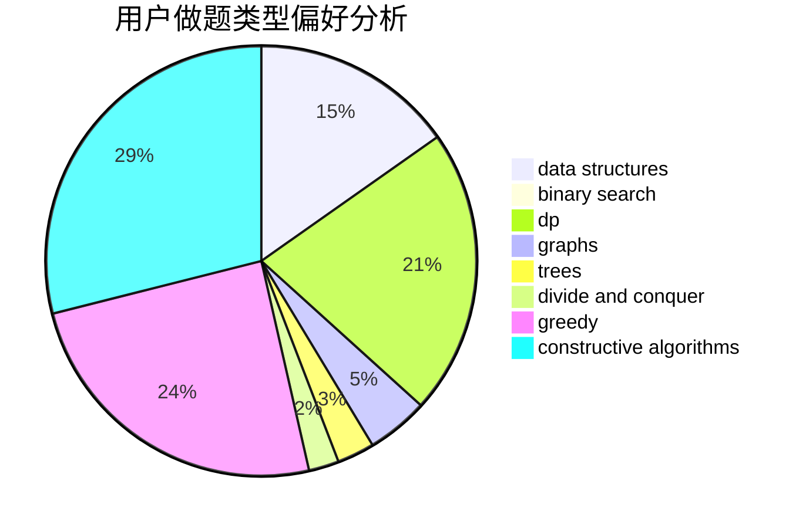
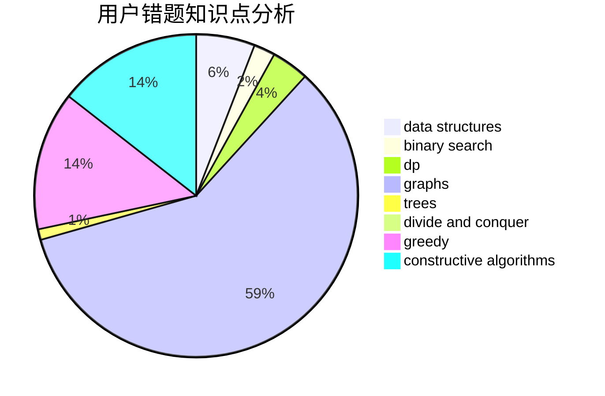

# Hongzy
<!-- tabs:start -->
#### **用户提交结果分析**

#### **用户做题类型偏好分析**

#### **用户错题知识点分析**

<!-- tabs:end -->
# 推荐题目
[Filling Diamonds](http://codeforces.com/problemset/problem/1339/A)		brute force,
                        dp,
                        implementation,
                        math		  
[Destroying Roads](https://codeforces.com/contest/544/problem/D)		constructive algorithms,
                        graphs,
                        shortest paths		  
[Fibonacci-ish](http://codeforces.com/problemset/problem/633/D)		brute force,
                        dp,
                        hashing,
                        implementation,
                        math		  
[Harmony Analysis](http://codeforces.com/problemset/problem/610/C)		constructive algorithms		  
[Tokitsukaze, CSL and Stone Game](http://codeforces.com/problemset/problem/1190/B)		games		  
[World Evil](http://codeforces.com/problemset/problem/62/E)		dp,
                        flows		  
[Perun, Ult!](http://codeforces.com/problemset/problem/912/C)		brute force,
                        greedy,
                        sortings		  
[Appleman and Toastman](https://codeforces.com/contest/462/problem/C)		greedy,
                        sortings		  
[Let's Play the Words?](http://codeforces.com/problemset/problem/1277/D)		data structures,
                        hashing,
                        implementation,
                        math		  
[Andrey and Problem](http://codeforces.com/problemset/problem/442/B)		greedy,
                        math,
                        probabilities		  
<!-- tabs:start -->
#### **data structures**
[Filling Diamonds](http://codeforces.com/problemset/problem/1277/D)		data structures,
                        hashing,
                        implementation,
                        math		  
[Destroying Roads](http://codeforces.com/problemset/problem/1039/D)		data structures,
                        dp,
                        trees		  
[Fibonacci-ish](http://codeforces.com/problemset/problem/1366/G)		data structures,
                        dp,
                        strings		  
[Harmony Analysis](http://codeforces.com/problemset/problem/1037/F)		combinatorics,
                        data structures,
                        math		  
[Tokitsukaze, CSL and Stone Game](http://codeforces.com/problemset/problem/29/C)		data structures,
                        dfs and similar,
                        graphs,
                        implementation		  
[World Evil](http://codeforces.com/problemset/problem/1185/C2)		brute force,
                        data structures,
                        greedy,
                        math		  
[Perun, Ult!](http://codeforces.com/problemset/problem/1263/F)		data structures,
                        dfs and similar,
                        dp,
                        flows,
                        graphs,
                        trees		  
[Appleman and Toastman](http://codeforces.com/problemset/problem/763/D)		data structures,
                        graphs,
                        hashing,
                        shortest paths,
                        trees		  
[Let's Play the Words?](http://codeforces.com/problemset/problem/1492/C)		binary search,
                        data structures,
                        dp,
                        greedy,
                        two pointers		  
[Andrey and Problem](http://codeforces.com/problemset/problem/1490/G)		binary search,
                        data structures,
                        math		  
#### **binary search**
[Filling Diamonds](http://codeforces.com/problemset/problem/504/E)		binary search,
                        dfs and similar,
                        hashing,
                        string suffix structures,
                        trees		  
[Destroying Roads](http://codeforces.com/problemset/problem/1355/C)		binary search,
                        implementation,
                        math,
                        two pointers		  
[Fibonacci-ish](http://codeforces.com/problemset/problem/1492/C)		binary search,
                        data structures,
                        dp,
                        greedy,
                        two pointers		  
[Harmony Analysis](http://codeforces.com/problemset/problem/1463/D)		binary search,
                        constructive algorithms,
                        greedy,
                        two pointers		  
[Tokitsukaze, CSL and Stone Game](http://codeforces.com/problemset/problem/1490/G)		binary search,
                        data structures,
                        math		  
[World Evil](http://codeforces.com/problemset/problem/1479/D)		binary search,
                        bitmasks,
                        brute force,
                        data structures,
                        probabilities,
                        trees		  
[Perun, Ult!](http://codeforces.com/problemset/problem/1436/E)		binary search,
                        data structures,
                        two pointers		  
[Appleman and Toastman](http://codeforces.com/problemset/problem/1461/D)		binary search,
                        brute force,
                        data structures,
                        divide and conquer,
                        implementation,
                        sortings		  
[Let's Play the Words?](http://codeforces.com/problemset/problem/1493/C)		binary search,
                        brute force,
                        constructive algorithms,
                        greedy,
                        strings		  
[Andrey and Problem](http://codeforces.com/problemset/problem/1487/D)		binary search,
                        brute force,
                        math,
                        number theory		  
#### **dp**
[Filling Diamonds](http://codeforces.com/problemset/problem/1339/A)		brute force,
                        dp,
                        implementation,
                        math		  
[Destroying Roads](http://codeforces.com/problemset/problem/633/D)		brute force,
                        dp,
                        hashing,
                        implementation,
                        math		  
[Fibonacci-ish](http://codeforces.com/problemset/problem/62/E)		dp,
                        flows		  
[Harmony Analysis](http://codeforces.com/problemset/problem/1039/D)		data structures,
                        dp,
                        trees		  
[Tokitsukaze, CSL and Stone Game](http://codeforces.com/problemset/problem/1366/G)		data structures,
                        dp,
                        strings		  
[World Evil](http://codeforces.com/problemset/problem/1263/F)		data structures,
                        dfs and similar,
                        dp,
                        flows,
                        graphs,
                        trees		  
[Perun, Ult!](http://codeforces.com/problemset/problem/1182/A)		dp,
                        math		  
[Appleman and Toastman](http://codeforces.com/problemset/problem/1034/E)		bitmasks,
                        dp,
                        math		  
[Let's Play the Words?](http://codeforces.com/problemset/problem/1105/E)		bitmasks,
                        brute force,
                        dp,
                        meet-in-the-middle		  
[Andrey and Problem](http://codeforces.com/problemset/problem/1492/C)		binary search,
                        data structures,
                        dp,
                        greedy,
                        two pointers		  
#### **graph**
[Filling Diamonds](https://codeforces.com/contest/544/problem/D)		constructive algorithms,
                        graphs,
                        shortest paths		  
[Destroying Roads](http://codeforces.com/problemset/problem/29/C)		data structures,
                        dfs and similar,
                        graphs,
                        implementation		  
[Fibonacci-ish](http://codeforces.com/problemset/problem/1263/F)		data structures,
                        dfs and similar,
                        dp,
                        flows,
                        graphs,
                        trees		  
[Harmony Analysis](http://codeforces.com/problemset/problem/901/D)		constructive algorithms,
                        dfs and similar,
                        graphs		  
[Tokitsukaze, CSL and Stone Game](http://codeforces.com/problemset/problem/1301/F)		dfs and similar,
                        graphs,
                        implementation,
                        shortest paths		  
[World Evil](http://codeforces.com/problemset/problem/1009/G)		bitmasks,
                        flows,
                        graph matchings,
                        graphs,
                        greedy		  
[Perun, Ult!](http://codeforces.com/problemset/problem/763/D)		data structures,
                        graphs,
                        hashing,
                        shortest paths,
                        trees		  
[Appleman and Toastman](http://codeforces.com/problemset/problem/1487/C)		brute force,
                        constructive algorithms,
                        dfs and similar,
                        graphs,
                        greedy,
                        implementation,
                        math		  
[Let's Play the Words?](http://codeforces.com/problemset/problem/1437/C)		dp,
                        flows,
                        graph matchings,
                        greedy,
                        math,
                        sortings		  
[Andrey and Problem](http://codeforces.com/problemset/problem/1470/D)		constructive algorithms,
                        dfs and similar,
                        graph matchings,
                        graphs,
                        greedy		  
#### **trees**
[Filling Diamonds](http://codeforces.com/problemset/problem/1039/D)		data structures,
                        dp,
                        trees		  
[Destroying Roads](http://codeforces.com/problemset/problem/1263/F)		data structures,
                        dfs and similar,
                        dp,
                        flows,
                        graphs,
                        trees		  
[Fibonacci-ish](http://codeforces.com/problemset/problem/763/D)		data structures,
                        graphs,
                        hashing,
                        shortest paths,
                        trees		  
[Harmony Analysis](http://codeforces.com/problemset/problem/504/E)		binary search,
                        dfs and similar,
                        hashing,
                        string suffix structures,
                        trees		  
[Tokitsukaze, CSL and Stone Game](http://codeforces.com/problemset/problem/1110/G)		constructive algorithms,
                        games,
                        trees		  
[World Evil](http://codeforces.com/problemset/problem/1479/D)		binary search,
                        bitmasks,
                        brute force,
                        data structures,
                        probabilities,
                        trees		  
[Perun, Ult!](http://codeforces.com/problemset/problem/1511/C)		brute force,
                        data structures,
                        implementation,
                        trees		  
[Appleman and Toastman](http://codeforces.com/problemset/problem/1499/F)		combinatorics,
                        dfs and similar,
                        dp,
                        trees		  
[Let's Play the Words?](http://codeforces.com/problemset/problem/1491/E)		brute force,
                        dfs and similar,
                        divide and conquer,
                        number theory,
                        trees		  
[Andrey and Problem](http://codeforces.com/problemset/problem/1466/D)		data structures,
                        greedy,
                        sortings,
                        trees		  
#### **divide and conquer**
[Filling Diamonds](http://codeforces.com/problemset/problem/1070/M)		constructive algorithms,
                        divide and conquer,
                        geometry		  
[Destroying Roads](http://codeforces.com/problemset/problem/1470/F)		divide and conquer		  
[Fibonacci-ish](http://codeforces.com/problemset/problem/1461/D)		binary search,
                        brute force,
                        data structures,
                        divide and conquer,
                        implementation,
                        sortings		  
[Harmony Analysis](http://codeforces.com/problemset/problem/1466/G)		combinatorics,
                        divide and conquer,
                        hashing,
                        math,
                        string suffix structures,
                        strings		  
[Tokitsukaze, CSL and Stone Game](http://codeforces.com/problemset/problem/1490/D)		dfs and similar,
                        divide and conquer,
                        implementation		  
[World Evil](https://codeforces.com/contest/1483/problem/C)		data structures,
                        divide and conquer,
                        dp		  
[Perun, Ult!](http://codeforces.com/problemset/problem/1491/E)		brute force,
                        dfs and similar,
                        divide and conquer,
                        number theory,
                        trees		  
[Appleman and Toastman](http://codeforces.com/problemset/problem/1303/G)		data structures,
                        divide and conquer,
                        geometry,
                        trees		  
[Let's Play the Words?](http://codeforces.com/problemset/problem/1494/D)		constructive algorithms,
                        data structures,
                        dfs and similar,
                        divide and conquer,
                        dsu,
                        greedy,
                        sortings,
                        trees		  
[Andrey and Problem](http://codeforces.com/problemset/problem/1482/E)		data structures,
                        divide and conquer,
                        dp		  
#### **greedy**
[Filling Diamonds](http://codeforces.com/problemset/problem/912/C)		brute force,
                        greedy,
                        sortings		  
[Destroying Roads](https://codeforces.com/contest/462/problem/C)		greedy,
                        sortings		  
[Fibonacci-ish](http://codeforces.com/problemset/problem/442/B)		greedy,
                        math,
                        probabilities		  
[Harmony Analysis](http://codeforces.com/problemset/problem/605/A)		constructive algorithms,
                        greedy		  
[Tokitsukaze, CSL and Stone Game](http://codeforces.com/problemset/problem/835/B)		greedy		  
[World Evil](http://codeforces.com/problemset/problem/1185/C2)		brute force,
                        data structures,
                        greedy,
                        math		  
[Perun, Ult!](http://codeforces.com/problemset/problem/1300/B)		greedy,
                        implementation,
                        sortings		  
[Appleman and Toastman](http://codeforces.com/problemset/problem/1009/G)		bitmasks,
                        flows,
                        graph matchings,
                        graphs,
                        greedy		  
[Let's Play the Words?](http://codeforces.com/problemset/problem/1492/C)		binary search,
                        data structures,
                        dp,
                        greedy,
                        two pointers		  
[Andrey and Problem](https://codeforces.com/contest/1496/problem/C)		geometry,
                        greedy,
                        math,
                        sortings		  
#### **constructive algorithms**
[Filling Diamonds](https://codeforces.com/contest/544/problem/D)		constructive algorithms,
                        graphs,
                        shortest paths		  
[Destroying Roads](http://codeforces.com/problemset/problem/610/C)		constructive algorithms		  
[Fibonacci-ish](http://codeforces.com/problemset/problem/605/A)		constructive algorithms,
                        greedy		  
[Harmony Analysis](http://codeforces.com/problemset/problem/1070/M)		constructive algorithms,
                        divide and conquer,
                        geometry		  
[Tokitsukaze, CSL and Stone Game](http://codeforces.com/problemset/problem/286/A)		constructive algorithms,
                        math		  
[World Evil](http://codeforces.com/problemset/problem/912/B)		bitmasks,
                        constructive algorithms,
                        number theory		  
[Perun, Ult!](http://codeforces.com/problemset/problem/710/C)		constructive algorithms,
                        math		  
[Appleman and Toastman](http://codeforces.com/problemset/problem/901/D)		constructive algorithms,
                        dfs and similar,
                        graphs		  
[Let's Play the Words?](http://codeforces.com/problemset/problem/1451/F)		constructive algorithms,
                        games		  
[Andrey and Problem](http://codeforces.com/problemset/problem/1455/C)		constructive algorithms,
                        games,
                        math		  
#### **sortings**
[Filling Diamonds](http://codeforces.com/problemset/problem/912/C)		brute force,
                        greedy,
                        sortings		  
[Destroying Roads](https://codeforces.com/contest/462/problem/C)		greedy,
                        sortings		  
[Fibonacci-ish](http://codeforces.com/problemset/problem/1300/B)		greedy,
                        implementation,
                        sortings		  
[Harmony Analysis](https://codeforces.com/contest/1496/problem/C)		geometry,
                        greedy,
                        math,
                        sortings		  
[Tokitsukaze, CSL and Stone Game](http://codeforces.com/problemset/problem/1495/A)		geometry,
                        greedy,
                        math,
                        sortings		  
[World Evil](http://codeforces.com/problemset/problem/1497/A)		brute force,
                        data structures,
                        greedy,
                        sortings		  
[Perun, Ult!](http://codeforces.com/problemset/problem/1427/A)		math,
                        sortings		  
[Appleman and Toastman](http://codeforces.com/problemset/problem/1461/D)		binary search,
                        brute force,
                        data structures,
                        divide and conquer,
                        implementation,
                        sortings		  
[Let's Play the Words?](http://codeforces.com/problemset/problem/1437/C)		dp,
                        flows,
                        graph matchings,
                        greedy,
                        math,
                        sortings		  
[Andrey and Problem](http://codeforces.com/problemset/problem/1473/A)		greedy,
                        implementation,
                        math,
                        sortings		  
<!-- tabs:end -->
