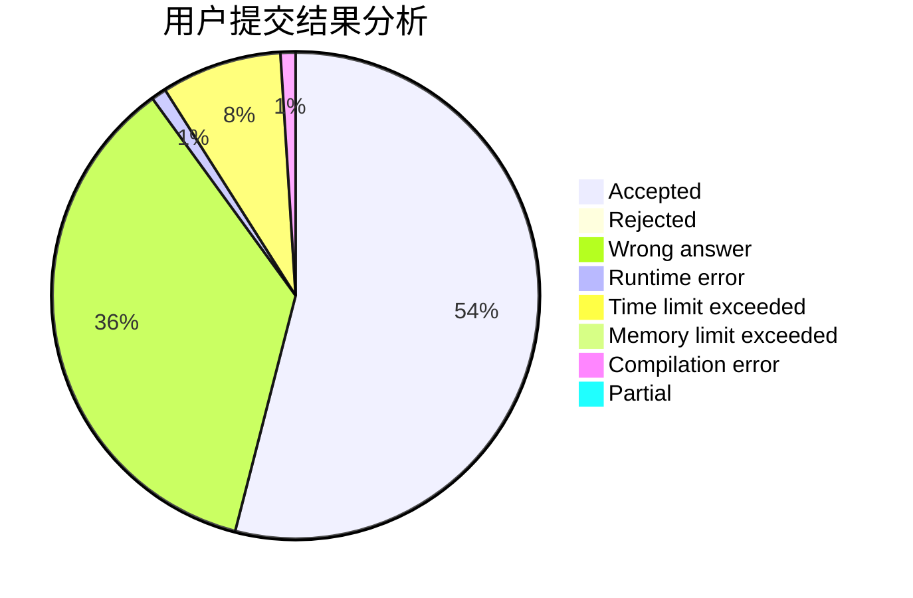
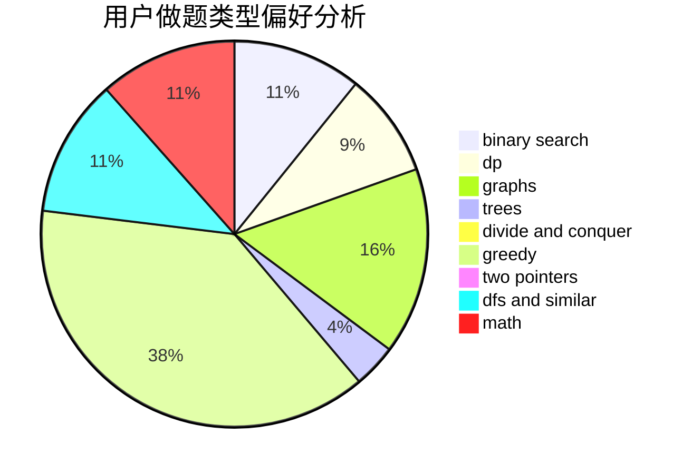

# Hongzy

<!-- tabs:start -->

#### **用户提交结果分析**

#### **用户做题类型偏好分析**

<!-- tabs:end -->
# 推荐题目
[569A](https://codeforces.com/contest/569/problem/A)
[629E](https://codeforces.com/contest/629/problem/E)
[1346A](https://codeforces.com/contest/1346/problem/A)
[665F](https://codeforces.com/contest/665/problem/F)
[659G](https://codeforces.com/contest/659/problem/G)
[11962](https://codeforces.com/contest/1196/problem/2)
[300B](https://codeforces.com/contest/300/problem/B)
[482C](https://codeforces.com/contest/482/problem/C)
[931A](https://codeforces.com/contest/931/problem/A)
[852I](https://codeforces.com/contest/852/problem/I)
