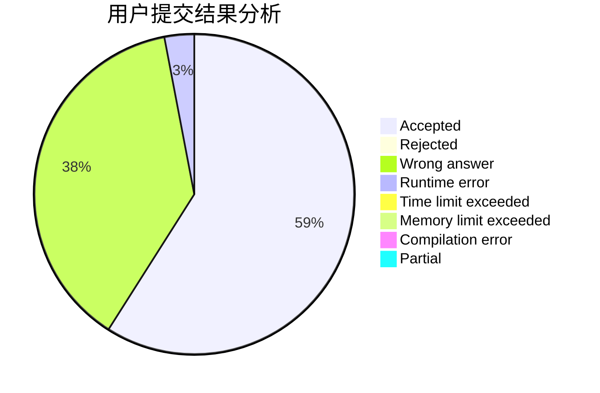
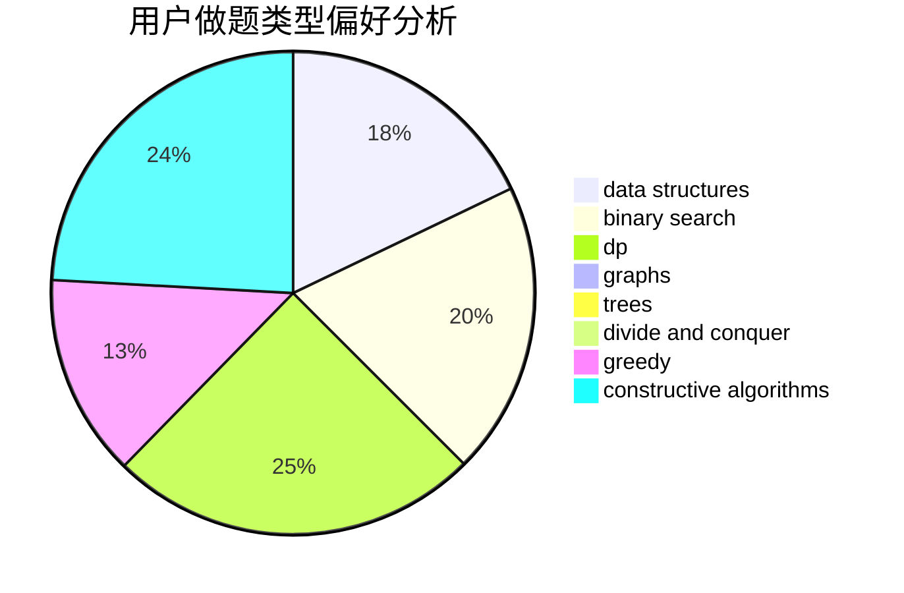

# Hooinkyoma
<!-- tabs:start -->
#### **用户提交结果分析**

#### **用户做题类型偏好分析**

#### **用户错题知识点分析**

<!-- tabs:end -->
# 推荐题目
[Number of Simple Paths](http://codeforces.com/problemset/problem/1454/E)		combinatorics,
                        dfs and similar,
                        graphs,
                        trees		  
[Cartoons](http://codeforces.com/problemset/problem/1297/B)		*special problem,
                        implementation,
                        sortings		  
[Toy Train (Simplified)](http://codeforces.com/problemset/problem/1129/A1)		brute force,
                        greedy		  
[A Tale of Two Lands](http://codeforces.com/problemset/problem/1166/C)		binary search,
                        sortings,
                        two pointers		  
[DNA Alignment](http://codeforces.com/problemset/problem/520/C)		math,
                        strings		  
[President and Roads](http://codeforces.com/problemset/problem/567/E)		dfs and similar,
                        graphs,
                        hashing,
                        shortest paths		  
[New Year and Snowy Grid](http://codeforces.com/problemset/problem/750/H)		dfs and similar,
                        dsu,
                        graphs,
                        interactive		  
[Odds and Ends](http://codeforces.com/problemset/problem/849/A)		implementation		  
[Appleman and Complicated Task](http://codeforces.com/problemset/problem/461/D)		dsu,
                        math		  
[Winding polygonal line](http://codeforces.com/problemset/problem/1158/D)		constructive algorithms,
                        geometry,
                        greedy,
                        math		  
<!-- tabs:start -->
#### **data structures**
[Number of Simple Paths](http://codeforces.com/problemset/problem/912/D)		data structures,
                        graphs,
                        greedy,
                        probabilities,
                        shortest paths		  
[Cartoons](http://codeforces.com/problemset/problem/1299/C)		data structures,
                        geometry,
                        greedy		  
[Toy Train (Simplified)](http://codeforces.com/problemset/problem/1492/C)		binary search,
                        data structures,
                        dp,
                        greedy,
                        two pointers		  
[A Tale of Two Lands](http://codeforces.com/problemset/problem/1490/G)		binary search,
                        data structures,
                        math		  
[DNA Alignment](http://codeforces.com/problemset/problem/1479/D)		binary search,
                        bitmasks,
                        brute force,
                        data structures,
                        probabilities,
                        trees		  
[President and Roads](http://codeforces.com/problemset/problem/1497/A)		brute force,
                        data structures,
                        greedy,
                        sortings		  
[New Year and Snowy Grid](http://codeforces.com/problemset/problem/1491/C)		brute force,
                        data structures,
                        dp,
                        greedy,
                        implementation		  
[Odds and Ends](http://codeforces.com/problemset/problem/1492/B)		data structures,
                        greedy,
                        math		  
[Appleman and Complicated Task](http://codeforces.com/problemset/problem/1436/E)		binary search,
                        data structures,
                        two pointers		  
[Winding polygonal line](http://codeforces.com/problemset/problem/1461/D)		binary search,
                        brute force,
                        data structures,
                        divide and conquer,
                        implementation,
                        sortings		  
#### **binary search**
[Number of Simple Paths](http://codeforces.com/problemset/problem/1166/C)		binary search,
                        sortings,
                        two pointers		  
[Cartoons](https://codeforces.com/contest/831/problem/D)		binary search,
                        brute force,
                        dp,
                        greedy,
                        sortings		  
[Toy Train (Simplified)](http://codeforces.com/problemset/problem/166/A)		binary search,
                        implementation,
                        sortings		  
[A Tale of Two Lands](http://codeforces.com/problemset/problem/912/E)		binary search,
                        dfs and similar,
                        math,
                        meet-in-the-middle,
                        number theory,
                        two pointers		  
[DNA Alignment](http://codeforces.com/problemset/problem/1492/C)		binary search,
                        data structures,
                        dp,
                        greedy,
                        two pointers		  
[President and Roads](http://codeforces.com/problemset/problem/1463/D)		binary search,
                        constructive algorithms,
                        greedy,
                        two pointers		  
[New Year and Snowy Grid](http://codeforces.com/problemset/problem/1490/G)		binary search,
                        data structures,
                        math		  
[Odds and Ends](http://codeforces.com/problemset/problem/1479/D)		binary search,
                        bitmasks,
                        brute force,
                        data structures,
                        probabilities,
                        trees		  
[Appleman and Complicated Task](http://codeforces.com/problemset/problem/1436/E)		binary search,
                        data structures,
                        two pointers		  
[Winding polygonal line](http://codeforces.com/problemset/problem/1461/D)		binary search,
                        brute force,
                        data structures,
                        divide and conquer,
                        implementation,
                        sortings		  
#### **dp**
[Number of Simple Paths](https://codeforces.com/contest/831/problem/D)		binary search,
                        brute force,
                        dp,
                        greedy,
                        sortings		  
[Cartoons](http://codeforces.com/problemset/problem/792/C)		dp,
                        greedy,
                        math,
                        number theory		  
[Toy Train (Simplified)](http://codeforces.com/problemset/problem/316/D1)		brute force,
                        dp		  
[A Tale of Two Lands](http://codeforces.com/problemset/problem/1492/C)		binary search,
                        data structures,
                        dp,
                        greedy,
                        two pointers		  
[DNA Alignment](https://codeforces.com/contest/1457/problem/C)		brute force,
                        dp,
                        implementation		  
[President and Roads](http://codeforces.com/problemset/problem/1491/C)		brute force,
                        data structures,
                        dp,
                        greedy,
                        implementation		  
[New Year and Snowy Grid](http://codeforces.com/problemset/problem/1437/C)		dp,
                        flows,
                        graph matchings,
                        greedy,
                        math,
                        sortings		  
[Odds and Ends](http://codeforces.com/problemset/problem/1499/B)		brute force,
                        dp,
                        greedy,
                        implementation		  
[Appleman and Complicated Task](http://codeforces.com/problemset/problem/1491/D)		bitmasks,
                        constructive algorithms,
                        dp,
                        greedy,
                        math		  
[Winding polygonal line](http://codeforces.com/problemset/problem/1497/E1)		data structures,
                        dp,
                        greedy,
                        math,
                        number theory,
                        two pointers		  
#### **graph**
[Number of Simple Paths](http://codeforces.com/problemset/problem/1454/E)		combinatorics,
                        dfs and similar,
                        graphs,
                        trees		  
[Cartoons](http://codeforces.com/problemset/problem/567/E)		dfs and similar,
                        graphs,
                        hashing,
                        shortest paths		  
[Toy Train (Simplified)](http://codeforces.com/problemset/problem/750/H)		dfs and similar,
                        dsu,
                        graphs,
                        interactive		  
[A Tale of Two Lands](http://codeforces.com/problemset/problem/912/D)		data structures,
                        graphs,
                        greedy,
                        probabilities,
                        shortest paths		  
[DNA Alignment](http://codeforces.com/problemset/problem/164/C)		flows,
                        graphs		  
[President and Roads](http://codeforces.com/problemset/problem/1487/C)		brute force,
                        constructive algorithms,
                        dfs and similar,
                        graphs,
                        greedy,
                        implementation,
                        math		  
[New Year and Snowy Grid](http://codeforces.com/problemset/problem/1437/C)		dp,
                        flows,
                        graph matchings,
                        greedy,
                        math,
                        sortings		  
[Odds and Ends](http://codeforces.com/problemset/problem/1470/D)		constructive algorithms,
                        dfs and similar,
                        graph matchings,
                        graphs,
                        greedy		  
[Appleman and Complicated Task](http://codeforces.com/problemset/problem/1476/C)		dp,
                        graphs,
                        greedy		  
[Winding polygonal line](http://codeforces.com/problemset/problem/1304/D)		constructive algorithms,
                        graphs,
                        greedy,
                        two pointers		  
#### **trees**
[Number of Simple Paths](http://codeforces.com/problemset/problem/1454/E)		combinatorics,
                        dfs and similar,
                        graphs,
                        trees		  
[Cartoons](http://codeforces.com/problemset/problem/1479/D)		binary search,
                        bitmasks,
                        brute force,
                        data structures,
                        probabilities,
                        trees		  
[Toy Train (Simplified)](http://codeforces.com/problemset/problem/1511/C)		brute force,
                        data structures,
                        implementation,
                        trees		  
[A Tale of Two Lands](http://codeforces.com/problemset/problem/1499/F)		combinatorics,
                        dfs and similar,
                        dp,
                        trees		  
[DNA Alignment](http://codeforces.com/problemset/problem/1491/E)		brute force,
                        dfs and similar,
                        divide and conquer,
                        number theory,
                        trees		  
[President and Roads](http://codeforces.com/problemset/problem/1466/D)		data structures,
                        greedy,
                        sortings,
                        trees		  
[New Year and Snowy Grid](http://codeforces.com/problemset/problem/1495/D)		combinatorics,
                        dfs and similar,
                        graphs,
                        math,
                        shortest paths,
                        trees		  
[Odds and Ends](http://codeforces.com/problemset/problem/1303/G)		data structures,
                        divide and conquer,
                        geometry,
                        trees		  
[Appleman and Complicated Task](http://codeforces.com/problemset/problem/1454/E)		combinatorics,
                        dfs and similar,
                        graphs,
                        trees		  
[Winding polygonal line](http://codeforces.com/problemset/problem/1494/D)		constructive algorithms,
                        data structures,
                        dfs and similar,
                        divide and conquer,
                        dsu,
                        greedy,
                        sortings,
                        trees		  
#### **divide and conquer**
[Number of Simple Paths](http://codeforces.com/problemset/problem/1461/D)		binary search,
                        brute force,
                        data structures,
                        divide and conquer,
                        implementation,
                        sortings		  
[Cartoons](http://codeforces.com/problemset/problem/1466/G)		combinatorics,
                        divide and conquer,
                        hashing,
                        math,
                        string suffix structures,
                        strings		  
[Toy Train (Simplified)](http://codeforces.com/problemset/problem/1490/D)		dfs and similar,
                        divide and conquer,
                        implementation		  
[A Tale of Two Lands](https://codeforces.com/contest/1483/problem/C)		data structures,
                        divide and conquer,
                        dp		  
[DNA Alignment](http://codeforces.com/problemset/problem/1491/E)		brute force,
                        dfs and similar,
                        divide and conquer,
                        number theory,
                        trees		  
[President and Roads](http://codeforces.com/problemset/problem/1303/G)		data structures,
                        divide and conquer,
                        geometry,
                        trees		  
[New Year and Snowy Grid](http://codeforces.com/problemset/problem/1494/D)		constructive algorithms,
                        data structures,
                        dfs and similar,
                        divide and conquer,
                        dsu,
                        greedy,
                        sortings,
                        trees		  
[Odds and Ends](http://codeforces.com/problemset/problem/1482/E)		data structures,
                        divide and conquer,
                        dp		  
[Appleman and Complicated Task](http://codeforces.com/problemset/problem/566/C)		dfs and similar,
                        divide and conquer,
                        trees		  
[Winding polygonal line](http://codeforces.com/problemset/problem/1428/F)		binary search,
                        data structures,
                        divide and conquer,
                        dp,
                        two pointers		  
#### **greedy**
[Number of Simple Paths](http://codeforces.com/problemset/problem/1129/A1)		brute force,
                        greedy		  
[Cartoons](http://codeforces.com/problemset/problem/1158/D)		constructive algorithms,
                        geometry,
                        greedy,
                        math		  
[Toy Train (Simplified)](https://codeforces.com/contest/831/problem/D)		binary search,
                        brute force,
                        dp,
                        greedy,
                        sortings		  
[A Tale of Two Lands](http://codeforces.com/problemset/problem/870/B)		greedy		  
[DNA Alignment](http://codeforces.com/problemset/problem/792/C)		dp,
                        greedy,
                        math,
                        number theory		  
[President and Roads](http://codeforces.com/problemset/problem/912/D)		data structures,
                        graphs,
                        greedy,
                        probabilities,
                        shortest paths		  
[New Year and Snowy Grid](http://codeforces.com/problemset/problem/1299/C)		data structures,
                        geometry,
                        greedy		  
[Odds and Ends](http://codeforces.com/problemset/problem/1492/C)		binary search,
                        data structures,
                        dp,
                        greedy,
                        two pointers		  
[Appleman and Complicated Task](https://codeforces.com/contest/1496/problem/C)		geometry,
                        greedy,
                        math,
                        sortings		  
[Winding polygonal line](http://codeforces.com/problemset/problem/1493/A)		constructive algorithms,
                        greedy		  
#### **constructive algorithms**
[Number of Simple Paths](http://codeforces.com/problemset/problem/1158/D)		constructive algorithms,
                        geometry,
                        greedy,
                        math		  
[Cartoons](http://codeforces.com/problemset/problem/803/B)		constructive algorithms		  
[Toy Train (Simplified)](http://codeforces.com/problemset/problem/1493/A)		constructive algorithms,
                        greedy		  
[A Tale of Two Lands](http://codeforces.com/problemset/problem/1463/D)		binary search,
                        constructive algorithms,
                        greedy,
                        two pointers		  
[DNA Alignment](https://codeforces.com/contest/1456/problem/B)		bitmasks,
                        brute force,
                        constructive algorithms		  
[President and Roads](http://codeforces.com/problemset/problem/1492/D)		bitmasks,
                        constructive algorithms,
                        greedy,
                        math		  
[New Year and Snowy Grid](https://codeforces.com/contest/1504/problem/D)		constructive algorithms,
                        games,
                        interactive		  
[Odds and Ends](https://codeforces.com/contest/1483/problem/A)		brute force,
                        constructive algorithms,
                        greedy,
                        implementation		  
[Appleman and Complicated Task](https://codeforces.com/contest/1457/problem/D)		bitmasks,
                        brute force,
                        constructive algorithms		  
[Winding polygonal line](http://codeforces.com/problemset/problem/1513/A)		constructive algorithms,
                        implementation		  
#### **sortings**
[Number of Simple Paths](http://codeforces.com/problemset/problem/1297/B)		*special problem,
                        implementation,
                        sortings		  
[Cartoons](http://codeforces.com/problemset/problem/1166/C)		binary search,
                        sortings,
                        two pointers		  
[Toy Train (Simplified)](https://codeforces.com/contest/831/problem/D)		binary search,
                        brute force,
                        dp,
                        greedy,
                        sortings		  
[A Tale of Two Lands](http://codeforces.com/problemset/problem/166/A)		binary search,
                        implementation,
                        sortings		  
[DNA Alignment](https://codeforces.com/contest/1496/problem/C)		geometry,
                        greedy,
                        math,
                        sortings		  
[President and Roads](http://codeforces.com/problemset/problem/1495/A)		geometry,
                        greedy,
                        math,
                        sortings		  
[New Year and Snowy Grid](http://codeforces.com/problemset/problem/1497/A)		brute force,
                        data structures,
                        greedy,
                        sortings		  
[Odds and Ends](http://codeforces.com/problemset/problem/1427/A)		math,
                        sortings		  
[Appleman and Complicated Task](http://codeforces.com/problemset/problem/1461/D)		binary search,
                        brute force,
                        data structures,
                        divide and conquer,
                        implementation,
                        sortings		  
[Winding polygonal line](http://codeforces.com/problemset/problem/1437/C)		dp,
                        flows,
                        graph matchings,
                        greedy,
                        math,
                        sortings		  
<!-- tabs:end -->
