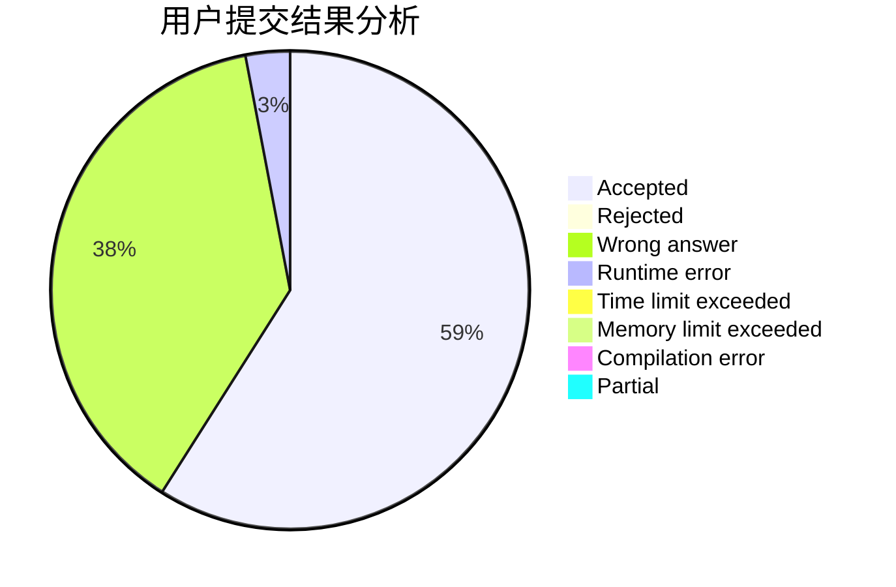
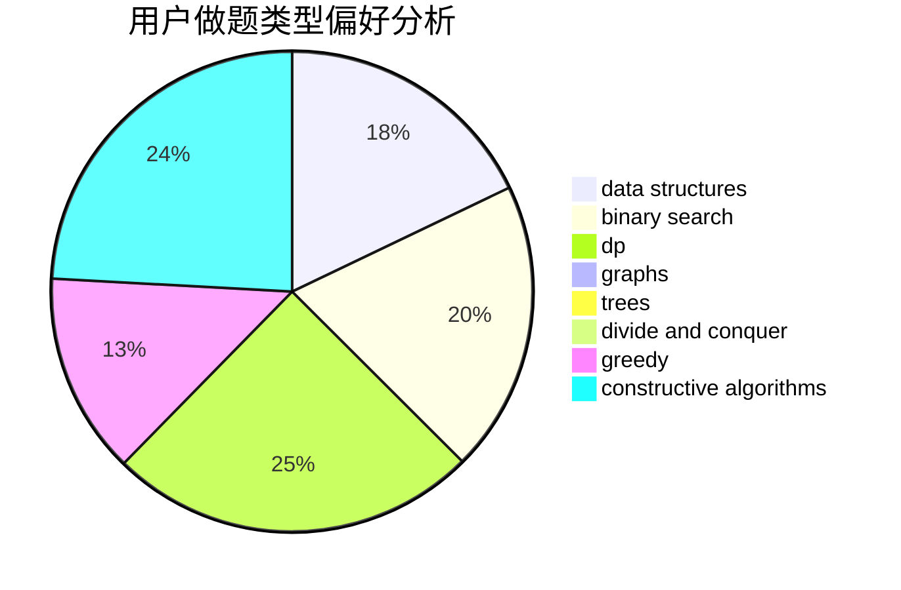

# Hooinkyoma

<!-- tabs:start -->

#### **用户提交结果分析**

#### **用户做题类型偏好分析**

#### **用户错题知识点分析**

<!-- tabs:end -->
# 推荐题目
[1454E](https://codeforces.com/contest/1454/problem/E)		combinatorics,
                        dfs and similar,
                        graphs,
                        trees		  
[750H](https://codeforces.com/contest/750/problem/H)		dfs and similar,
                        dsu,
                        graphs,
                        interactive		  
[1129A1](https://codeforces.com/contest/1129A/problem/1)		brute force,
                        greedy		  
[1166C](https://codeforces.com/contest/1166/problem/C)		binary search,
                        sortings,
                        two pointers		  
[461D](https://codeforces.com/contest/461/problem/D)		dsu,
                        math		  
[849A](https://codeforces.com/contest/849/problem/A)		implementation		  
[164C](https://codeforces.com/contest/164/problem/C)		flows,
                        graphs		  
[61A](https://codeforces.com/contest/61/problem/A)		implementation		  
[567E](https://codeforces.com/contest/567/problem/E)		dfs and similar,
                        graphs,
                        hashing,
                        shortest paths		  
[630C](https://codeforces.com/contest/630/problem/C)		combinatorics,
                        math		  
