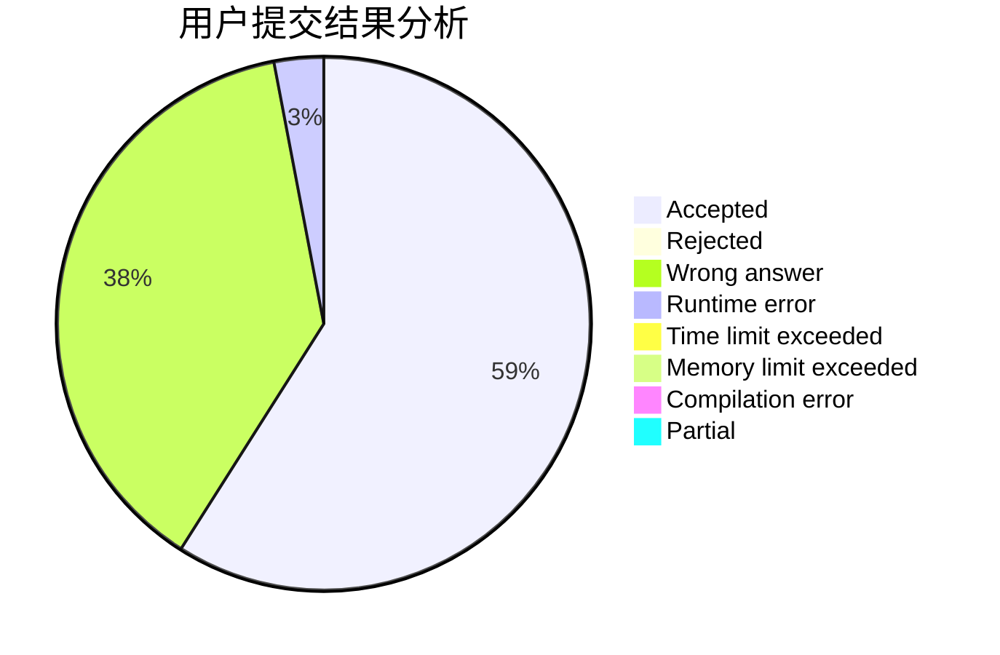
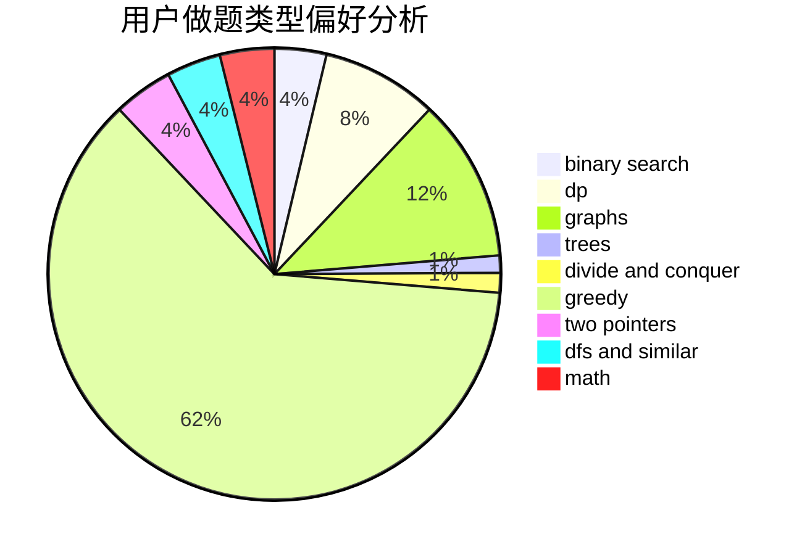

# Hooinkyoma

<!-- tabs:start -->

#### **用户提交结果分析**

#### **用户做题类型偏好分析**

<!-- tabs:end -->
# 推荐题目
[1464B](https://codeforces.com/contest/1464/problem/B)
[771D](https://codeforces.com/contest/771/problem/D)
[1130E](https://codeforces.com/contest/1130/problem/E)
[1169B](https://codeforces.com/contest/1169/problem/B)
[480C](https://codeforces.com/contest/480/problem/C)
[868C](https://codeforces.com/contest/868/problem/C)
[18A](https://codeforces.com/contest/18/problem/A)
[63C](https://codeforces.com/contest/63/problem/C)
[587D](https://codeforces.com/contest/587/problem/D)
[660A](https://codeforces.com/contest/660/problem/A)
