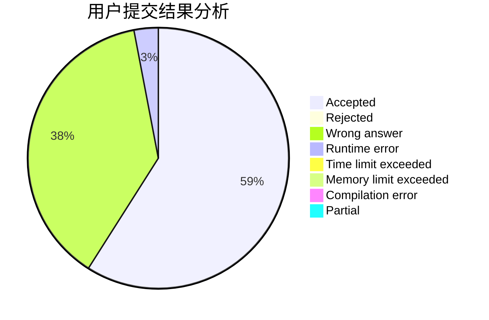
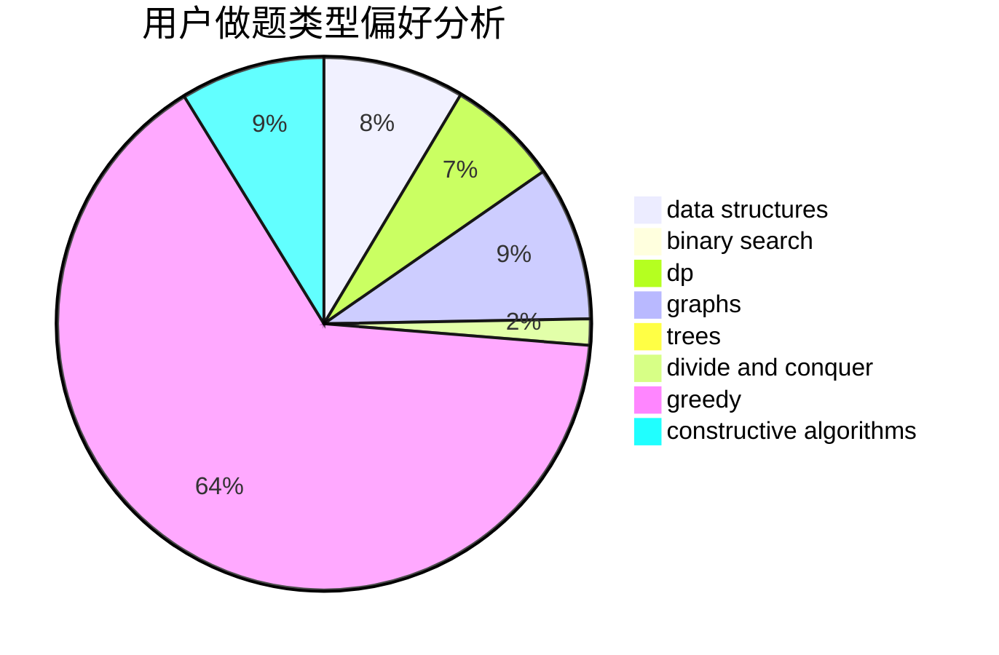

# Hooinkyoma

<!-- tabs:start -->

#### **用户提交结果分析**

#### **用户做题类型偏好分析**

#### **用户错题知识点分析**

<!-- tabs:end -->
# 推荐题目
[1464B](https://codeforces.com/contest/1464/problem/B)		dsu,graphs,sortings,trees		  
[771D](https://codeforces.com/contest/771/problem/D)		dp		  
[1130E](https://codeforces.com/contest/1130/problem/E)		dsu,graphs,sortings,trees		  
[1169B](https://codeforces.com/contest/1169/problem/B)		graphs,
                        implementation		  
[480C](https://codeforces.com/contest/480/problem/C)		dsu,graphs,sortings,trees		  
[868C](https://codeforces.com/contest/868/problem/C)		bitmasks,
                        brute force,
                        constructive algorithms,
                        dp		  
[18A](https://codeforces.com/contest/18/problem/A)		brute force,
                        geometry		  
[63C](https://codeforces.com/contest/63/problem/C)		brute force,
                        implementation		  
[587D](https://codeforces.com/contest/587/problem/D)		2-sat,
                        binary search		  
[660A](https://codeforces.com/contest/660/problem/A)		greedy,
                        implementation,
                        math,
                        number theory		  
