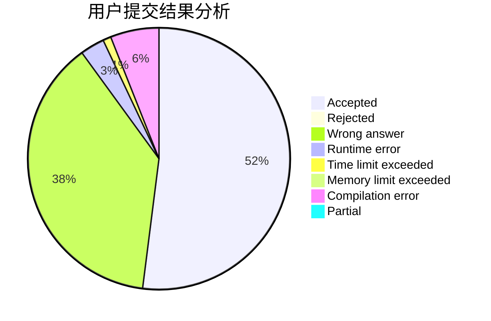
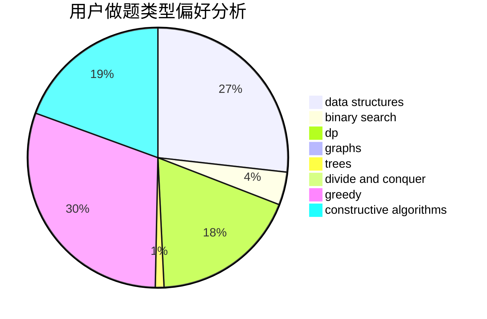
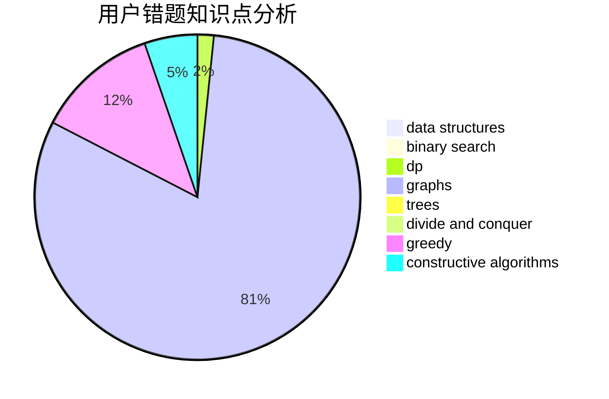

# Hosea

<!-- tabs:start -->

#### **用户提交结果分析**

#### **用户做题类型偏好分析**

#### **用户错题知识点分析**

<!-- tabs:end -->
# 推荐题目
[1187E](https://codeforces.com/contest/1187/problem/E)		dfs and similar,
                        dp,
                        trees		  
[781C](https://codeforces.com/contest/781/problem/C)		dsu,graphs,sortings,trees		  
[1163E](https://codeforces.com/contest/1163/problem/E)		bitmasks,
                        brute force,
                        constructive algorithms,
                        data structures,
                        graphs,
                        math		  
[852D](https://codeforces.com/contest/852/problem/D)		binary search,
                        flows,
                        graph matchings,
                        shortest paths		  
[552A](https://codeforces.com/contest/552/problem/A)		implementation,
                        math		  
[782E](https://codeforces.com/contest/782/problem/E)		dsu,graphs,sortings,trees		  
[337C](https://codeforces.com/contest/337/problem/C)		binary search,
                        greedy,
                        math,
                        matrices,
                        number theory		  
[811B](https://codeforces.com/contest/811/problem/B)		implementation,
                        sortings		  
[374A](https://codeforces.com/contest/374/problem/A)		greedy,
                        implementation		  
[1155B](https://codeforces.com/contest/1155/problem/B)		games,
                        greedy,
                        implementation		  
