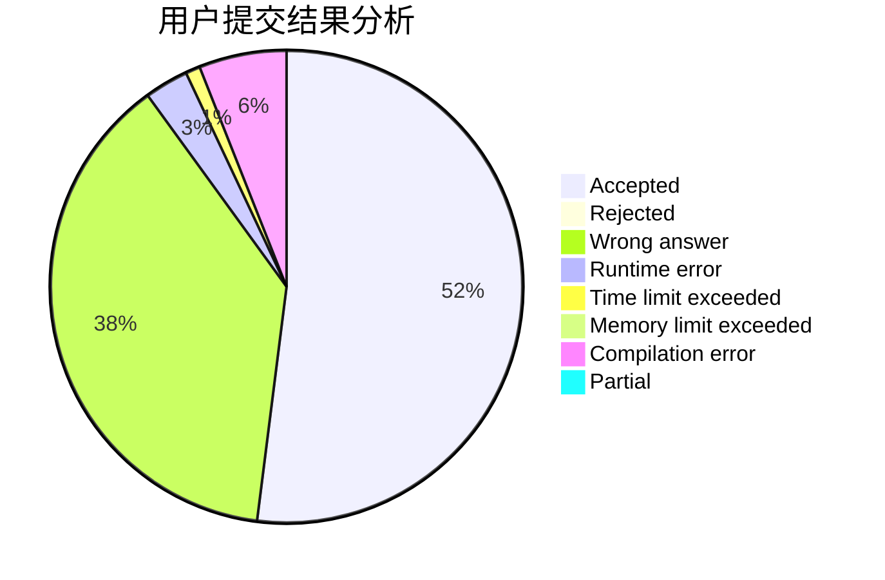
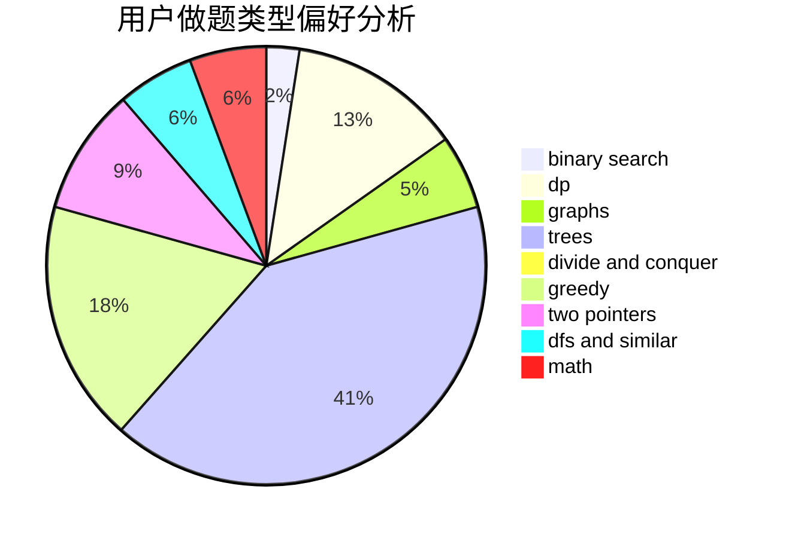

# Hosea

<!-- tabs:start -->

#### **用户提交结果分析**

#### **用户做题类型偏好分析**

<!-- tabs:end -->
# 推荐题目
[1187E](https://codeforces.com/contest/1187/problem/E)
[781C](https://codeforces.com/contest/781/problem/C)
[1163E](https://codeforces.com/contest/1163/problem/E)
[852D](https://codeforces.com/contest/852/problem/D)
[552A](https://codeforces.com/contest/552/problem/A)
[782E](https://codeforces.com/contest/782/problem/E)
[337C](https://codeforces.com/contest/337/problem/C)
[811B](https://codeforces.com/contest/811/problem/B)
[374A](https://codeforces.com/contest/374/problem/A)
[1155B](https://codeforces.com/contest/1155/problem/B)
