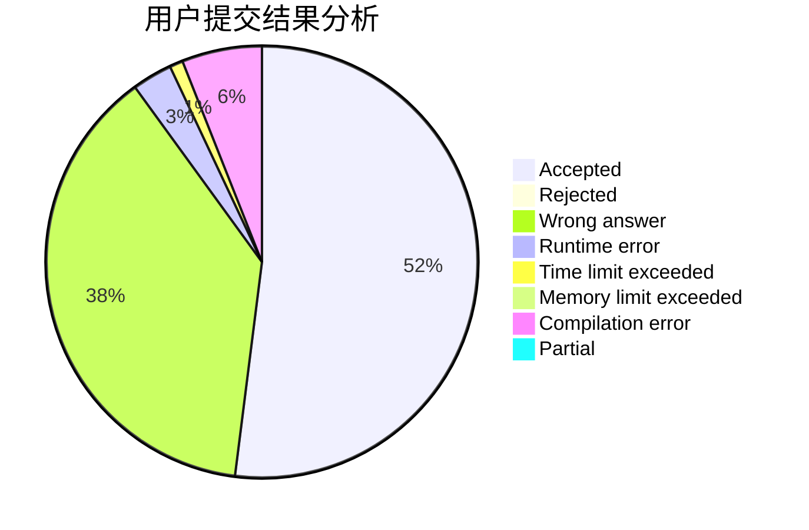
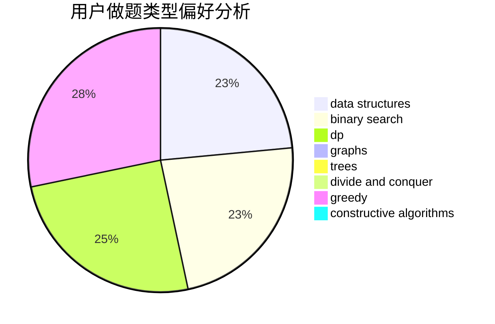
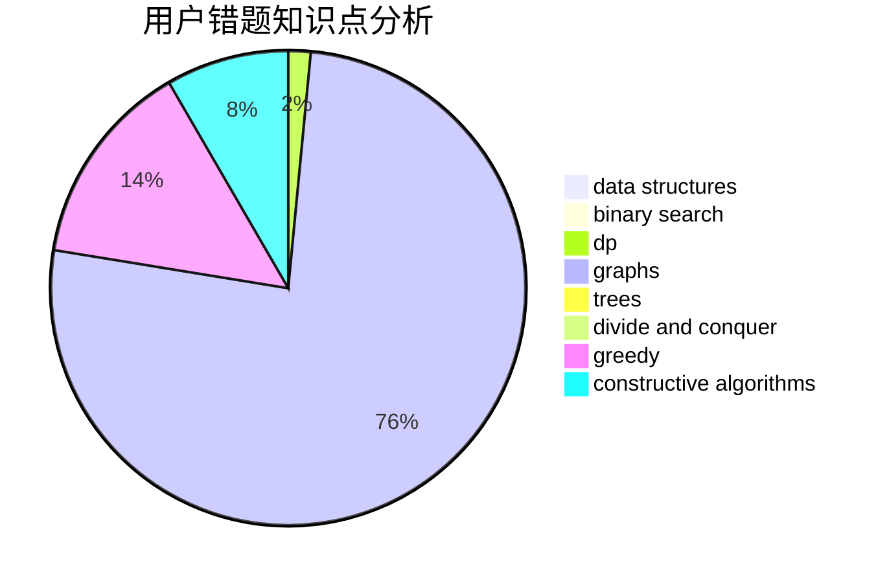

# Hosea

<!-- tabs:start -->

#### **用户提交结果分析**

#### **用户做题类型偏好分析**

#### **用户错题知识点分析**

<!-- tabs:end -->
# 推荐题目
[1184B2](https://codeforces.com/contest/1184B/problem/2)		flows,
                        graph matchings,
                        graphs,
                        shortest paths,
                        sortings		  
[762E](https://codeforces.com/contest/762/problem/E)		binary search,
                        data structures		  
[1161B](https://codeforces.com/contest/1161/problem/B)		dsu,graphs,sortings,trees		  
[834C](https://codeforces.com/contest/834/problem/C)		dsu,graphs,sortings,trees		  
[528A](https://codeforces.com/contest/528/problem/A)		dsu,graphs,sortings,trees		  
[764B](https://codeforces.com/contest/764/problem/B)		constructive algorithms,
                        implementation		  
[313C](https://codeforces.com/contest/313/problem/C)		constructive algorithms,
                        greedy,
                        implementation,
                        sortings		  
[797C](https://codeforces.com/contest/797/problem/C)		data structures,
                        greedy,
                        strings		  
[348B](https://codeforces.com/contest/348/problem/B)		dfs and similar,
                        number theory,
                        trees		  
[1153B](https://codeforces.com/contest/1153/problem/B)		constructive algorithms,
                        greedy		  
