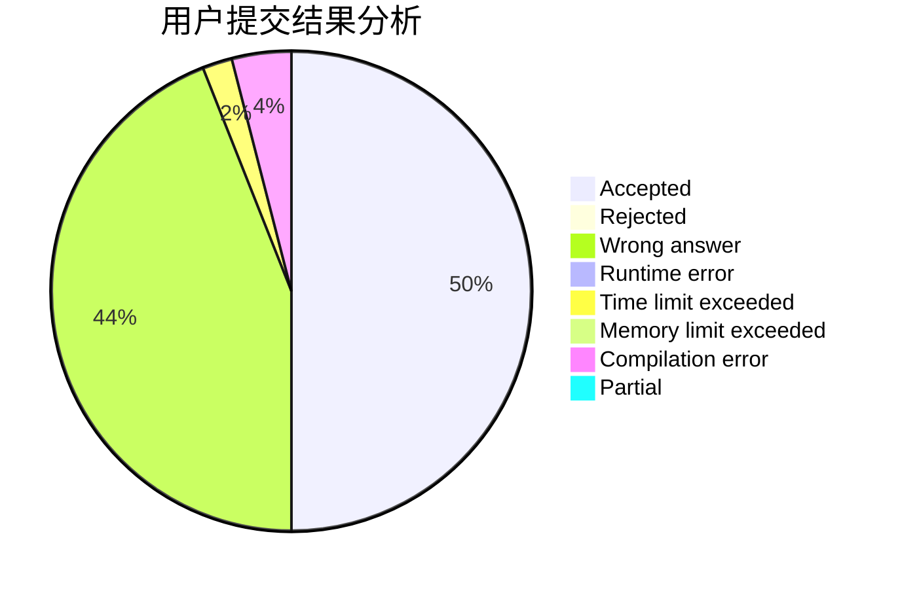
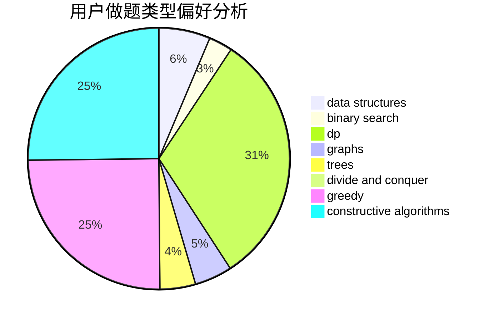
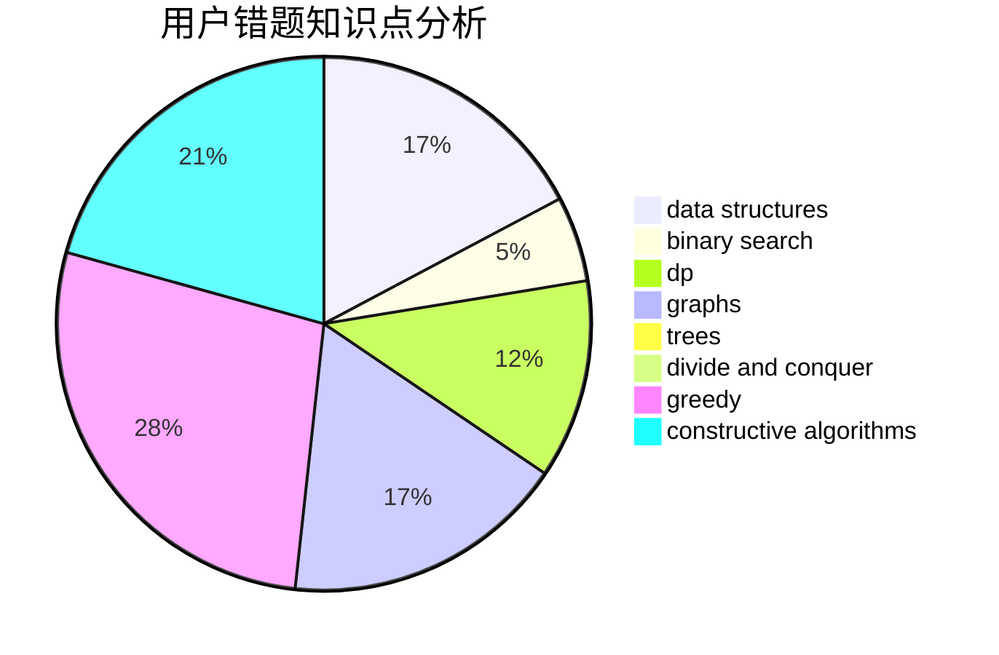

# HoshizoraZ

<!-- tabs:start -->

#### **用户提交结果分析**

#### **用户做题类型偏好分析**

#### **用户错题知识点分析**

<!-- tabs:end -->
# 推荐题目
[1402C](https://codeforces.com/contest/1402/problem/C)		*special problem,
                        combinatorics,
                        dfs and similar,
                        dp,
                        games,
                        graphs,
                        matrices,
                        trees		  
[762B](https://codeforces.com/contest/762/problem/B)		greedy,
                        implementation,
                        sortings,
                        two pointers		  
[371C](https://codeforces.com/contest/371/problem/C)		binary search,
                        brute force		  
[360A](https://codeforces.com/contest/360/problem/A)		greedy,
                        implementation		  
[1030C](https://codeforces.com/contest/1030/problem/C)		implementation		  
[317A](https://codeforces.com/contest/317/problem/A)		brute force		  
[555C](https://codeforces.com/contest/555/problem/C)		data structures		  
[1307F](https://codeforces.com/contest/1307/problem/F)		dfs and similar,
                        dsu,
                        trees		  
[709B](https://codeforces.com/contest/709/problem/B)		greedy,
                        implementation,
                        sortings		  
[727A](https://codeforces.com/contest/727/problem/A)		brute force,
                        dfs and similar,
                        math		  
