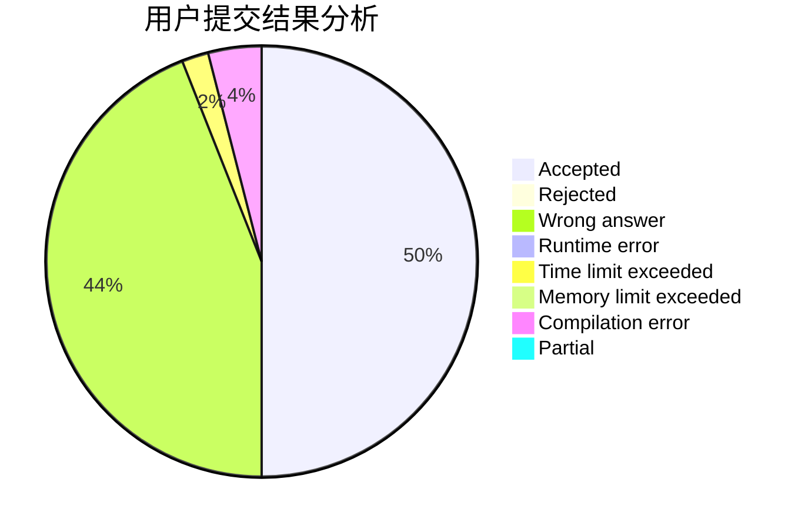
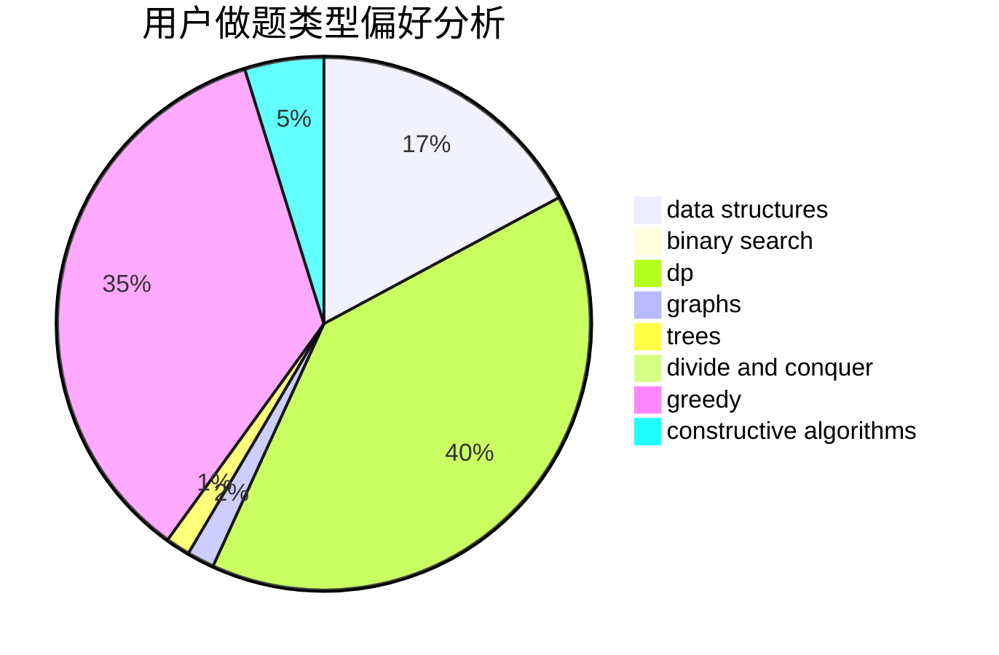
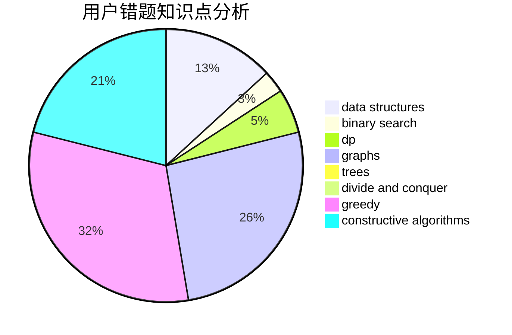

# HoshizoraZ

<!-- tabs:start -->

#### **用户提交结果分析**

#### **用户做题类型偏好分析**

#### **用户错题知识点分析**

<!-- tabs:end -->
# 推荐题目
[1413E](https://codeforces.com/contest/1413/problem/E)		greedy,
                        math,
                        ternary search		  
[780F](https://codeforces.com/contest/780/problem/F)		bitmasks,
                        dp,
                        graphs,
                        matrices		  
[400E](https://codeforces.com/contest/400/problem/E)		binary search,
                        bitmasks,
                        data structures		  
[388B](https://codeforces.com/contest/388/problem/B)		bitmasks,
                        constructive algorithms,
                        graphs,
                        implementation,
                        math		  
[1030G](https://codeforces.com/contest/1030/problem/G)		number theory		  
[346B](https://codeforces.com/contest/346/problem/B)		dp,
                        strings		  
[57D](https://codeforces.com/contest/57/problem/D)		dp,
                        math		  
[1316B](https://codeforces.com/contest/1316/problem/B)		brute force,
                        constructive algorithms,
                        implementation,
                        sortings,
                        strings		  
[729C](https://codeforces.com/contest/729/problem/C)		binary search,
                        greedy,
                        sortings		  
[744C](https://codeforces.com/contest/744/problem/C)		bitmasks,
                        brute force,
                        dp		  
