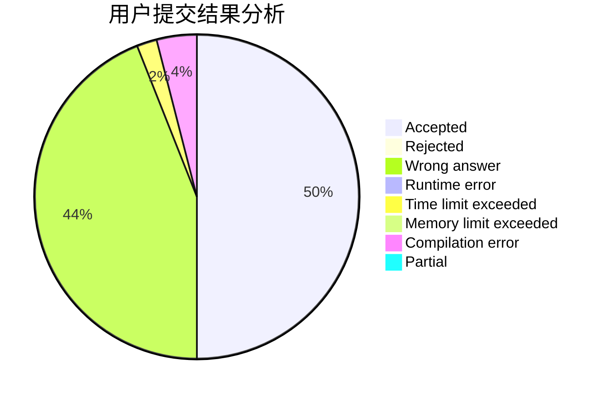
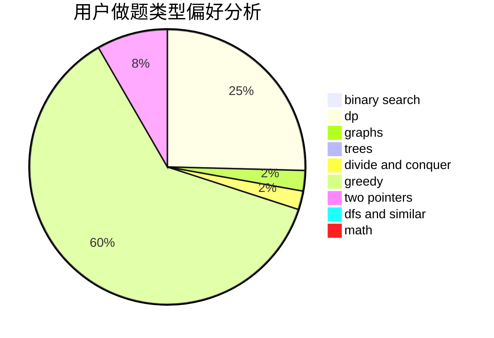

# HoshizoraZ

<!-- tabs:start -->

#### **用户提交结果分析**

#### **用户做题类型偏好分析**

<!-- tabs:end -->
# 推荐题目
[1413E](https://codeforces.com/contest/1413/problem/E)
[780F](https://codeforces.com/contest/780/problem/F)
[400E](https://codeforces.com/contest/400/problem/E)
[388B](https://codeforces.com/contest/388/problem/B)
[1030G](https://codeforces.com/contest/1030/problem/G)
[346B](https://codeforces.com/contest/346/problem/B)
[57D](https://codeforces.com/contest/57/problem/D)
[1316B](https://codeforces.com/contest/1316/problem/B)
[729C](https://codeforces.com/contest/729/problem/C)
[744C](https://codeforces.com/contest/744/problem/C)
