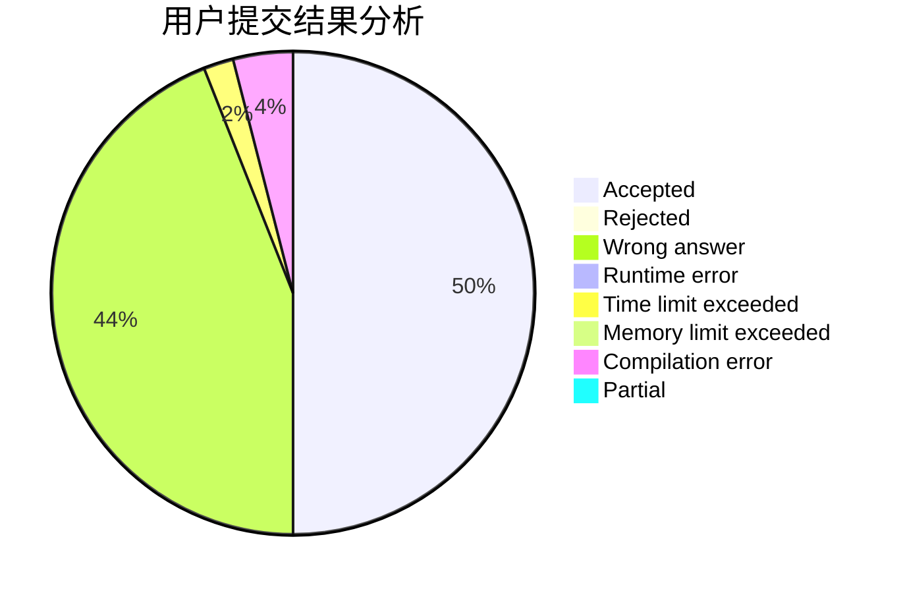
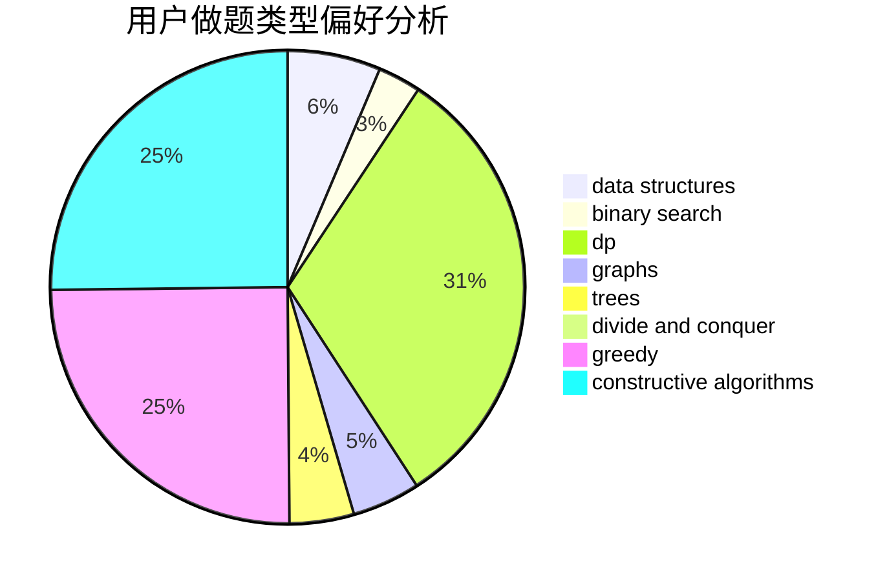
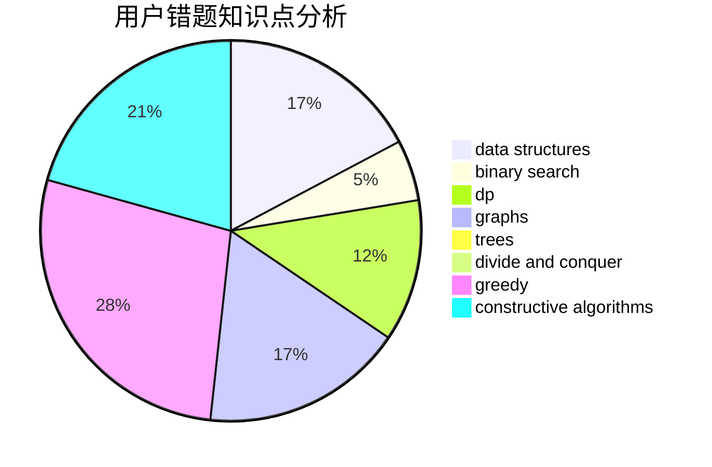

# HoshizoraZ
<!-- tabs:start -->
#### **用户提交结果分析**

#### **用户做题类型偏好分析**

#### **用户错题知识点分析**

<!-- tabs:end -->
# 推荐题目
[Case of Chocolate](http://codeforces.com/problemset/problem/555/C)		data structures		  
[Remembering Strings](http://codeforces.com/problemset/problem/543/C)		bitmasks,
                        dp		  
[Levko and Array Recovery](http://codeforces.com/problemset/problem/360/A)		greedy,
                        implementation		  
[Mysterious numbers - 1](http://codeforces.com/problemset/problem/171/A)		*special problem,
                        constructive algorithms		  
[Zuma](https://codeforces.com/contest/608/problem/D)		dp		  
[Vasya and Golden Ticket](http://codeforces.com/problemset/problem/1030/C)		implementation		  
[Substrings Sort](https://codeforces.com/contest/1489/problem/D)		sortings,
                        strings		  
[Graph Coloring](http://codeforces.com/problemset/problem/662/B)		dfs and similar,
                        graphs		  
[Star Trek](http://codeforces.com/problemset/problem/1402/C)		*special problem,
                        combinatorics,
                        dfs and similar,
                        dp,
                        games,
                        graphs,
                        matrices,
                        trees		  
[Perfect Pair](http://codeforces.com/problemset/problem/317/A)		brute force		  
<!-- tabs:start -->
#### **data structures**
[Case of Chocolate](http://codeforces.com/problemset/problem/555/C)		data structures		  
[Remembering Strings](http://codeforces.com/problemset/problem/1506/D)		constructive algorithms,
                        data structures,
                        greedy		  
[Levko and Array Recovery](http://codeforces.com/problemset/problem/280/D)		data structures,
                        flows,
                        graphs,
                        implementation		  
[Mysterious numbers - 1](http://codeforces.com/problemset/problem/1204/D2)		data structures,
                        greedy,
                        math,
                        strings		  
[Zuma](http://codeforces.com/problemset/problem/1089/K)		data structures		  
[Vasya and Golden Ticket](https://codeforces.com/contest/651/problem/C)		data structures,
                        geometry,
                        math		  
[Substrings Sort](http://codeforces.com/problemset/problem/797/C)		data structures,
                        greedy,
                        strings		  
[Graph Coloring](http://codeforces.com/problemset/problem/1000/F)		data structures,
                        divide and conquer		  
[Star Trek](https://codeforces.com/contest/1484/problem/E)		data structures,
                        divide and conquer,
                        dp		  
[Perfect Pair](http://codeforces.com/problemset/problem/1492/C)		binary search,
                        data structures,
                        dp,
                        greedy,
                        two pointers		  
#### **binary search**
[Case of Chocolate](http://codeforces.com/problemset/problem/804/D)		binary search,
                        brute force,
                        dfs and similar,
                        dp,
                        sortings,
                        trees		  
[Remembering Strings](http://codeforces.com/problemset/problem/371/C)		binary search,
                        brute force		  
[Levko and Array Recovery](http://codeforces.com/problemset/problem/1492/C)		binary search,
                        data structures,
                        dp,
                        greedy,
                        two pointers		  
[Mysterious numbers - 1](http://codeforces.com/problemset/problem/1492/C)		binary search,
                        data structures,
                        dp,
                        greedy,
                        two pointers		  
[Zuma](http://codeforces.com/problemset/problem/1463/D)		binary search,
                        constructive algorithms,
                        greedy,
                        two pointers		  
[Vasya and Golden Ticket](http://codeforces.com/problemset/problem/1490/G)		binary search,
                        data structures,
                        math		  
[Substrings Sort](http://codeforces.com/problemset/problem/1479/D)		binary search,
                        bitmasks,
                        brute force,
                        data structures,
                        probabilities,
                        trees		  
[Graph Coloring](http://codeforces.com/problemset/problem/1436/E)		binary search,
                        data structures,
                        two pointers		  
[Star Trek](http://codeforces.com/problemset/problem/1461/D)		binary search,
                        brute force,
                        data structures,
                        divide and conquer,
                        implementation,
                        sortings		  
[Perfect Pair](http://codeforces.com/problemset/problem/1493/C)		binary search,
                        brute force,
                        constructive algorithms,
                        greedy,
                        strings		  
#### **dp**
[Case of Chocolate](http://codeforces.com/problemset/problem/543/C)		bitmasks,
                        dp		  
[Remembering Strings](https://codeforces.com/contest/608/problem/D)		dp		  
[Levko and Array Recovery](http://codeforces.com/problemset/problem/1402/C)		*special problem,
                        combinatorics,
                        dfs and similar,
                        dp,
                        games,
                        graphs,
                        matrices,
                        trees		  
[Mysterious numbers - 1](http://codeforces.com/problemset/problem/1182/E)		dp,
                        math,
                        matrices,
                        number theory		  
[Zuma](http://codeforces.com/problemset/problem/372/B)		brute force,
                        divide and conquer,
                        dp		  
[Vasya and Golden Ticket](http://codeforces.com/problemset/problem/804/D)		binary search,
                        brute force,
                        dfs and similar,
                        dp,
                        sortings,
                        trees		  
[Substrings Sort](http://codeforces.com/problemset/problem/6/D)		brute force,
                        dp		  
[Graph Coloring](https://codeforces.com/contest/1484/problem/E)		data structures,
                        divide and conquer,
                        dp		  
[Star Trek](http://codeforces.com/problemset/problem/1492/C)		binary search,
                        data structures,
                        dp,
                        greedy,
                        two pointers		  
[Perfect Pair](http://codeforces.com/problemset/problem/1481/F)		dp,
                        greedy,
                        trees		  
#### **graph**
[Case of Chocolate](http://codeforces.com/problemset/problem/662/B)		dfs and similar,
                        graphs		  
[Remembering Strings](http://codeforces.com/problemset/problem/1402/C)		*special problem,
                        combinatorics,
                        dfs and similar,
                        dp,
                        games,
                        graphs,
                        matrices,
                        trees		  
[Levko and Array Recovery](https://codeforces.com/contest/1161/problem/D)		dfs and similar,
                        graphs		  
[Mysterious numbers - 1](http://codeforces.com/problemset/problem/280/D)		data structures,
                        flows,
                        graphs,
                        implementation		  
[Zuma](http://codeforces.com/problemset/problem/1487/C)		brute force,
                        constructive algorithms,
                        dfs and similar,
                        graphs,
                        greedy,
                        implementation,
                        math		  
[Vasya and Golden Ticket](http://codeforces.com/problemset/problem/1437/C)		dp,
                        flows,
                        graph matchings,
                        greedy,
                        math,
                        sortings		  
[Substrings Sort](http://codeforces.com/problemset/problem/1470/D)		constructive algorithms,
                        dfs and similar,
                        graph matchings,
                        graphs,
                        greedy		  
[Graph Coloring](http://codeforces.com/problemset/problem/1476/C)		dp,
                        graphs,
                        greedy		  
[Star Trek](http://codeforces.com/problemset/problem/1304/D)		constructive algorithms,
                        graphs,
                        greedy,
                        two pointers		  
[Perfect Pair](http://codeforces.com/problemset/problem/1475/C)		combinatorics,
                        graphs,
                        math		  
#### **trees**
[Case of Chocolate](http://codeforces.com/problemset/problem/1402/C)		*special problem,
                        combinatorics,
                        dfs and similar,
                        dp,
                        games,
                        graphs,
                        matrices,
                        trees		  
[Remembering Strings](http://codeforces.com/problemset/problem/1307/F)		dfs and similar,
                        dsu,
                        trees		  
[Levko and Array Recovery](http://codeforces.com/problemset/problem/804/D)		binary search,
                        brute force,
                        dfs and similar,
                        dp,
                        sortings,
                        trees		  
[Mysterious numbers - 1](http://codeforces.com/problemset/problem/913/B)		implementation,
                        trees		  
[Zuma](http://codeforces.com/problemset/problem/1481/F)		dp,
                        greedy,
                        trees		  
[Vasya and Golden Ticket](http://codeforces.com/problemset/problem/1479/D)		binary search,
                        bitmasks,
                        brute force,
                        data structures,
                        probabilities,
                        trees		  
[Substrings Sort](http://codeforces.com/problemset/problem/1511/C)		brute force,
                        data structures,
                        implementation,
                        trees		  
[Graph Coloring](http://codeforces.com/problemset/problem/1499/F)		combinatorics,
                        dfs and similar,
                        dp,
                        trees		  
[Star Trek](http://codeforces.com/problemset/problem/1491/E)		brute force,
                        dfs and similar,
                        divide and conquer,
                        number theory,
                        trees		  
[Perfect Pair](http://codeforces.com/problemset/problem/1466/D)		data structures,
                        greedy,
                        sortings,
                        trees		  
#### **divide and conquer**
[Case of Chocolate](http://codeforces.com/problemset/problem/372/B)		brute force,
                        divide and conquer,
                        dp		  
[Remembering Strings](http://codeforces.com/problemset/problem/1000/F)		data structures,
                        divide and conquer		  
[Levko and Array Recovery](https://codeforces.com/contest/1484/problem/E)		data structures,
                        divide and conquer,
                        dp		  
[Mysterious numbers - 1](http://codeforces.com/problemset/problem/1461/D)		binary search,
                        brute force,
                        data structures,
                        divide and conquer,
                        implementation,
                        sortings		  
[Zuma](http://codeforces.com/problemset/problem/1466/G)		combinatorics,
                        divide and conquer,
                        hashing,
                        math,
                        string suffix structures,
                        strings		  
[Vasya and Golden Ticket](http://codeforces.com/problemset/problem/1490/D)		dfs and similar,
                        divide and conquer,
                        implementation		  
[Substrings Sort](https://codeforces.com/contest/1483/problem/C)		data structures,
                        divide and conquer,
                        dp		  
[Graph Coloring](http://codeforces.com/problemset/problem/1491/E)		brute force,
                        dfs and similar,
                        divide and conquer,
                        number theory,
                        trees		  
[Star Trek](http://codeforces.com/problemset/problem/1303/G)		data structures,
                        divide and conquer,
                        geometry,
                        trees		  
[Perfect Pair](http://codeforces.com/problemset/problem/1494/D)		constructive algorithms,
                        data structures,
                        dfs and similar,
                        divide and conquer,
                        dsu,
                        greedy,
                        sortings,
                        trees		  
#### **greedy**
[Case of Chocolate](http://codeforces.com/problemset/problem/360/A)		greedy,
                        implementation		  
[Remembering Strings](http://codeforces.com/problemset/problem/709/B)		greedy,
                        implementation,
                        sortings		  
[Levko and Array Recovery](http://codeforces.com/problemset/problem/762/B)		greedy,
                        implementation,
                        sortings,
                        two pointers		  
[Mysterious numbers - 1](http://codeforces.com/problemset/problem/912/C)		brute force,
                        greedy,
                        sortings		  
[Zuma](http://codeforces.com/problemset/problem/1506/D)		constructive algorithms,
                        data structures,
                        greedy		  
[Vasya and Golden Ticket](http://codeforces.com/problemset/problem/1291/A)		greedy,
                        math,
                        strings		  
[Substrings Sort](http://codeforces.com/problemset/problem/1204/D2)		data structures,
                        greedy,
                        math,
                        strings		  
[Graph Coloring](http://codeforces.com/problemset/problem/797/C)		data structures,
                        greedy,
                        strings		  
[Star Trek](http://codeforces.com/problemset/problem/518/B)		greedy,
                        implementation,
                        strings		  
[Perfect Pair](http://codeforces.com/problemset/problem/1492/C)		binary search,
                        data structures,
                        dp,
                        greedy,
                        two pointers		  
#### **constructive algorithms**
[Case of Chocolate](http://codeforces.com/problemset/problem/171/A)		*special problem,
                        constructive algorithms		  
[Remembering Strings](http://codeforces.com/problemset/problem/865/A)		constructive algorithms		  
[Levko and Array Recovery](http://codeforces.com/problemset/problem/1213/E)		brute force,
                        constructive algorithms		  
[Mysterious numbers - 1](http://codeforces.com/problemset/problem/1506/D)		constructive algorithms,
                        data structures,
                        greedy		  
[Zuma](http://codeforces.com/problemset/problem/1365/E)		brute force,
                        constructive algorithms		  
[Vasya and Golden Ticket](http://codeforces.com/problemset/problem/1493/A)		constructive algorithms,
                        greedy		  
[Substrings Sort](http://codeforces.com/problemset/problem/1463/D)		binary search,
                        constructive algorithms,
                        greedy,
                        two pointers		  
[Graph Coloring](https://codeforces.com/contest/1456/problem/B)		bitmasks,
                        brute force,
                        constructive algorithms		  
[Star Trek](http://codeforces.com/problemset/problem/1492/D)		bitmasks,
                        constructive algorithms,
                        greedy,
                        math		  
[Perfect Pair](https://codeforces.com/contest/1504/problem/D)		constructive algorithms,
                        games,
                        interactive		  
#### **sortings**
[Case of Chocolate](https://codeforces.com/contest/1489/problem/D)		sortings,
                        strings		  
[Remembering Strings](http://codeforces.com/problemset/problem/709/B)		greedy,
                        implementation,
                        sortings		  
[Levko and Array Recovery](http://codeforces.com/problemset/problem/762/B)		greedy,
                        implementation,
                        sortings,
                        two pointers		  
[Mysterious numbers - 1](http://codeforces.com/problemset/problem/912/C)		brute force,
                        greedy,
                        sortings		  
[Zuma](http://codeforces.com/problemset/problem/804/D)		binary search,
                        brute force,
                        dfs and similar,
                        dp,
                        sortings,
                        trees		  
[Vasya and Golden Ticket](http://codeforces.com/problemset/problem/1012/A)		brute force,
                        implementation,
                        math,
                        sortings		  
[Substrings Sort](https://codeforces.com/contest/1496/problem/C)		geometry,
                        greedy,
                        math,
                        sortings		  
[Graph Coloring](http://codeforces.com/problemset/problem/1495/A)		geometry,
                        greedy,
                        math,
                        sortings		  
[Star Trek](http://codeforces.com/problemset/problem/1497/A)		brute force,
                        data structures,
                        greedy,
                        sortings		  
[Perfect Pair](http://codeforces.com/problemset/problem/1427/A)		math,
                        sortings		  
<!-- tabs:end -->
