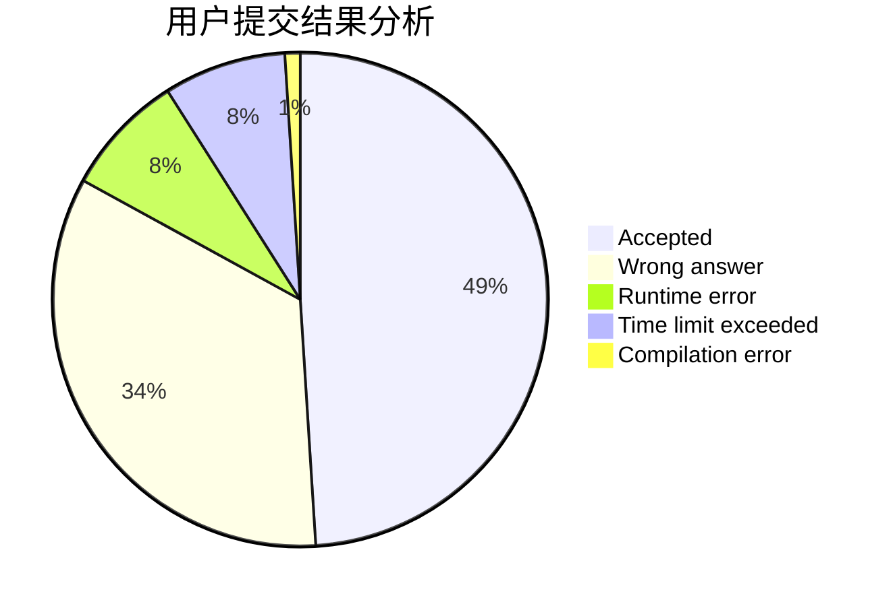
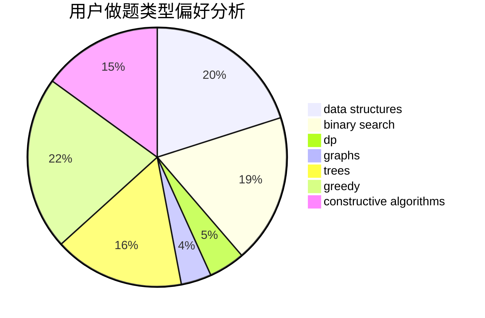

# Hoshizora_Z
<!-- tabs:start -->
#### **用户提交结果分析**

#### **用户做题类型偏好分析**

#### **用户错题知识点分析**

<!-- tabs:end -->
# 推荐题目
[Party Lemonade](http://codeforces.com/problemset/problem/913/C)		bitmasks,
                        dp,
                        greedy		  
[Julia the snail](http://codeforces.com/problemset/problem/793/F)		data structures,
                        divide and conquer,
                        dp		  
[Cubical Planet](http://codeforces.com/problemset/problem/39/D)		math		  
[Dreamoon and Binary](http://codeforces.com/problemset/problem/477/D)		dp,
                        strings		  
[The penguin's game](http://codeforces.com/problemset/problem/835/E)		binary search,
                        constructive algorithms,
                        interactive		  
[Divide Candies](http://codeforces.com/problemset/problem/1056/B)		math,
                        number theory		  
[Cover Points](http://codeforces.com/problemset/problem/1047/B)		geometry,
                        math		  
[Chamber of Secrets](http://codeforces.com/problemset/problem/173/B)		dfs and similar,
                        shortest paths		  
[Basketball Team](http://codeforces.com/problemset/problem/107/B)		combinatorics,
                        dp,
                        math,
                        probabilities		  
[Math Problem](https://codeforces.com/contest/1262/problem/A)		math		  
<!-- tabs:start -->
#### **data structures**
[Julia the snail](http://codeforces.com/problemset/problem/793/F)		data structures,
                        divide and conquer,
                        dp		  
[Autocompletion](http://codeforces.com/problemset/problem/1312/G)		data structures,
                        dfs and similar,
                        dp		  
[Roadside Trees](http://codeforces.com/problemset/problem/264/E)		data structures,
                        dp		  
[Noble Knight's Path](http://codeforces.com/problemset/problem/226/E)		data structures,
                        trees		  
[Max Mex](http://codeforces.com/problemset/problem/1083/C)		data structures,
                        trees		  
[Gosha is hunting](http://codeforces.com/problemset/problem/739/E)		brute force,
                        data structures,
                        dp,
                        flows,
                        math,
                        probabilities,
                        sortings		  
[NEKO's Maze Game](https://codeforces.com/contest/1293/problem/C)		data structures,
                        dsu,
                        implementation		  
[Maximum width](http://codeforces.com/problemset/problem/1492/C)		binary search,
                        data structures,
                        dp,
                        greedy,
                        two pointers		  
[Old Floppy Drive](http://codeforces.com/problemset/problem/1490/G)		binary search,
                        data structures,
                        math		  
[Odd Mineral Resource](http://codeforces.com/problemset/problem/1479/D)		binary search,
                        bitmasks,
                        brute force,
                        data structures,
                        probabilities,
                        trees		  
#### **binary search**
[The penguin's game](http://codeforces.com/problemset/problem/835/E)		binary search,
                        constructive algorithms,
                        interactive		  
[Downloading B++](http://codeforces.com/problemset/problem/883/C)		binary search,
                        implementation		  
[Another Problem on Strings](http://codeforces.com/problemset/problem/165/C)		binary search,
                        brute force,
                        dp,
                        math,
                        strings,
                        two pointers		  
[String Game](https://codeforces.com/contest/779/problem/D)		binary search,
                        greedy,
                        strings		  
[Cross Sum](http://codeforces.com/problemset/problem/607/E)		binary search,
                        geometry		  
[Maximum width](http://codeforces.com/problemset/problem/1492/C)		binary search,
                        data structures,
                        dp,
                        greedy,
                        two pointers		  
[Pairs](http://codeforces.com/problemset/problem/1463/D)		binary search,
                        constructive algorithms,
                        greedy,
                        two pointers		  
[Old Floppy Drive](http://codeforces.com/problemset/problem/1490/G)		binary search,
                        data structures,
                        math		  
[Odd Mineral Resource](http://codeforces.com/problemset/problem/1479/D)		binary search,
                        bitmasks,
                        brute force,
                        data structures,
                        probabilities,
                        trees		  
[Complicated Computations](http://codeforces.com/problemset/problem/1436/E)		binary search,
                        data structures,
                        two pointers		  
#### **dp**
[Party Lemonade](http://codeforces.com/problemset/problem/913/C)		bitmasks,
                        dp,
                        greedy		  
[Julia the snail](http://codeforces.com/problemset/problem/793/F)		data structures,
                        divide and conquer,
                        dp		  
[Dreamoon and Binary](http://codeforces.com/problemset/problem/477/D)		dp,
                        strings		  
[Basketball Team](http://codeforces.com/problemset/problem/107/B)		combinatorics,
                        dp,
                        math,
                        probabilities		  
[Autocompletion](http://codeforces.com/problemset/problem/1312/G)		data structures,
                        dfs and similar,
                        dp		  
[Roadside Trees](http://codeforces.com/problemset/problem/264/E)		data structures,
                        dp		  
[Another Problem on Strings](http://codeforces.com/problemset/problem/165/C)		binary search,
                        brute force,
                        dp,
                        math,
                        strings,
                        two pointers		  
[Substitutes in Number](http://codeforces.com/problemset/problem/464/C)		dp		  
[Jeff and Brackets](http://codeforces.com/problemset/problem/351/C)		dp,
                        matrices		  
[Professional layer](http://codeforces.com/problemset/problem/1103/D)		bitmasks,
                        dp		  
#### **graph**
[Flights](http://codeforces.com/problemset/problem/241/E)		graphs,
                        shortest paths		  
[Solve The Maze](http://codeforces.com/problemset/problem/1365/D)		constructive algorithms,
                        dfs and similar,
                        dsu,
                        graphs,
                        greedy,
                        implementation,
                        shortest paths		  
[Little Pony and Summer Sun Celebration](http://codeforces.com/problemset/problem/453/C)		constructive algorithms,
                        dfs and similar,
                        graphs		  
[Minimum Ties](http://codeforces.com/problemset/problem/1487/C)		brute force,
                        constructive algorithms,
                        dfs and similar,
                        graphs,
                        greedy,
                        implementation,
                        math		  
[Chef Monocarp](http://codeforces.com/problemset/problem/1437/C)		dp,
                        flows,
                        graph matchings,
                        greedy,
                        math,
                        sortings		  
[Strange Housing](http://codeforces.com/problemset/problem/1470/D)		constructive algorithms,
                        dfs and similar,
                        graph matchings,
                        graphs,
                        greedy		  
[Longest Simple Cycle](http://codeforces.com/problemset/problem/1476/C)		dp,
                        graphs,
                        greedy		  
[Shortest and Longest LIS](http://codeforces.com/problemset/problem/1304/D)		constructive algorithms,
                        graphs,
                        greedy,
                        two pointers		  
[Ball in Berland](http://codeforces.com/problemset/problem/1475/C)		combinatorics,
                        graphs,
                        math		  
[Kyoya and Train](http://codeforces.com/problemset/problem/553/E)		dp,
                        fft,
                        graphs,
                        math,
                        probabilities		  
#### **trees**
[Noble Knight's Path](http://codeforces.com/problemset/problem/226/E)		data structures,
                        trees		  
[Max Mex](http://codeforces.com/problemset/problem/1083/C)		data structures,
                        trees		  
[Odd Mineral Resource](http://codeforces.com/problemset/problem/1479/D)		binary search,
                        bitmasks,
                        brute force,
                        data structures,
                        probabilities,
                        trees		  
[Yet Another Card Deck](http://codeforces.com/problemset/problem/1511/C)		brute force,
                        data structures,
                        implementation,
                        trees		  
[Diameter Cuts](http://codeforces.com/problemset/problem/1499/F)		combinatorics,
                        dfs and similar,
                        dp,
                        trees		  
[Fib-tree](http://codeforces.com/problemset/problem/1491/E)		brute force,
                        dfs and similar,
                        divide and conquer,
                        number theory,
                        trees		  
[13th Labour of Heracles](http://codeforces.com/problemset/problem/1466/D)		data structures,
                        greedy,
                        sortings,
                        trees		  
[BFS Trees](http://codeforces.com/problemset/problem/1495/D)		combinatorics,
                        dfs and similar,
                        graphs,
                        math,
                        shortest paths,
                        trees		  
[Sum of Prefix Sums](http://codeforces.com/problemset/problem/1303/G)		data structures,
                        divide and conquer,
                        geometry,
                        trees		  
[Number of Simple Paths](http://codeforces.com/problemset/problem/1454/E)		combinatorics,
                        dfs and similar,
                        graphs,
                        trees		  
#### **divide and conquer**
[Julia the snail](http://codeforces.com/problemset/problem/793/F)		data structures,
                        divide and conquer,
                        dp		  
[Random Elections](http://codeforces.com/problemset/problem/850/E)		bitmasks,
                        brute force,
                        divide and conquer,
                        fft,
                        math		  
[Divide and Summarize](http://codeforces.com/problemset/problem/1461/D)		binary search,
                        brute force,
                        data structures,
                        divide and conquer,
                        implementation,
                        sortings		  
[Song of the Sirens](http://codeforces.com/problemset/problem/1466/G)		combinatorics,
                        divide and conquer,
                        hashing,
                        math,
                        string suffix structures,
                        strings		  
[Permutation Transformation](http://codeforces.com/problemset/problem/1490/D)		dfs and similar,
                        divide and conquer,
                        implementation		  
[Skyline Photo](https://codeforces.com/contest/1483/problem/C)		data structures,
                        divide and conquer,
                        dp		  
[Fib-tree](http://codeforces.com/problemset/problem/1491/E)		brute force,
                        dfs and similar,
                        divide and conquer,
                        number theory,
                        trees		  
[Sum of Prefix Sums](http://codeforces.com/problemset/problem/1303/G)		data structures,
                        divide and conquer,
                        geometry,
                        trees		  
[Dogeforces](http://codeforces.com/problemset/problem/1494/D)		constructive algorithms,
                        data structures,
                        dfs and similar,
                        divide and conquer,
                        dsu,
                        greedy,
                        sortings,
                        trees		  
[Logistical Questions](http://codeforces.com/problemset/problem/566/C)		dfs and similar,
                        divide and conquer,
                        trees		  
#### **greedy**
[Party Lemonade](http://codeforces.com/problemset/problem/913/C)		bitmasks,
                        dp,
                        greedy		  
[Gravity Flip](http://codeforces.com/problemset/problem/405/A)		greedy,
                        implementation,
                        sortings		  
[Sorting Railway Cars](https://codeforces.com/contest/606/problem/C)		constructive algorithms,
                        greedy		  
[Double Matrix](http://codeforces.com/problemset/problem/1162/B)		brute force,
                        greedy		  
[String Game](https://codeforces.com/contest/779/problem/D)		binary search,
                        greedy,
                        strings		  
[Solve The Maze](http://codeforces.com/problemset/problem/1365/D)		constructive algorithms,
                        dfs and similar,
                        dsu,
                        graphs,
                        greedy,
                        implementation,
                        shortest paths		  
[Lucky Conversion](http://codeforces.com/problemset/problem/145/A)		greedy,
                        implementation		  
[Almost Equal](http://codeforces.com/problemset/problem/1205/A)		constructive algorithms,
                        greedy,
                        math		  
[Good Numbers (easy version)](http://codeforces.com/problemset/problem/1249/C1)		brute force,
                        greedy,
                        implementation		  
[Permutation Partitions](http://codeforces.com/problemset/problem/1326/C)		combinatorics,
                        greedy,
                        math		  
#### **constructive algorithms**
[The penguin's game](http://codeforces.com/problemset/problem/835/E)		binary search,
                        constructive algorithms,
                        interactive		  
[Sorting Railway Cars](https://codeforces.com/contest/606/problem/C)		constructive algorithms,
                        greedy		  
[Solve The Maze](http://codeforces.com/problemset/problem/1365/D)		constructive algorithms,
                        dfs and similar,
                        dsu,
                        graphs,
                        greedy,
                        implementation,
                        shortest paths		  
[Almost Equal](http://codeforces.com/problemset/problem/1205/A)		constructive algorithms,
                        greedy,
                        math		  
[Little Pony and Summer Sun Celebration](http://codeforces.com/problemset/problem/453/C)		constructive algorithms,
                        dfs and similar,
                        graphs		  
[Anti-knapsack](http://codeforces.com/problemset/problem/1493/A)		constructive algorithms,
                        greedy		  
[Pairs](http://codeforces.com/problemset/problem/1463/D)		binary search,
                        constructive algorithms,
                        greedy,
                        two pointers		  
[XOR-gun](https://codeforces.com/contest/1456/problem/B)		bitmasks,
                        brute force,
                        constructive algorithms		  
[Genius's Gambit](http://codeforces.com/problemset/problem/1492/D)		bitmasks,
                        constructive algorithms,
                        greedy,
                        math		  
[3-Coloring](https://codeforces.com/contest/1504/problem/D)		constructive algorithms,
                        games,
                        interactive		  
#### **sortings**
[Gravity Flip](http://codeforces.com/problemset/problem/405/A)		greedy,
                        implementation,
                        sortings		  
[Gosha is hunting](http://codeforces.com/problemset/problem/739/E)		brute force,
                        data structures,
                        dp,
                        flows,
                        math,
                        probabilities,
                        sortings		  
[Diamond Miner](https://codeforces.com/contest/1496/problem/C)		geometry,
                        greedy,
                        math,
                        sortings		  
[Meximization](http://codeforces.com/problemset/problem/1497/A)		brute force,
                        data structures,
                        greedy,
                        sortings		  
[Avoiding Zero](http://codeforces.com/problemset/problem/1427/A)		math,
                        sortings		  
[Divide and Summarize](http://codeforces.com/problemset/problem/1461/D)		binary search,
                        brute force,
                        data structures,
                        divide and conquer,
                        implementation,
                        sortings		  
[Chef Monocarp](http://codeforces.com/problemset/problem/1437/C)		dp,
                        flows,
                        graph matchings,
                        greedy,
                        math,
                        sortings		  
[Replacing Elements](http://codeforces.com/problemset/problem/1473/A)		greedy,
                        implementation,
                        math,
                        sortings		  
[Eastern Exhibition](http://codeforces.com/problemset/problem/1486/B)		binary search,
                        geometry,
                        shortest paths,
                        sortings		  
[The Great Hero](http://codeforces.com/problemset/problem/1480/B)		greedy,
                        implementation,
                        sortings		  
<!-- tabs:end -->
