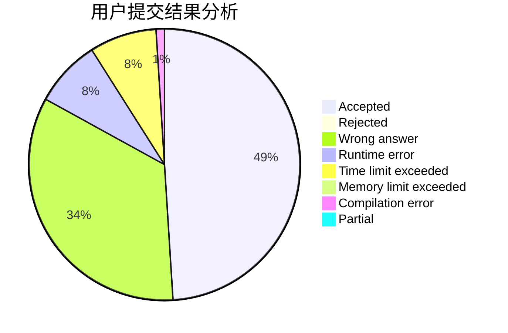
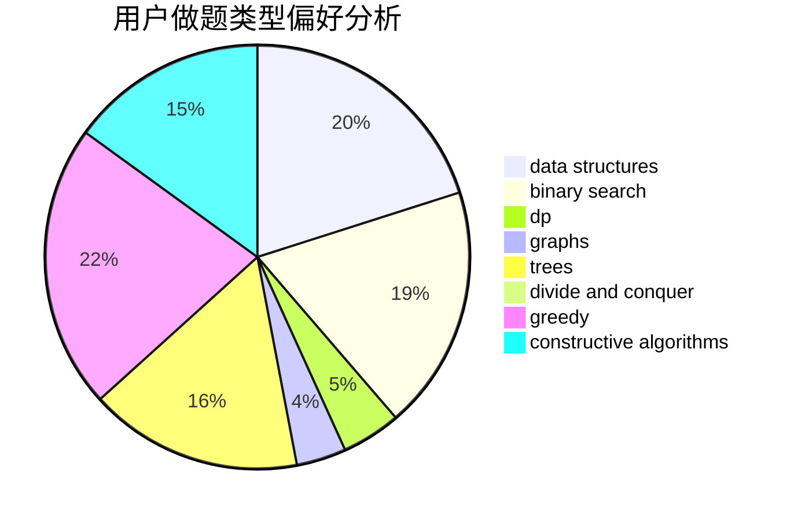

# Hoshizora_Z

<!-- tabs:start -->

#### **用户提交结果分析**

#### **用户做题类型偏好分析**

#### **用户错题知识点分析**

<!-- tabs:end -->
# 推荐题目
[1312G](https://codeforces.com/contest/1312/problem/G)		data structures,
                        dfs and similar,
                        dp		  
[913C](https://codeforces.com/contest/913/problem/C)		bitmasks,
                        dp,
                        greedy		  
[835E](https://codeforces.com/contest/835/problem/E)		binary search,
                        constructive algorithms,
                        interactive		  
[1262A](https://codeforces.com/contest/1262/problem/A)		dsu,graphs,sortings,trees		  
[1365D](https://codeforces.com/contest/1365/problem/D)		constructive algorithms,
                        dfs and similar,
                        dsu,
                        graphs,
                        greedy,
                        implementation,
                        shortest paths		  
[1316A](https://codeforces.com/contest/1316/problem/A)		implementation		  
[477D](https://codeforces.com/contest/477/problem/D)		dp,
                        strings		  
[107B](https://codeforces.com/contest/107/problem/B)		combinatorics,
                        dp,
                        math,
                        probabilities		  
[883C](https://codeforces.com/contest/883/problem/C)		binary search,
                        implementation		  
[793F](https://codeforces.com/contest/793/problem/F)		data structures,
                        divide and conquer,
                        dp		  
