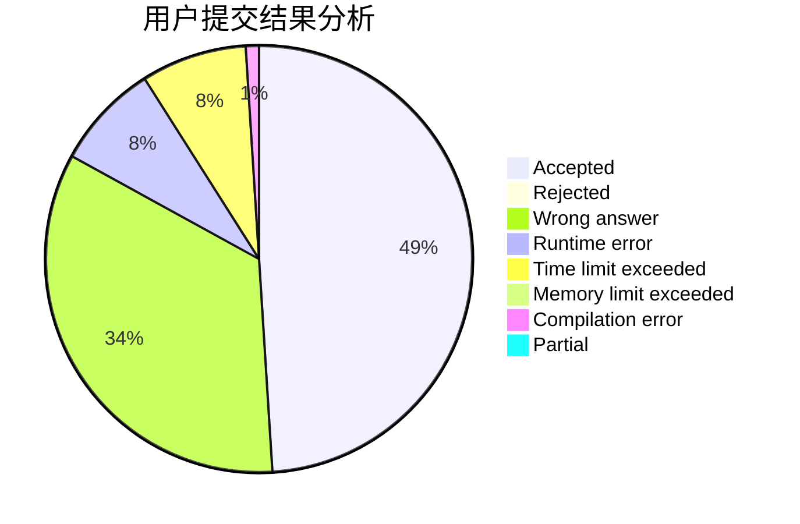
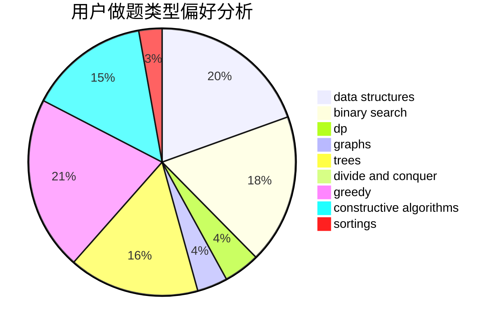

# Hoshizora_Z
<!-- tabs:start -->
#### **用户提交结果分析**

#### **用户做题类型偏好分析**

#### **用户错题知识点分析**

<!-- tabs:end -->
# 推荐题目
[913C](http://codeforces.com/problemset/problem/913/C)		bitmasks,
                        dp,
                        greedy		  
[793F](http://codeforces.com/problemset/problem/793/F)		data structures,
                        divide and conquer,
                        dp		  
[39D](http://codeforces.com/problemset/problem/39/D)		math		  
[477D](http://codeforces.com/problemset/problem/477/D)		dp,
                        strings		  
[835E](http://codeforces.com/problemset/problem/835/E)		binary search,
                        constructive algorithms,
                        interactive		  
[1056B](http://codeforces.com/problemset/problem/1056/B)		math,
                        number theory		  
[1047B](http://codeforces.com/problemset/problem/1047/B)		geometry,
                        math		  
[173B](http://codeforces.com/problemset/problem/173/B)		dfs and similar,
                        shortest paths		  
[107B](http://codeforces.com/problemset/problem/107/B)		combinatorics,
                        dp,
                        math,
                        probabilities		  
[1262A](https://codeforces.com/contest/1262/problem/A)		math		  
<!-- tabs:start -->
#### **data structures**
[793F](http://codeforces.com/problemset/problem/793/F)		data structures,
                        divide and conquer,
                        dp		  
[1312G](http://codeforces.com/problemset/problem/1312/G)		data structures,
                        dfs and similar,
                        dp		  
[264E](http://codeforces.com/problemset/problem/264/E)		data structures,
                        dp		  
[226E](http://codeforces.com/problemset/problem/226/E)		data structures,
                        trees		  
[1083C](http://codeforces.com/problemset/problem/1083/C)		data structures,
                        trees		  
[739E](http://codeforces.com/problemset/problem/739/E)		brute force,
                        data structures,
                        dp,
                        flows,
                        math,
                        probabilities,
                        sortings		  
[1293C](https://codeforces.com/contest/1293/problem/C)		data structures,
                        dsu,
                        implementation		  
[1492C](http://codeforces.com/problemset/problem/1492/C)		binary search,
                        data structures,
                        dp,
                        greedy,
                        two pointers		  
[1490G](http://codeforces.com/problemset/problem/1490/G)		binary search,
                        data structures,
                        math		  
[1479D](http://codeforces.com/problemset/problem/1479/D)		binary search,
                        bitmasks,
                        brute force,
                        data structures,
                        probabilities,
                        trees		  
#### **binary search**
[835E](http://codeforces.com/problemset/problem/835/E)		binary search,
                        constructive algorithms,
                        interactive		  
[883C](http://codeforces.com/problemset/problem/883/C)		binary search,
                        implementation		  
[165C](http://codeforces.com/problemset/problem/165/C)		binary search,
                        brute force,
                        dp,
                        math,
                        strings,
                        two pointers		  
[779D](https://codeforces.com/contest/779/problem/D)		binary search,
                        greedy,
                        strings		  
[607E](http://codeforces.com/problemset/problem/607/E)		binary search,
                        geometry		  
[1492C](http://codeforces.com/problemset/problem/1492/C)		binary search,
                        data structures,
                        dp,
                        greedy,
                        two pointers		  
[1463D](http://codeforces.com/problemset/problem/1463/D)		binary search,
                        constructive algorithms,
                        greedy,
                        two pointers		  
[1490G](http://codeforces.com/problemset/problem/1490/G)		binary search,
                        data structures,
                        math		  
[1479D](http://codeforces.com/problemset/problem/1479/D)		binary search,
                        bitmasks,
                        brute force,
                        data structures,
                        probabilities,
                        trees		  
[1436E](http://codeforces.com/problemset/problem/1436/E)		binary search,
                        data structures,
                        two pointers		  
#### **dp**
[913C](http://codeforces.com/problemset/problem/913/C)		bitmasks,
                        dp,
                        greedy		  
[793F](http://codeforces.com/problemset/problem/793/F)		data structures,
                        divide and conquer,
                        dp		  
[477D](http://codeforces.com/problemset/problem/477/D)		dp,
                        strings		  
[107B](http://codeforces.com/problemset/problem/107/B)		combinatorics,
                        dp,
                        math,
                        probabilities		  
[1312G](http://codeforces.com/problemset/problem/1312/G)		data structures,
                        dfs and similar,
                        dp		  
[264E](http://codeforces.com/problemset/problem/264/E)		data structures,
                        dp		  
[165C](http://codeforces.com/problemset/problem/165/C)		binary search,
                        brute force,
                        dp,
                        math,
                        strings,
                        two pointers		  
[464C](http://codeforces.com/problemset/problem/464/C)		dp		  
[351C](http://codeforces.com/problemset/problem/351/C)		dp,
                        matrices		  
[1103D](http://codeforces.com/problemset/problem/1103/D)		bitmasks,
                        dp		  
#### **graph**
[241E](http://codeforces.com/problemset/problem/241/E)		graphs,
                        shortest paths		  
[1365D](http://codeforces.com/problemset/problem/1365/D)		constructive algorithms,
                        dfs and similar,
                        dsu,
                        graphs,
                        greedy,
                        implementation,
                        shortest paths		  
[453C](http://codeforces.com/problemset/problem/453/C)		constructive algorithms,
                        dfs and similar,
                        graphs		  
[1487C](http://codeforces.com/problemset/problem/1487/C)		brute force,
                        constructive algorithms,
                        dfs and similar,
                        graphs,
                        greedy,
                        implementation,
                        math		  
[1437C](http://codeforces.com/problemset/problem/1437/C)		dp,
                        flows,
                        graph matchings,
                        greedy,
                        math,
                        sortings		  
[1470D](http://codeforces.com/problemset/problem/1470/D)		constructive algorithms,
                        dfs and similar,
                        graph matchings,
                        graphs,
                        greedy		  
[1476C](http://codeforces.com/problemset/problem/1476/C)		dp,
                        graphs,
                        greedy		  
[1304D](http://codeforces.com/problemset/problem/1304/D)		constructive algorithms,
                        graphs,
                        greedy,
                        two pointers		  
[1475C](http://codeforces.com/problemset/problem/1475/C)		combinatorics,
                        graphs,
                        math		  
[553E](http://codeforces.com/problemset/problem/553/E)		dp,
                        fft,
                        graphs,
                        math,
                        probabilities		  
#### **trees**
[226E](http://codeforces.com/problemset/problem/226/E)		data structures,
                        trees		  
[1083C](http://codeforces.com/problemset/problem/1083/C)		data structures,
                        trees		  
[1479D](http://codeforces.com/problemset/problem/1479/D)		binary search,
                        bitmasks,
                        brute force,
                        data structures,
                        probabilities,
                        trees		  
[1511C](http://codeforces.com/problemset/problem/1511/C)		brute force,
                        data structures,
                        implementation,
                        trees		  
[1499F](http://codeforces.com/problemset/problem/1499/F)		combinatorics,
                        dfs and similar,
                        dp,
                        trees		  
[1491E](http://codeforces.com/problemset/problem/1491/E)		brute force,
                        dfs and similar,
                        divide and conquer,
                        number theory,
                        trees		  
[1466D](http://codeforces.com/problemset/problem/1466/D)		data structures,
                        greedy,
                        sortings,
                        trees		  
[1495D](http://codeforces.com/problemset/problem/1495/D)		combinatorics,
                        dfs and similar,
                        graphs,
                        math,
                        shortest paths,
                        trees		  
[1303G](http://codeforces.com/problemset/problem/1303/G)		data structures,
                        divide and conquer,
                        geometry,
                        trees		  
[1454E](http://codeforces.com/problemset/problem/1454/E)		combinatorics,
                        dfs and similar,
                        graphs,
                        trees		  
#### **divide and conquer**
[793F](http://codeforces.com/problemset/problem/793/F)		data structures,
                        divide and conquer,
                        dp		  
[850E](http://codeforces.com/problemset/problem/850/E)		bitmasks,
                        brute force,
                        divide and conquer,
                        fft,
                        math		  
[1461D](http://codeforces.com/problemset/problem/1461/D)		binary search,
                        brute force,
                        data structures,
                        divide and conquer,
                        implementation,
                        sortings		  
[1466G](http://codeforces.com/problemset/problem/1466/G)		combinatorics,
                        divide and conquer,
                        hashing,
                        math,
                        string suffix structures,
                        strings		  
[1490D](http://codeforces.com/problemset/problem/1490/D)		dfs and similar,
                        divide and conquer,
                        implementation		  
[1483C](https://codeforces.com/contest/1483/problem/C)		data structures,
                        divide and conquer,
                        dp		  
[1491E](http://codeforces.com/problemset/problem/1491/E)		brute force,
                        dfs and similar,
                        divide and conquer,
                        number theory,
                        trees		  
[1303G](http://codeforces.com/problemset/problem/1303/G)		data structures,
                        divide and conquer,
                        geometry,
                        trees		  
[1494D](http://codeforces.com/problemset/problem/1494/D)		constructive algorithms,
                        data structures,
                        dfs and similar,
                        divide and conquer,
                        dsu,
                        greedy,
                        sortings,
                        trees		  
[1482E](http://codeforces.com/problemset/problem/1482/E)		data structures,
                        divide and conquer,
                        dp		  
#### **greedy**
[913C](http://codeforces.com/problemset/problem/913/C)		bitmasks,
                        dp,
                        greedy		  
[405A](http://codeforces.com/problemset/problem/405/A)		greedy,
                        implementation,
                        sortings		  
[606C](https://codeforces.com/contest/606/problem/C)		constructive algorithms,
                        greedy		  
[1162B](http://codeforces.com/problemset/problem/1162/B)		brute force,
                        greedy		  
[779D](https://codeforces.com/contest/779/problem/D)		binary search,
                        greedy,
                        strings		  
[1365D](http://codeforces.com/problemset/problem/1365/D)		constructive algorithms,
                        dfs and similar,
                        dsu,
                        graphs,
                        greedy,
                        implementation,
                        shortest paths		  
[145A](http://codeforces.com/problemset/problem/145/A)		greedy,
                        implementation		  
[1205A](http://codeforces.com/problemset/problem/1205/A)		constructive algorithms,
                        greedy,
                        math		  
[1249C1](http://codeforces.com/problemset/problem/1249/C1)		brute force,
                        greedy,
                        implementation		  
[1326C](http://codeforces.com/problemset/problem/1326/C)		combinatorics,
                        greedy,
                        math		  
#### **constructive algorithms**
[835E](http://codeforces.com/problemset/problem/835/E)		binary search,
                        constructive algorithms,
                        interactive		  
[606C](https://codeforces.com/contest/606/problem/C)		constructive algorithms,
                        greedy		  
[1365D](http://codeforces.com/problemset/problem/1365/D)		constructive algorithms,
                        dfs and similar,
                        dsu,
                        graphs,
                        greedy,
                        implementation,
                        shortest paths		  
[1205A](http://codeforces.com/problemset/problem/1205/A)		constructive algorithms,
                        greedy,
                        math		  
[453C](http://codeforces.com/problemset/problem/453/C)		constructive algorithms,
                        dfs and similar,
                        graphs		  
[1493A](http://codeforces.com/problemset/problem/1493/A)		constructive algorithms,
                        greedy		  
[1463D](http://codeforces.com/problemset/problem/1463/D)		binary search,
                        constructive algorithms,
                        greedy,
                        two pointers		  
[1456B](https://codeforces.com/contest/1456/problem/B)		bitmasks,
                        brute force,
                        constructive algorithms		  
[1492D](http://codeforces.com/problemset/problem/1492/D)		bitmasks,
                        constructive algorithms,
                        greedy,
                        math		  
[1504D](https://codeforces.com/contest/1504/problem/D)		constructive algorithms,
                        games,
                        interactive		  
#### **sortings**
[405A](http://codeforces.com/problemset/problem/405/A)		greedy,
                        implementation,
                        sortings		  
[739E](http://codeforces.com/problemset/problem/739/E)		brute force,
                        data structures,
                        dp,
                        flows,
                        math,
                        probabilities,
                        sortings		  
[1496C](https://codeforces.com/contest/1496/problem/C)		geometry,
                        greedy,
                        math,
                        sortings		  
[1495A](http://codeforces.com/problemset/problem/1495/A)		geometry,
                        greedy,
                        math,
                        sortings		  
[1497A](http://codeforces.com/problemset/problem/1497/A)		brute force,
                        data structures,
                        greedy,
                        sortings		  
[1427A](http://codeforces.com/problemset/problem/1427/A)		math,
                        sortings		  
[1461D](http://codeforces.com/problemset/problem/1461/D)		binary search,
                        brute force,
                        data structures,
                        divide and conquer,
                        implementation,
                        sortings		  
[1437C](http://codeforces.com/problemset/problem/1437/C)		dp,
                        flows,
                        graph matchings,
                        greedy,
                        math,
                        sortings		  
[1473A](http://codeforces.com/problemset/problem/1473/A)		greedy,
                        implementation,
                        math,
                        sortings		  
[1486B](http://codeforces.com/problemset/problem/1486/B)		binary search,
                        geometry,
                        shortest paths,
                        sortings		  
<!-- tabs:end -->
