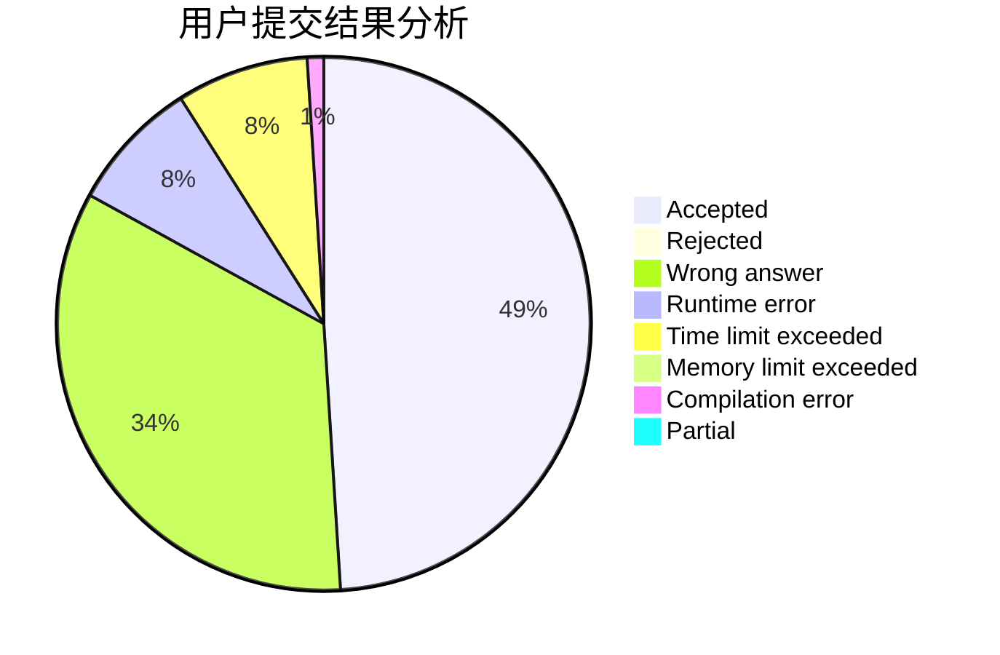
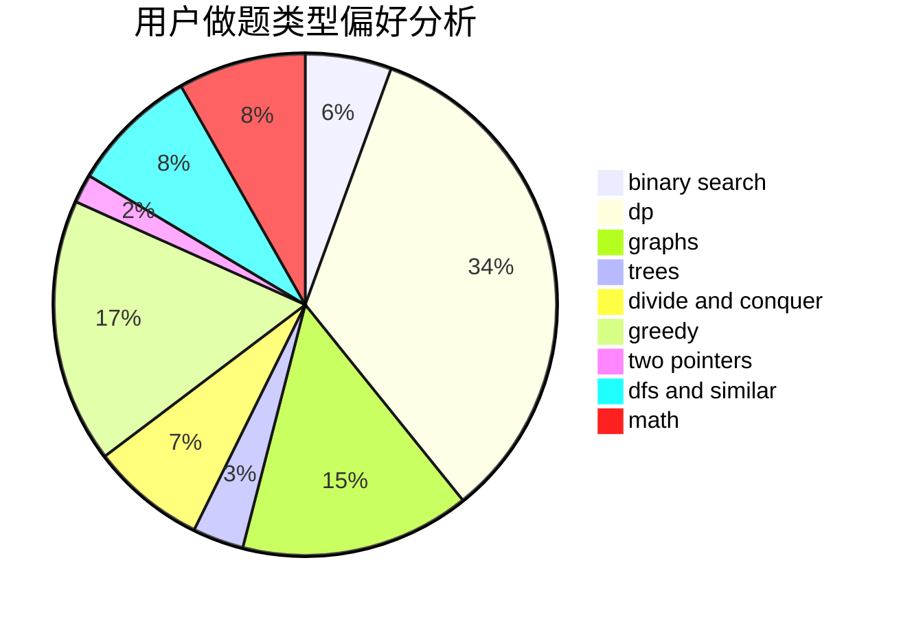

# Hoshizora_Z

<!-- tabs:start -->

#### **用户提交结果分析**

#### **用户做题类型偏好分析**

<!-- tabs:end -->
# 推荐题目
[1322C](https://codeforces.com/contest/1322/problem/C)
[932A](https://codeforces.com/contest/932/problem/A)
[853C](https://codeforces.com/contest/853/problem/C)
[1267I](https://codeforces.com/contest/1267/problem/I)
[1372B](https://codeforces.com/contest/1372/problem/B)
[1325E](https://codeforces.com/contest/1325/problem/E)
[497D](https://codeforces.com/contest/497/problem/D)
[1080A](https://codeforces.com/contest/1080/problem/A)
[900B](https://codeforces.com/contest/900/problem/B)
[808G](https://codeforces.com/contest/808/problem/G)
