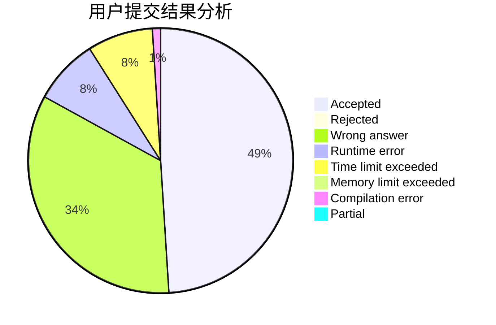
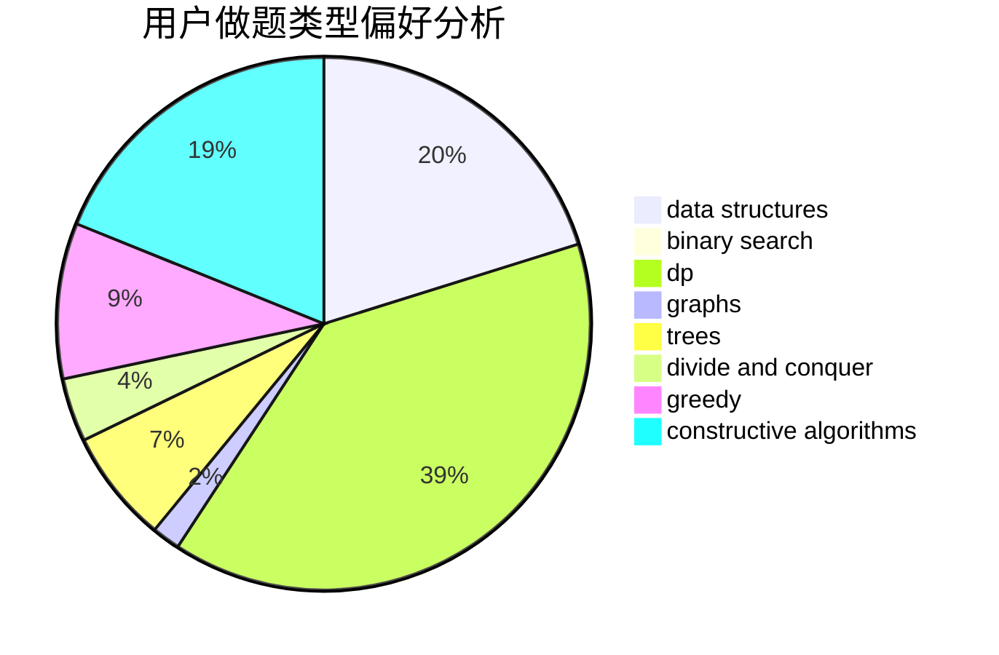

# Hoshizora_Z

<!-- tabs:start -->

#### **用户提交结果分析**

#### **用户做题类型偏好分析**

#### **用户错题知识点分析**

<!-- tabs:end -->
# 推荐题目
[1322C](https://codeforces.com/contest/1322/problem/C)		graphs,
                        hashing,
                        math,
                        number theory		  
[932A](https://codeforces.com/contest/932/problem/A)		constructive algorithms		  
[853C](https://codeforces.com/contest/853/problem/C)		data structures		  
[1267I](https://codeforces.com/contest/1267/problem/I)		brute force,
                        constructive algorithms,
                        implementation,
                        interactive,
                        sortings		  
[1372B](https://codeforces.com/contest/1372/problem/B)		greedy,
                        math,
                        number theory		  
[1325E](https://codeforces.com/contest/1325/problem/E)		brute force,
                        dfs and similar,
                        graphs,
                        number theory,
                        shortest paths		  
[497D](https://codeforces.com/contest/497/problem/D)		brute force,
                        geometry,
                        math		  
[1080A](https://codeforces.com/contest/1080/problem/A)		math		  
[900B](https://codeforces.com/contest/900/problem/B)		math,
                        number theory		  
[808G](https://codeforces.com/contest/808/problem/G)		dp,
                        strings		  
