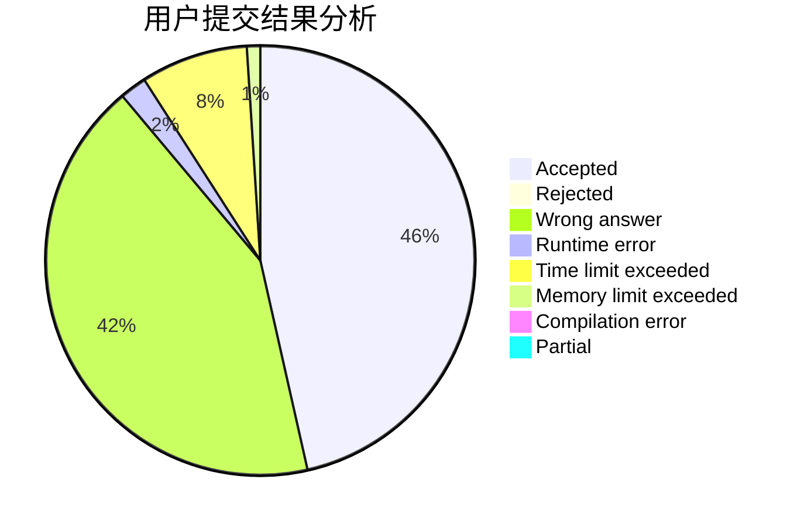
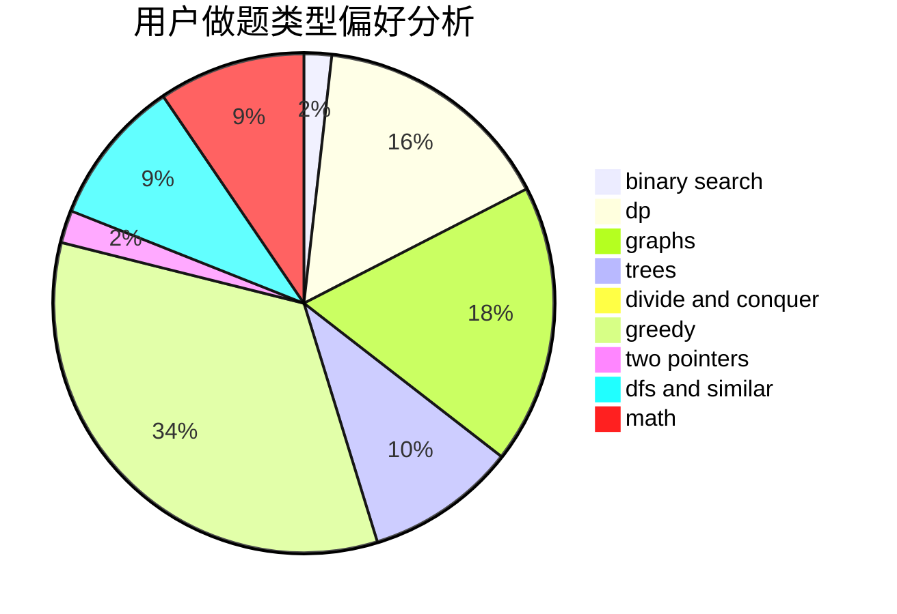

# Hs-Black

<!-- tabs:start -->

#### **用户提交结果分析**

#### **用户做题类型偏好分析**

<!-- tabs:end -->
# 推荐题目
[1463E](https://codeforces.com/contest/1463/problem/E)
[1366F](https://codeforces.com/contest/1366/problem/F)
[490F](https://codeforces.com/contest/490/problem/F)
[482A](https://codeforces.com/contest/482/problem/A)
[1089A](https://codeforces.com/contest/1089/problem/A)
[1347D](https://codeforces.com/contest/1347/problem/D)
[613E](https://codeforces.com/contest/613/problem/E)
[791C](https://codeforces.com/contest/791/problem/C)
[27C](https://codeforces.com/contest/27/problem/C)
[1366E](https://codeforces.com/contest/1366/problem/E)
