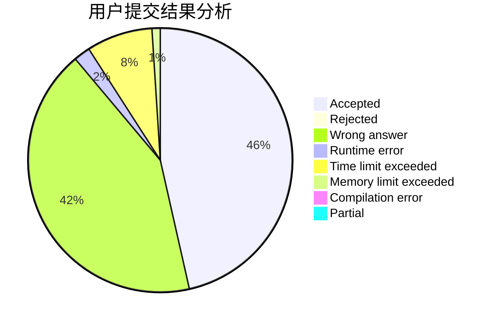
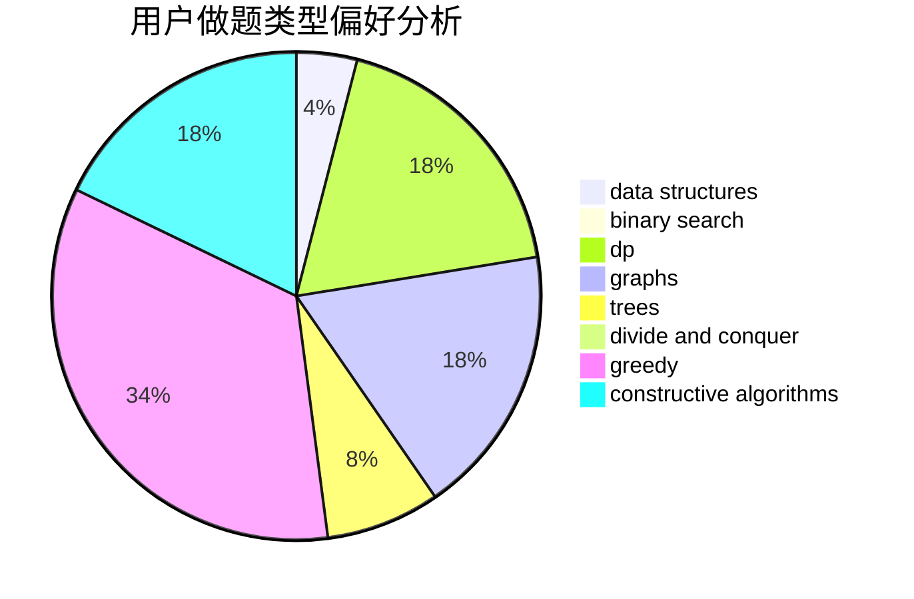
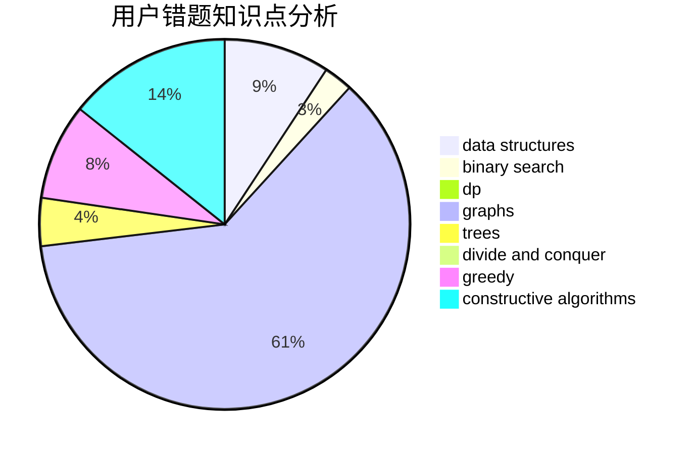

# Hs-Black

<!-- tabs:start -->

#### **用户提交结果分析**

#### **用户做题类型偏好分析**

#### **用户错题知识点分析**

<!-- tabs:end -->
# 推荐题目
[1463E](https://codeforces.com/contest/1463/problem/E)		constructive algorithms,
                        dfs and similar,
                        dsu,
                        graphs,
                        implementation,
                        sortings,
                        trees		  
[1366F](https://codeforces.com/contest/1366/problem/F)		binary search,
                        dp,
                        geometry,
                        graphs		  
[490F](https://codeforces.com/contest/490/problem/F)		data structures,
                        dfs and similar,
                        dp,
                        trees		  
[482A](https://codeforces.com/contest/482/problem/A)		constructive algorithms,
                        greedy		  
[1089A](https://codeforces.com/contest/1089/problem/A)		dp		  
[1347D](https://codeforces.com/contest/1347/problem/D)		dsu,graphs,sortings,trees		  
[613E](https://codeforces.com/contest/613/problem/E)		dp,
                        hashing,
                        strings		  
[791C](https://codeforces.com/contest/791/problem/C)		dsu,graphs,sortings,trees		  
[27C](https://codeforces.com/contest/27/problem/C)		constructive algorithms,
                        greedy		  
[1366E](https://codeforces.com/contest/1366/problem/E)		binary search,
                        brute force,
                        combinatorics,
                        constructive algorithms,
                        dp,
                        two pointers		  
