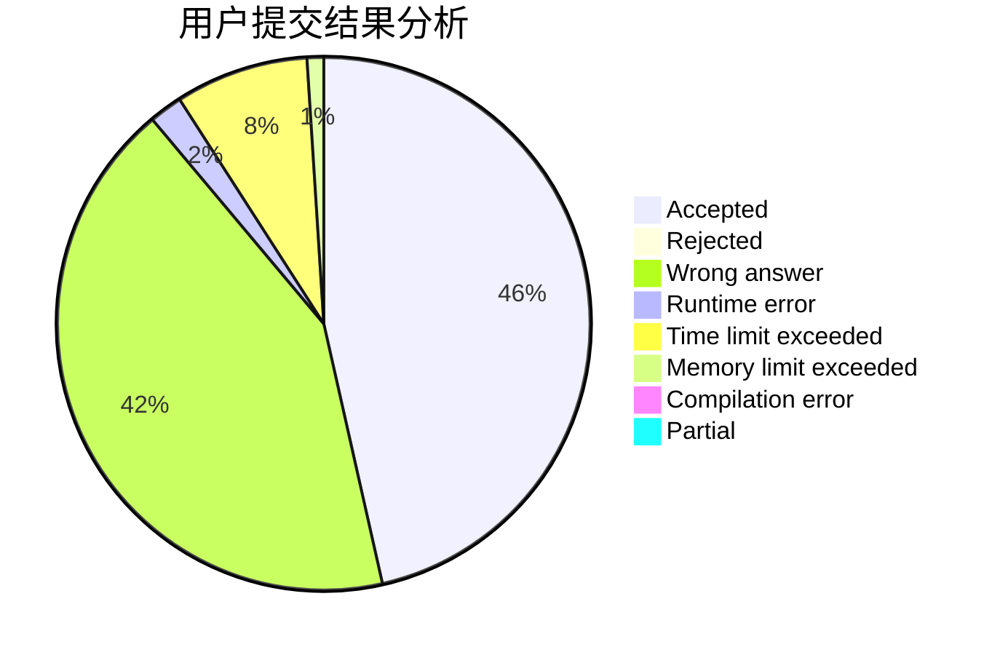
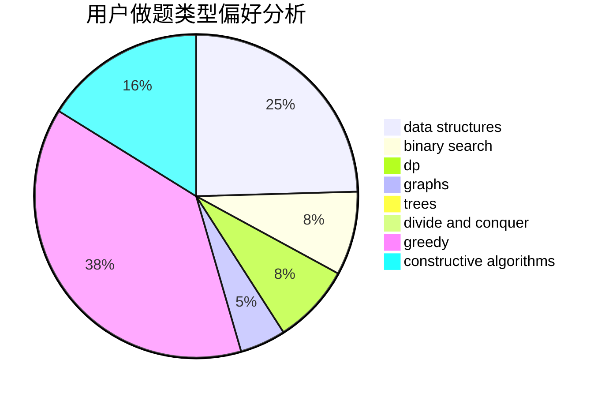
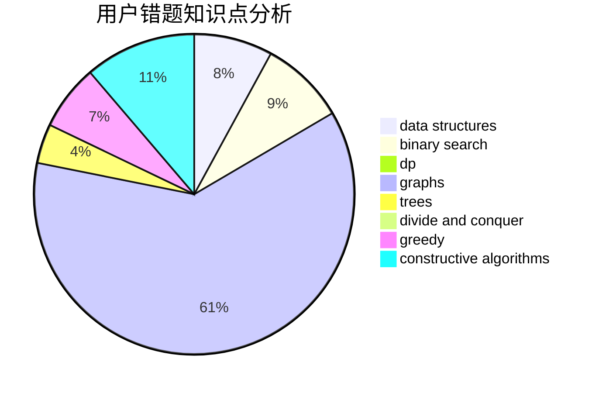

# Hs-Black

<!-- tabs:start -->

#### **用户提交结果分析**

#### **用户做题类型偏好分析**

#### **用户错题知识点分析**

<!-- tabs:end -->
# 推荐题目
[1454B](https://codeforces.com/contest/1454/problem/B)		implementation		  
[1358D](https://codeforces.com/contest/1358/problem/D)		binary search,
                        brute force,
                        greedy,
                        implementation,
                        two pointers		  
[472C](https://codeforces.com/contest/472/problem/C)		greedy		  
[462A](https://codeforces.com/contest/462/problem/A)		brute force,
                        implementation		  
[1088D](https://codeforces.com/contest/1088/problem/D)		bitmasks,
                        constructive algorithms,
                        implementation,
                        interactive		  
[1340E](https://codeforces.com/contest/1340/problem/E)		graphs,
                        interactive,
                        probabilities		  
[597A](https://codeforces.com/contest/597/problem/A)		math		  
[771D](https://codeforces.com/contest/771/problem/D)		dp		  
[261E](https://codeforces.com/contest/261/problem/E)		brute force,
                        dp,
                        two pointers		  
[1358C](https://codeforces.com/contest/1358/problem/C)		math		  
