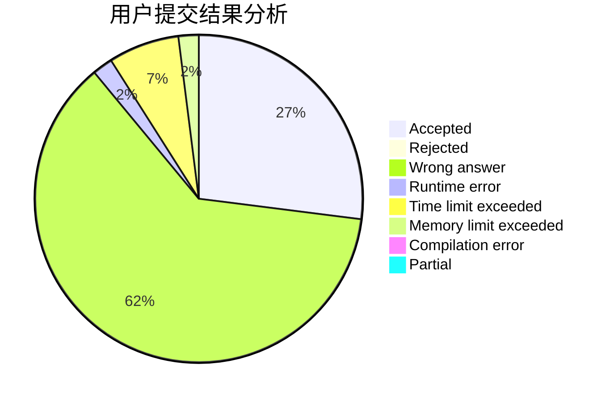
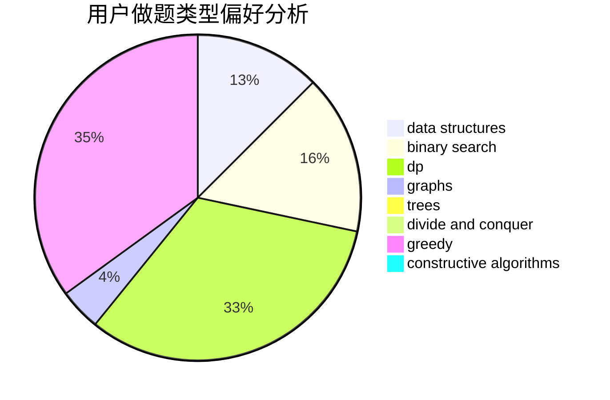
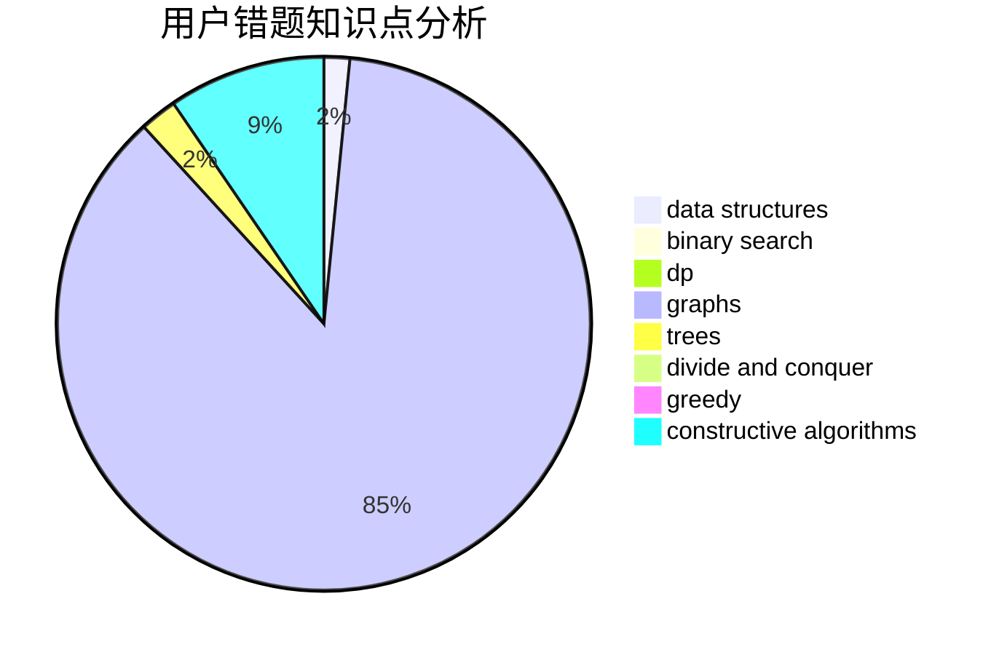

# HuaShanLunJian

<!-- tabs:start -->

#### **用户提交结果分析**

#### **用户做题类型偏好分析**

#### **用户错题知识点分析**

<!-- tabs:end -->
# 推荐题目
[1290A](https://codeforces.com/contest/1290/problem/A)		brute force,
                        data structures,
                        implementation		  
[220C](https://codeforces.com/contest/220/problem/C)		data structures		  
[434C](https://codeforces.com/contest/434/problem/C)		dsu,graphs,sortings,trees		  
[785D](https://codeforces.com/contest/785/problem/D)		combinatorics,
                        dp,
                        math,
                        number theory		  
[103E](https://codeforces.com/contest/103/problem/E)		flows,
                        graph matchings		  
[832D](https://codeforces.com/contest/832/problem/D)		dfs and similar,
                        graphs,
                        trees		  
[50E](https://codeforces.com/contest/50/problem/E)		math		  
[1182E](https://codeforces.com/contest/1182/problem/E)		dp,
                        math,
                        matrices,
                        number theory		  
[607A](https://codeforces.com/contest/607/problem/A)		binary search,
                        dp		  
[1490C](https://codeforces.com/contest/1490/problem/C)		binary search,
                        brute force,
                        brute force,
                        math		  
